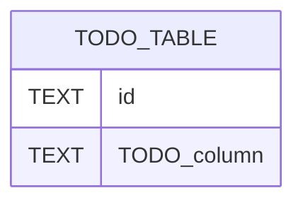

# Database Schema — Dashboard_music_platform_algo_spotify

> Auto-populated by `generate-dev-docs.py`. Add relationships manually.

## Table Inventory

<!-- AUTO:TABLES_BEGIN -->
*Auto-generated 2026-08-21 — 47 tables*

### `active_sessions`
*Source: `database/saas_schema.py`*

| Column | Notes |
|--------|-------|
| `artist_id` | [TODO] |
| `last_heartbeat` | [TODO] |

### `algo_lifecycle_benchmark`
*Source: `database/benchmark_schema.py`*

| Column | Notes |
|--------|-------|
| `id` | [TODO] |
| `algorithm` | [TODO] |
| `weight_category_type` | [TODO] |
| `age_week_bin` | [TODO] |
| `age_week_bin_order` | [TODO] |
| `ratio_min` | [TODO] |
| `ratio_q1` | [TODO] |
| `ratio_median` | [TODO] |
| `ratio_q3` | [TODO] |
| `ratio_max` | [TODO] |
| `total_stream_median` | [TODO] |
| `sample_count` | [TODO] |
| `dataset_version` | [TODO] |
| `exported_at` | [TODO] |

### `app_operating_costs`
*Source: `database/app_costs_schema.py`*

| Column | Notes |
|--------|-------|
| `id` | [TODO] |
| `category` | [TODO] |
| `label` | [TODO] |
| `amount_eur` | [TODO] |
| `billing_period` | [TODO] |
| `start_month` | [TODO] |
| `end_month` | [TODO] |
| `active` | [TODO] |
| `note` | [TODO] |
| `created_at` | [TODO] |

### `apple_daily_plays`
*Source: `database/apple_music_csv_schema.py`*

| Column | Notes |
|--------|-------|
| `id` | [TODO] |
| `artist_id` | [TODO] |
| `song_name` | [TODO] |
| `date` | [TODO] |
| `plays` | [TODO] |
| `collected_at` | [TODO] |

### `apple_listeners`
*Source: `database/apple_music_csv_schema.py`*

| Column | Notes |
|--------|-------|
| `id` | [TODO] |
| `artist_id` | [TODO] |
| `date` | [TODO] |
| `listeners` | [TODO] |
| `collected_at` | [TODO] |

### `apple_songs_history`
*Source: `database/apple_music_csv_schema.py`*

| Column | Notes |
|--------|-------|
| `id` | [TODO] |
| `artist_id` | [TODO] |
| `song_name` | [TODO] |
| `plays` | [TODO] |
| `shazam_count` | [TODO] |
| `date` | [TODO] |
| `collected_at` | [TODO] |

### `apple_songs_performance`
*Source: `database/apple_music_csv_schema.py`*

| Column | Notes |
|--------|-------|
| `id` | [TODO] |
| `artist_id` | [TODO] |
| `song_name` | [TODO] |
| `album_name` | [TODO] |
| `plays` | [TODO] |
| `listeners` | [TODO] |
| `shazam_count` | [TODO] |
| `radio_spins` | [TODO] |
| `purchases` | [TODO] |
| `collected_at` | [TODO] |

### `artist_credentials`
*Source: `database/saas_schema.py`*

| Column | Notes |
|--------|-------|
| `id` | [TODO] |
| `artist_id` | [TODO] |
| `platform` | [TODO] |
| `token_encrypted` | [TODO] |
| `extra_config` | [TODO] |
| `expires_at` | [TODO] |
| `created_at` | [TODO] |
| `updated_at` | [TODO] |

### `artist_subscriptions`
*Source: `database/stripe_schema.py`*

| Column | Notes |
|--------|-------|
| `id` | [TODO] |
| `artist_id` | [TODO] |
| `plan_id` | [TODO] |
| `stripe_customer_id` | [TODO] |
| `stripe_subscription_id` | [TODO] |
| `status` | [TODO] |
| `current_period_start` | [TODO] |
| `current_period_end` | [TODO] |
| `cancel_at_period_end` | [TODO] |
| `created_at` | [TODO] |
| `updated_at` | [TODO] |

### `artist_wrapped`
*Source: `database/wrapped_schema.py`*

| Column | Notes |
|--------|-------|
| `id` | [TODO] |
| `artist_id` | [TODO] |
| `year` | [TODO] |
| `listeners` | [TODO] |
| `streams` | [TODO] |
| `hours_listened` | [TODO] |
| `countries` | [TODO] |
| `listener_gain_pct` | [TODO] |
| `stream_gain_pct` | [TODO] |
| `save_gain_pct` | [TODO] |
| `playlist_add_gain_pct` | [TODO] |
| `saves` | [TODO] |
| `playlist_adds` | [TODO] |
| `top_fans_count` | [TODO] |
| `top_fans_rank` | [TODO] |
| `updated_at` | [TODO] |
| `CONSTRAINT` | [TODO] |

### `distrokid_monthly_revenue`
*Source: `database/distrokid_schema.py`*

| Column | Notes |
|--------|-------|
| `id` | [TODO] |
| `artist_id` | [TODO] |
| `year` | [TODO] |
| `month` | [TODO] |
| `revenue_eur` | [TODO] |
| `fx_rate` | [TODO] |
| `notes` | [TODO] |
| `source` | [TODO] |
| `created_at` | [TODO] |
| `updated_at` | [TODO] |
| `CONSTRAINT` | [TODO] |

### `distrokid_sales_detail`
*Source: `database/distrokid_csv_schema.py`*

| Column | Notes |
|--------|-------|
| `id` | [TODO] |
| `artist_id` | [TODO] |
| `sale_year` | [TODO] |
| `sale_month` | [TODO] |
| `reporting_date` | [TODO] |
| `store` | [TODO] |
| `artist_name` | [TODO] |
| `title` | [TODO] |
| `isrc` | [TODO] |
| `upc` | [TODO] |
| `quantity` | [TODO] |
| `team_percentage` | [TODO] |
| `source_type` | [TODO] |
| `country` | [TODO] |
| `songwriter_royalties_usd` | [TODO] |
| `earnings_usd` | [TODO] |
| `recoup_usd` | [TODO] |
| `collected_at` | [TODO] |
| `CONSTRAINT` | [TODO] |
| `(artist_id,` | [TODO] |
| `reporting_date,` | [TODO] |

### `hypeddit_campaigns`
*Source: `database/hypeddit_schema.py`*

| Column | Notes |
|--------|-------|
| `id` | [TODO] |
| `artist_id` | [TODO] |
| `campaign_name` | [TODO] |
| `created_at` | [TODO] |
| `updated_at` | [TODO] |
| `is_active` | [TODO] |

### `hypeddit_daily_stats`
*Source: `database/hypeddit_schema.py`*

| Column | Notes |
|--------|-------|
| `id` | [TODO] |
| `artist_id` | [TODO] |
| `campaign_name` | [TODO] |
| `date` | [TODO] |
| `visits` | [TODO] |
| `clicks` | [TODO] |
| `budget` | [TODO] |
| `ctr` | [TODO] |
| `cost_per_click` | [TODO] |
| `created_at` | [TODO] |
| `updated_at` | [TODO] |
| `CONSTRAINT` | [TODO] |
| `REFERENCES` | [TODO] |
| `ON` | [TODO] |

### `imusician_monthly_revenue`
*Source: `database/imusician_schema.py`*

| Column | Notes |
|--------|-------|
| `id` | [TODO] |
| `artist_id` | [TODO] |
| `year` | [TODO] |
| `month` | [TODO] |
| `revenue_eur` | [TODO] |
| `notes` | [TODO] |
| `source` | [TODO] |
| `created_at` | [TODO] |
| `updated_at` | [TODO] |
| `CONSTRAINT` | [TODO] |

### `imusician_release_summary`
*Source: `database/imusician_csv_schema.py`*

| Column | Notes |
|--------|-------|
| `id` | [TODO] |
| `artist_id` | [TODO] |
| `REFERENCES` | [TODO] |
| `year` | [TODO] |
| `month` | [TODO] |
| `release_title` | [TODO] |
| `barcode` | [TODO] |
| `track_downloads` | [TODO] |
| `track_streams` | [TODO] |
| `release_downloads` | [TODO] |
| `track_downloads_revenue` | [TODO] |
| `track_streams_revenue` | [TODO] |
| `release_downloads_revenue` | [TODO] |
| `total_revenue` | [TODO] |
| `collected_at` | [TODO] |

### `imusician_sales_detail`
*Source: `database/imusician_csv_schema.py`*

| Column | Notes |
|--------|-------|
| `id` | [TODO] |
| `artist_id` | [TODO] |
| `REFERENCES` | [TODO] |
| `sales_year` | [TODO] |
| `sales_month` | [TODO] |
| `statement_year` | [TODO] |
| `statement_month` | [TODO] |
| `release_title` | [TODO] |
| `barcode` | [TODO] |
| `label` | [TODO] |
| `isrc` | [TODO] |
| `track_title` | [TODO] |
| `track_version` | [TODO] |
| `shop` | [TODO] |
| `transaction_type` | [TODO] |
| `country` | [TODO] |
| `quantity` | [TODO] |
| `revenue_eur` | [TODO] |
| `collected_at` | [TODO] |
| `artist_id,` | [TODO] |
| `statement_year,` | [TODO] |
| `)` | [TODO] |

### `instagram_media`
*Source: `database/instagram_schema.py`*

| Column | Notes |
|--------|-------|
| `id` | [TODO] |
| `artist_id` | [TODO] |
| `media_id` | [TODO] |
| `caption` | [TODO] |
| `media_type` | [TODO] |
| `permalink` | [TODO] |
| `media_url` | [TODO] |
| `timestamp` | [TODO] |
| `like_count` | [TODO] |
| `comments_count` | [TODO] |
| `collected_at` | [TODO] |
| `CONSTRAINT` | [TODO] |

### `instagram_media_insights`
*Source: `database/instagram_schema.py`*

| Column | Notes |
|--------|-------|
| `id` | [TODO] |
| `artist_id` | [TODO] |
| `media_id` | [TODO] |
| `date` | [TODO] |
| `impressions` | [TODO] |
| `reach` | [TODO] |
| `engagement` | [TODO] |
| `saved` | [TODO] |
| `shares` | [TODO] |
| `collected_at` | [TODO] |
| `CONSTRAINT` | [TODO] |

### `meta_ads`
*Source: `database/meta_ads_schema.py`*

| Column | Notes |
|--------|-------|
| `ad_id` | [TODO] |
| `artist_id` | [TODO] |
| `ad_name` | [TODO] |
| `adset_id` | [TODO] |
| `campaign_id` | [TODO] |
| `status` | [TODO] |
| `creative_id` | [TODO] |
| `title` | [TODO] |
| `body` | [TODO] |
| `call_to_action` | [TODO] |
| `created_time` | [TODO] |
| `updated_time` | [TODO] |
| `collected_at` | [TODO] |

### `meta_adsets`
*Source: `database/meta_ads_schema.py`*

| Column | Notes |
|--------|-------|
| `adset_id` | [TODO] |
| `artist_id` | [TODO] |
| `adset_name` | [TODO] |
| `campaign_id` | [TODO] |
| `status` | [TODO] |
| `optimization_goal` | [TODO] |
| `billing_event` | [TODO] |
| `daily_budget` | [TODO] |
| `lifetime_budget` | [TODO] |
| `start_time` | [TODO] |
| `end_time` | [TODO] |
| `targeting` | [TODO] |
| `countries` | [TODO] |
| `cities` | [TODO] |
| `gender` | [TODO] |
| `age_min` | [TODO] |
| `age_max` | [TODO] |
| `age_range` | [TODO] |
| `flexible_inclusions` | [TODO] |
| `advantage_audience` | [TODO] |
| `publisher_platforms` | [TODO] |
| `instagram_positions` | [TODO] |
| `device_platforms` | [TODO] |
| `collected_at` | [TODO] |

### `meta_campaigns`
*Source: `database/meta_ads_schema.py`*

| Column | Notes |
|--------|-------|
| `campaign_id` | [TODO] |
| `artist_id` | [TODO] |
| `campaign_name` | [TODO] |
| `status` | [TODO] |
| `objective` | [TODO] |
| `daily_budget` | [TODO] |
| `lifetime_budget` | [TODO] |
| `start_time` | [TODO] |
| `end_time` | [TODO] |
| `created_time` | [TODO] |
| `updated_time` | [TODO] |
| `collected_at` | [TODO] |

### `meta_insights`
*Source: `database/meta_ads_schema.py`*

| Column | Notes |
|--------|-------|
| `id` | [TODO] |
| `artist_id` | [TODO] |
| `ad_id` | [TODO] |
| `date` | [TODO] |
| `impressions` | [TODO] |
| `clicks` | [TODO] |
| `spend` | [TODO] |
| `reach` | [TODO] |
| `frequency` | [TODO] |
| `cpc` | [TODO] |
| `cpm` | [TODO] |
| `ctr` | [TODO] |
| `conversions` | [TODO] |
| `cost_per_conversion` | [TODO] |
| `collected_at` | [TODO] |

### `meta_insights_engagement`
*Source: `database/meta_insight_schema.py`*

| Column | Notes |
|--------|-------|
| `id` | [TODO] |
| `artist_id` | [TODO] |
| `campaign_name` | [TODO] |
| `date_start` | [TODO] |
| `page_interactions` | [TODO] |
| `post_reactions` | [TODO] |
| `comments` | [TODO] |
| `saves` | [TODO] |
| `shares` | [TODO] |
| `link_clicks` | [TODO] |
| `post_likes` | [TODO] |
| `collected_at` | [TODO] |

### `meta_insights_engagement_age`
*Source: `database/meta_insight_schema.py`*

| Column | Notes |
|--------|-------|
| `id` | [TODO] |
| `artist_id` | [TODO] |
| `campaign_name` | [TODO] |
| `age_range` | [TODO] |
| `page_interactions` | [TODO] |
| `post_reactions` | [TODO] |
| `comments` | [TODO] |
| `saves` | [TODO] |
| `shares` | [TODO] |
| `link_clicks` | [TODO] |
| `post_likes` | [TODO] |
| `collected_at` | [TODO] |

### `meta_insights_engagement_country`
*Source: `database/meta_insight_schema.py`*

| Column | Notes |
|--------|-------|
| `id` | [TODO] |
| `artist_id` | [TODO] |
| `campaign_name` | [TODO] |
| `country` | [TODO] |
| `page_interactions` | [TODO] |
| `post_reactions` | [TODO] |
| `comments` | [TODO] |
| `saves` | [TODO] |
| `shares` | [TODO] |
| `link_clicks` | [TODO] |
| `post_likes` | [TODO] |
| `collected_at` | [TODO] |

### `meta_insights_engagement_day`
*Source: `database/meta_insight_schema.py`*

| Column | Notes |
|--------|-------|
| `id` | [TODO] |
| `artist_id` | [TODO] |
| `campaign_name` | [TODO] |
| `day_date` | [TODO] |
| `page_interactions` | [TODO] |
| `post_reactions` | [TODO] |
| `comments` | [TODO] |
| `saves` | [TODO] |
| `shares` | [TODO] |
| `link_clicks` | [TODO] |
| `post_likes` | [TODO] |
| `collected_at` | [TODO] |

### `meta_insights_engagement_placement`
*Source: `database/meta_insight_schema.py`*

| Column | Notes |
|--------|-------|
| `id` | [TODO] |
| `artist_id` | [TODO] |
| `campaign_name` | [TODO] |
| `platform` | [TODO] |
| `placement` | [TODO] |
| `page_interactions` | [TODO] |
| `post_reactions` | [TODO] |
| `comments` | [TODO] |
| `saves` | [TODO] |
| `shares` | [TODO] |
| `link_clicks` | [TODO] |
| `post_likes` | [TODO] |
| `collected_at` | [TODO] |

### `meta_insights_performance`
*Source: `database/meta_insight_schema.py`*

| Column | Notes |
|--------|-------|
| `id` | [TODO] |
| `artist_id` | [TODO] |
| `campaign_name` | [TODO] |
| `date_start` | [TODO] |
| `spend` | [TODO] |
| `impressions` | [TODO] |
| `reach` | [TODO] |
| `frequency` | [TODO] |
| `results` | [TODO] |
| `cpr` | [TODO] |
| `cpm` | [TODO] |
| `link_clicks` | [TODO] |
| `cpc` | [TODO] |
| `ctr` | [TODO] |
| `lp_views` | [TODO] |
| `collected_at` | [TODO] |

### `meta_insights_performance_age`
*Source: `database/meta_insight_schema.py`*

| Column | Notes |
|--------|-------|
| `id` | [TODO] |
| `artist_id` | [TODO] |
| `campaign_name` | [TODO] |
| `age_range` | [TODO] |
| `spend` | [TODO] |
| `impressions` | [TODO] |
| `reach` | [TODO] |
| `results` | [TODO] |
| `cpr` | [TODO] |
| `collected_at` | [TODO] |

### `meta_insights_performance_country`
*Source: `database/meta_insight_schema.py`*

| Column | Notes |
|--------|-------|
| `id` | [TODO] |
| `artist_id` | [TODO] |
| `campaign_name` | [TODO] |
| `country` | [TODO] |
| `spend` | [TODO] |
| `impressions` | [TODO] |
| `reach` | [TODO] |
| `results` | [TODO] |
| `cpr` | [TODO] |
| `collected_at` | [TODO] |

### `meta_insights_performance_day`
*Source: `database/meta_insight_schema.py`*

| Column | Notes |
|--------|-------|
| `id` | [TODO] |
| `artist_id` | [TODO] |
| `campaign_name` | [TODO] |
| `day_date` | [TODO] |
| `spend` | [TODO] |
| `impressions` | [TODO] |
| `reach` | [TODO] |
| `results` | [TODO] |
| `cpr` | [TODO] |
| `collected_at` | [TODO] |

### `meta_insights_performance_placement`
*Source: `database/meta_insight_schema.py`*

| Column | Notes |
|--------|-------|
| `id` | [TODO] |
| `artist_id` | [TODO] |
| `campaign_name` | [TODO] |
| `platform` | [TODO] |
| `placement` | [TODO] |
| `spend` | [TODO] |
| `impressions` | [TODO] |
| `reach` | [TODO] |
| `results` | [TODO] |
| `cpr` | [TODO] |
| `collected_at` | [TODO] |

### `ml_prediction_outcomes`
*Source: `database/ml_schema.py`*

| Column | Notes |
|--------|-------|
| `id` | [TODO] |
| `prediction_id` | [TODO] |
| `artist_id` | [TODO] |
| `song` | [TODO] |
| `prediction_date` | [TODO] |
| `observed_at` | [TODO] |
| `horizon_days` | [TODO] |
| `dw_streams_28d` | [TODO] |
| `rr_streams_28d` | [TODO] |
| `radio_streams_28d` | [TODO] |
| `y_dw` | [TODO] |
| `y_rr` | [TODO] |
| `y_radio` | [TODO] |
| `model_version` | [TODO] |
| `labeled_at` | [TODO] |
| `CONSTRAINT` | [TODO] |

### `ml_song_predictions`
*Source: `database/ml_schema.py`*

| Column | Notes |
|--------|-------|
| `id` | [TODO] |
| `artist_id` | [TODO] |
| `song` | [TODO] |
| `prediction_date` | [TODO] |
| `days_since_release` | [TODO] |
| `streams_7d` | [TODO] |
| `streams_28d` | [TODO] |
| `dw_probability` | [TODO] |
| `rr_probability` | [TODO] |
| `radio_probability` | [TODO] |
| `dw_streams_forecast_7d` | [TODO] |
| `rr_streams_forecast_7d` | [TODO] |
| `radio_streams_forecast_7d` | [TODO] |
| `pi_forecast_7d` | [TODO] |
| `model_version` | [TODO] |
| `features_json` | [TODO] |
| `created_at` | [TODO] |
| `CONSTRAINT` | [TODO] |

### `s4a_audience`
*Source: `database/s4a_schema.py`*

| Column | Notes |
|--------|-------|
| `id` | [TODO] |
| `artist_id` | [TODO] |
| `date` | [TODO] |
| `listeners` | [TODO] |
| `streams` | [TODO] |
| `followers` | [TODO] |
| `collected_at` | [TODO] |

### `s4a_song_saves_daily`
*Source: `database/saves_history_schema.py`*

| Column | Notes |
|--------|-------|
| `id` | [TODO] |
| `artist_id` | [TODO] |
| `song` | [TODO] |
| `snapshot_date` | [TODO] |
| `saves` | [TODO] |
| `collected_at` | [TODO] |
| `)` | [TODO] |
| `` | [TODO] |
| `}` | [TODO] |
| `def` | [TODO] |
| `for` | [TODO] |
| `db.execute_query(ddl` | [TODO] |

### `s4a_song_timeline`
*Source: `database/s4a_schema.py`*

| Column | Notes |
|--------|-------|
| `id` | [TODO] |
| `artist_id` | [TODO] |
| `song` | [TODO] |
| `date` | [TODO] |
| `streams` | [TODO] |
| `collected_at` | [TODO] |

### `s4a_songs_global`
*Source: `database/s4a_schema.py`*

| Column | Notes |
|--------|-------|
| `id` | [TODO] |
| `artist_id` | [TODO] |
| `song` | [TODO] |
| `listeners` | [TODO] |
| `streams` | [TODO] |
| `saves` | [TODO] |
| `release_date` | [TODO] |
| `collected_at` | [TODO] |

### `saas_artists`
*Source: `database/saas_schema.py`*

| Column | Notes |
|--------|-------|
| `id` | [TODO] |
| `name` | [TODO] |
| `slug` | [TODO] |
| `tier` | [TODO] |
| `active` | [TODO] |
| `created_at` | [TODO] |

### `subscription_plans`
*Source: `database/stripe_schema.py`*

| Column | Notes |
|--------|-------|
| `id` | [TODO] |
| `name` | [TODO] |
| `stripe_price_id` | [TODO] |
| `price_monthly` | [TODO] |
| `max_artists` | [TODO] |
| `features` | [TODO] |
| `active` | [TODO] |
| `created_at` | [TODO] |

### `youtube_channel_history`
*Source: `database/youtube_schema.py`*

| Column | Notes |
|--------|-------|
| `id` | [TODO] |
| `artist_id` | [TODO] |
| `channel_id` | [TODO] |
| `subscriber_count` | [TODO] |
| `video_count` | [TODO] |
| `view_count` | [TODO] |
| `collected_at` | [TODO] |

### `youtube_channels`
*Source: `database/youtube_schema.py`*

| Column | Notes |
|--------|-------|
| `id` | [TODO] |
| `artist_id` | [TODO] |
| `channel_id` | [TODO] |
| `channel_name` | [TODO] |
| `description` | [TODO] |
| `published_at` | [TODO] |
| `subscriber_count` | [TODO] |
| `video_count` | [TODO] |
| `view_count` | [TODO] |
| `thumbnail_url` | [TODO] |
| `country` | [TODO] |
| `collected_at` | [TODO] |
| `CONSTRAINT` | [TODO] |

### `youtube_comments`
*Source: `database/youtube_schema.py`*

| Column | Notes |
|--------|-------|
| `id` | [TODO] |
| `artist_id` | [TODO] |
| `comment_id` | [TODO] |
| `video_id` | [TODO] |
| `author` | [TODO] |
| `text` | [TODO] |
| `like_count` | [TODO] |
| `published_at` | [TODO] |
| `collected_at` | [TODO] |
| `CONSTRAINT` | [TODO] |

### `youtube_playlists`
*Source: `database/youtube_schema.py`*

| Column | Notes |
|--------|-------|
| `id` | [TODO] |
| `artist_id` | [TODO] |
| `playlist_id` | [TODO] |
| `channel_id` | [TODO] |
| `title` | [TODO] |
| `description` | [TODO] |
| `video_count` | [TODO] |
| `published_at` | [TODO] |
| `thumbnail_url` | [TODO] |
| `collected_at` | [TODO] |
| `CONSTRAINT` | [TODO] |

### `youtube_video_stats`
*Source: `database/youtube_schema.py`*

| Column | Notes |
|--------|-------|
| `id` | [TODO] |
| `artist_id` | [TODO] |
| `video_id` | [TODO] |
| `view_count` | [TODO] |
| `like_count` | [TODO] |
| `comment_count` | [TODO] |
| `favorite_count` | [TODO] |
| `collected_at` | [TODO] |

### `youtube_videos`
*Source: `database/youtube_schema.py`*

| Column | Notes |
|--------|-------|
| `id` | [TODO] |
| `artist_id` | [TODO] |
| `video_id` | [TODO] |
| `channel_id` | [TODO] |
| `title` | [TODO] |
| `description` | [TODO] |
| `published_at` | [TODO] |
| `thumbnail_url` | [TODO] |
| `duration` | [TODO] |
| `definition` | [TODO] |
| `collected_at` | [TODO] |
| `CONSTRAINT` | [TODO] |

<!-- AUTO:TABLES_END -->

```mermaid
erDiagram
    ACTIVE_SESSIONS {
        string artist_id
        string last_heartbeat
    }
    ALGO_LIFECYCLE_BENCHMARK {
        string id
        string algorithm
        string weight_category_type
        string age_week_bin
        string age_week_bin_order
        string ratio_min
    }
    APP_OPERATING_COSTS {
        string id
        string category
        string label
        string amount_eur
        string billing_period
        string start_month
    }
    APPLE_DAILY_PLAYS {
        string id
        string artist_id
        string song_name
        string date
        string plays
        string collected_at
    }
    APPLE_LISTENERS {
        string id
        string artist_id
        string date
        string listeners
        string collected_at
    }
    APPLE_SONGS_HISTORY {
        string id
        string artist_id
        string song_name
        string plays
        string shazam_count
        string date
    }
    APPLE_SONGS_PERFORMANCE {
        string id
        string artist_id
        string song_name
        string album_name
        string plays
        string listeners
    }
    ARTIST_CREDENTIALS {
        string id
        string artist_id
        string platform
        string token_encrypted
        string extra_config
        string expires_at
    }
    ARTIST_SUBSCRIPTIONS {
        string id
        string artist_id
        string plan_id
        string stripe_customer_id
        string stripe_subscription_id
        string status
    }
    ARTIST_WRAPPED {
        string id
        string artist_id
        string year
        string listeners
        string streams
        string hours_listened
    }
    DISTROKID_MONTHLY_REVENUE {
        string id
        string artist_id
        string year
        string month
        string revenue_eur
        string fx_rate
    }
    DISTROKID_SALES_DETAIL {
        string id
        string artist_id
        string sale_year
        string sale_month
        string reporting_date
        string store
    }
    HYPEDDIT_CAMPAIGNS {
        string id
        string artist_id
        string campaign_name
        string created_at
        string updated_at
        string is_active
    }
    HYPEDDIT_DAILY_STATS {
        string id
        string artist_id
        string campaign_name
        string date
        string visits
        string clicks
    }
    IMUSICIAN_MONTHLY_REVENUE {
        string id
        string artist_id
        string year
        string month
        string revenue_eur
        string notes
    }
    IMUSICIAN_RELEASE_SUMMARY {
        string id
        string artist_id
        string REFERENCES
        string year
        string month
        string release_title
    }
    IMUSICIAN_SALES_DETAIL {
        string id
        string artist_id
        string REFERENCES
        string sales_year
        string sales_month
        string statement_year
    }
    INSTAGRAM_MEDIA {
        string id
        string artist_id
        string media_id
        string caption
        string media_type
        string permalink
    }
    INSTAGRAM_MEDIA_INSIGHTS {
        string id
        string artist_id
        string media_id
        string date
        string impressions
        string reach
    }
    META_ADS {
        string ad_id
        string artist_id
        string ad_name
        string adset_id
        string campaign_id
        string status
    }
    META_ADSETS {
        string adset_id
        string artist_id
        string adset_name
        string campaign_id
        string status
        string optimization_goal
    }
    META_CAMPAIGNS {
        string campaign_id
        string artist_id
        string campaign_name
        string status
        string objective
        string daily_budget
    }
    META_INSIGHTS {
        string id
        string artist_id
        string ad_id
        string date
        string impressions
        string clicks
    }
    META_INSIGHTS_ENGAGEMENT {
        string id
        string artist_id
        string campaign_name
        string date_start
        string page_interactions
        string post_reactions
    }
    META_INSIGHTS_ENGAGEMENT_AGE {
        string id
        string artist_id
        string campaign_name
        string age_range
        string page_interactions
        string post_reactions
    }
    META_INSIGHTS_ENGAGEMENT_COUNTRY {
        string id
        string artist_id
        string campaign_name
        string country
        string page_interactions
        string post_reactions
    }
    META_INSIGHTS_ENGAGEMENT_DAY {
        string id
        string artist_id
        string campaign_name
        string day_date
        string page_interactions
        string post_reactions
    }
    META_INSIGHTS_ENGAGEMENT_PLACEMENT {
        string id
        string artist_id
        string campaign_name
        string platform
        string placement
        string page_interactions
    }
    META_INSIGHTS_PERFORMANCE {
        string id
        string artist_id
        string campaign_name
        string date_start
        string spend
        string impressions
    }
    META_INSIGHTS_PERFORMANCE_AGE {
        string id
        string artist_id
        string campaign_name
        string age_range
        string spend
        string impressions
    }
    META_INSIGHTS_PERFORMANCE_COUNTRY {
        string id
        string artist_id
        string campaign_name
        string country
        string spend
        string impressions
    }
    META_INSIGHTS_PERFORMANCE_DAY {
        string id
        string artist_id
        string campaign_name
        string day_date
        string spend
        string impressions
    }
    META_INSIGHTS_PERFORMANCE_PLACEMENT {
        string id
        string artist_id
        string campaign_name
        string platform
        string placement
        string spend
    }
    ML_PREDICTION_OUTCOMES {
        string id
        string prediction_id
        string artist_id
        string song
        string prediction_date
        string observed_at
    }
    ML_SONG_PREDICTIONS {
        string id
        string artist_id
        string song
        string prediction_date
        string days_since_release
        string streams_7d
    }
    S4A_AUDIENCE {
        string id
        string artist_id
        string date
        string listeners
        string streams
        string followers
    }
    S4A_SONG_SAVES_DAILY {
        string id
        string artist_id
        string song
        string snapshot_date
        string saves
        string collected_at
    }
    S4A_SONG_TIMELINE {
        string id
        string artist_id
        string song
        string date
        string streams
        string collected_at
    }
    S4A_SONGS_GLOBAL {
        string id
        string artist_id
        string song
        string listeners
        string streams
        string saves
    }
    SAAS_ARTISTS {
        string id
        string name
        string slug
        string tier
        string active
        string created_at
    }
    SUBSCRIPTION_PLANS {
        string id
        string name
        string stripe_price_id
        string price_monthly
        string max_artists
        string features
    }
    YOUTUBE_CHANNEL_HISTORY {
        string id
        string artist_id
        string channel_id
        string subscriber_count
        string video_count
        string view_count
    }
    YOUTUBE_CHANNELS {
        string id
        string artist_id
        string channel_id
        string channel_name
        string description
        string published_at
    }
    YOUTUBE_COMMENTS {
        string id
        string artist_id
        string comment_id
        string video_id
        string author
        string text
    }
    YOUTUBE_PLAYLISTS {
        string id
        string artist_id
        string playlist_id
        string channel_id
        string title
        string description
    }
    YOUTUBE_VIDEO_STATS {
        string id
        string artist_id
        string video_id
        string view_count
        string like_count
        string comment_count
    }
    YOUTUBE_VIDEOS {
        string id
        string artist_id
        string video_id
        string channel_id
        string title
        string description
    }
```

## ERD

<!-- AUTO:ERD_BEGIN -->

<!-- AUTO:ERD_END -->

## Key constraints

- TODO: list FK constraints, unique constraints, indexes
