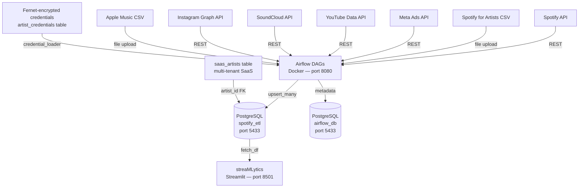
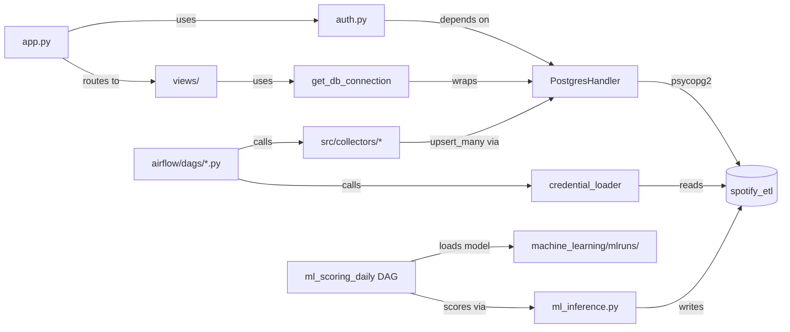
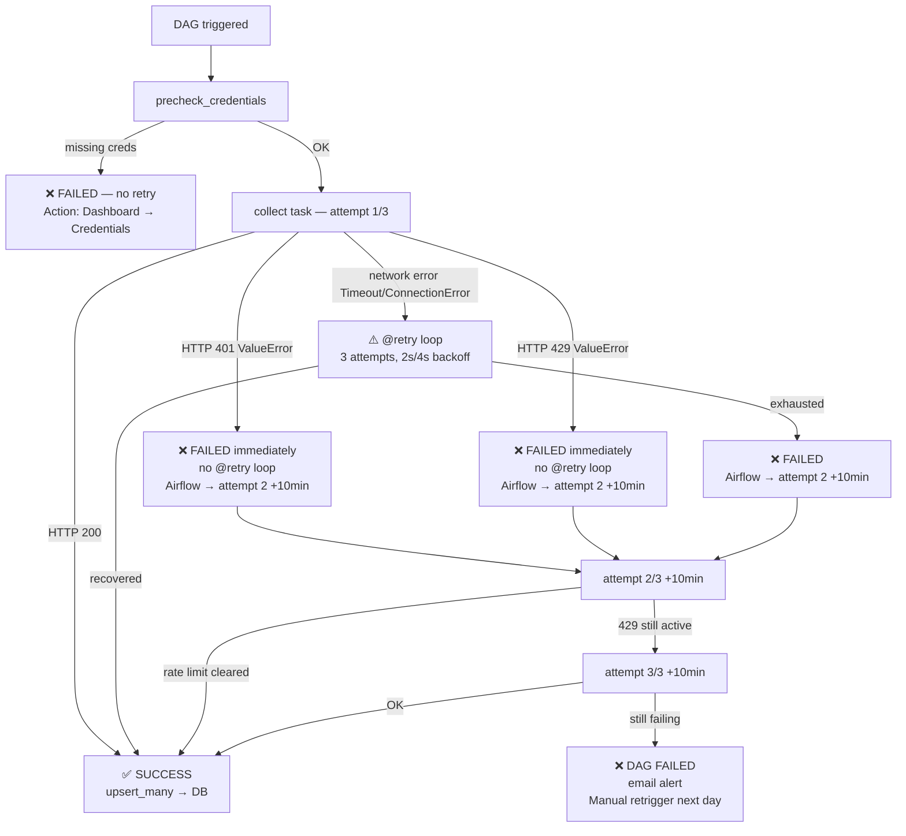

# Architecture Diagrams

*Auto-updated by the `strategic-plan-architect` background agent after each session.*
*Last updated: 2026-05-15*

---

## Macro Architecture (Service Level)

---

## Micro Architecture (Module Dependencies)

---

## Relational Classification Map

| Module | Type | Key Dependencies |
|---|---|---|
| `postgres_handler.py` | Core | psycopg2 |
| `app.py` | Core | auth.py, all views, get_db_connection |
| `init_db.sql` | Core | Docker entrypoint (runs once) |
| `auth.py` | Core | PostgresHandler, saas_artists table |
| `views/*.py` | Feature | get_db_connection, st.session_state |
| `airflow/dags/*.py` | Feature | collectors, credential_loader |
| `src/collectors/*.py` | Sub | platform APIs, PostgresHandler |
| `airflow/debug_dag/*.py` | Sub | mirrors its production DAG |
| `src/database/*_schema.py` | Sub | PostgresHandler |
| `src/transformers/*.py` | Sub | CSV input, feeds collectors |
| `retry.py` | Utility | — |
| `error_handler.py` | Utility | email_alerts |
| `config_loader.py` | Utility | config/config.yaml |
| `credential_loader.py` | Utility | PostgresHandler, Fernet |
| `freshness_monitor.py` | Utility | PostgresHandler |
| `.claude/hooks/*.py` | Hook | system events (PostToolUse, Stop, UserPromptSubmit) |

---

## Data Flow by Platform

| Platform | Collector | Table(s) | DAG |
|---|---|---|---|
| Spotify API | `spotify_api.py` | `spotify_tracks`, `spotify_top_tracks` | `spotify_api_daily` |
| Spotify for Artists | `s4a_csv_watcher.py` | `s4a_songs_global`, `s4a_song_timeline`, `s4a_audience` | `s4a_csv_watcher` |
| Meta Ads (API) | `meta_ads_api_collector.py` | `meta_campaigns`, `meta_adsets` (+ 10 targeting cols), `meta_ads` (+ title/body/cta), `meta_insights_performance`, `meta_insights_performance_day`, `meta_insights_performance_age`, `meta_insights_performance_country`, `meta_insights_performance_placement`, `meta_insights_engagement`, `meta_insights_engagement_day`, `meta_insights_engagement_age`, `meta_insights_engagement_country`, `meta_insights_engagement_placement` | `meta_ads_api_daily` |
| Meta Ads (CSV fallback) | `meta_csv_watcher.py` | `meta_campaigns`, `meta_adsets`, `meta_ads` | `meta_config_dag` |
| Meta Insights (CSV fallback) | `meta_insight_watcher.py` | `meta_insights_performance`, `meta_insights_engagement` | `meta_insights_dag` |
| YouTube | `youtube_collector.py` | `youtube_channels`, `youtube_channel_history`, `youtube_videos` | `youtube_daily` |
| SoundCloud | `soundcloud_api_collector.py` | `soundcloud_tracks` | `soundcloud_daily` |
| Instagram | `instagram_api_collector.py` | `instagram_media`, `instagram_stories` | `instagram_daily` |
| Apple Music | `meta_csv_watcher.py` (reused) | `apple_songs_performance`, `apple_daily_plays`, `apple_listeners` | `apple_music_csv_watcher` |
| iMusician | manual entry | `imusician_monthly_revenue` | — |
| ML scoring | `ml_inference.py` | `ml_song_predictions` | `ml_scoring_daily` |

> **Meta Ads — dual ingestion paths (since 2026-03-27, extended 2026-03-28):**
>
> **Path A — API (daily, automatic):** `meta_ads_api_daily` DAG runs at 05:00 UTC via `meta_ads_api_collector.py`. Uses `facebook_business` SDK. Fetches campaigns / adsets / ads / creatives, then 10 insight breakdown tables (performance + engagement, each with _day / _age / _country / _placement variants). All SDK list calls are wrapped by `_meta_list()` which retries on code 17 (per-ad-account hourly rate limit) with 60/120/180s progressive backoff. `run(insights_only=True)` mode skips the config fetch and loads campaign list from DB instead, reducing API calls by ~75% — intended for repeated manual runs to avoid triggering the hourly quota. Breakdown rows are trimmed to their slim schema before upsert.
>
> **Path B — CSV (manual fallback):** `meta_config_dag` + `meta_insights_dag` remain active for artists without API credentials. Both paths write idempotently to the same tables via ON CONFLICT DO UPDATE.
>
> **Schema state (migration 017):** `meta_insights_performance` and 4 breakdown tables have `custom_conversions INT DEFAULT 0`. `results = custom_conversions` (alias, backward-compat). `link_click` removed from `_RESULT_ACTION_TYPES` — was double-counting fans who clicked the ad AND the Spotify button on Hypeddit. CPR = `spend / custom_conversions` (offsite_conversion.custom only). `lp_views` = landing_page_view action count. Full funnel: impressions → link_clicks → lp_views → custom_conversions.
>
> **Meta CAPI (Hypeddit native):** Hypeddit supports server-side CAPI natively. Token generated in Events Manager → Dataset Quality API integration. Once configured, `custom_conversions` is populated with ~95%+ signal coverage (vs ~65% pixel-only on iOS/Safari). No code change required — collector already captures `offsite_conversion.custom`.

---

## DAG Failure & Rate-Limit Management

### Strategy per platform

| Collector | Rate-limit exception | @retry behavior | Airflow retry | Notes |
|---|---|---|---|---|
| SoundCloud | `ValueError` (non-retriable) | Bypasses 3-attempt loop immediately | 2× / 10 min delay | 429 → Airflow handles |
| Instagram | `ValueError` (non-retriable) | Bypasses 3-attempt loop immediately | 2× / 10 min delay | Same pattern |
| Meta Ads | Custom `_meta_list()` retry | code 17 → 60/120/180s progressive sleep | 2× / 10 min delay | SDK-level rate limit |
| Spotify | SDK exception (no explicit 429) | Caught as generic Exception → 3 retries | 2× / 10 min delay | Spotipy handles internally |
| YouTube | SDK exception (no explicit 429) | Caught as generic Exception → 3 retries | 2× / 10 min delay | googleapiclient handles |

### Failure flow diagram

### Root causes for 429 spikes to avoid

- **Infinite pagination loop** — fixed 2026-03-27: `if data.get('next_href') and collection`
- **Multiple manual triggers in rapid succession** — each run = N API calls, compounding quickly
- **@retry rapid re-attempts on 429** — fixed 2026-03-27: 429 raises `ValueError` (non-retriable), bypasses local retry

### Safe retrigger rule

After a 429 DAG failure : wait **minimum 30 minutes** before manual retrigger. The daily schedule (9h) is safe by design — 24h between runs = no rate-limit risk under normal operation.

---

## Dashboard Views Map

| View file | Page name | Data sources | Role |
|---|---|---|---|
| `home.py` | Home | All tables (KPI + freshness) | all |
| `spotify_s4a_combined.py` | Spotify + S4A | spotify_tracks, s4a_* | all |
| `meta_ads_overview.py` | Meta Ads | meta_insights_performance (+ custom_conversions, lp_views), meta_insights_performance_day/age/country/placement, meta_insights_engagement | all |
| `perf_monitor.py` | Perf. Dashboard | st.session_state._perf_log, psutil, DB ping | admin |
| `meta_x_spotify.py` | Meta × Spotify | meta_insights, spotify_tracks | all |
| `youtube.py` | YouTube | youtube_* | all |
| `soundcloud.py` | SoundCloud | soundcloud_tracks | all |
| `instagram.py` | Instagram | instagram_* | all |
| `apple_music.py` | Apple Music | apple_* | all |
| `hypeddit.py` | Hypeddit | hypeddit_* | all |
| `imusician.py` | iMusician | imusician_monthly_revenue | all |
| `trigger_algo.py` | Trigger Algo | ml_song_predictions | all |
| `ml_performance.py` | ML Performance | ml_song_predictions, mlruns | admin |
| `airflow_kpi.py` | Airflow KPI | Airflow REST API | admin |
| `admin.py` | Admin | saas_artists, artist_credentials | admin |
| `credentials/` (package) | Credentials API | artist_credentials | all |
| `upload_csv.py` | Upload CSV | all CSV-sourced tables | all |
| `export_csv.py` | Export CSV (ZIP or Excel) | all tables | all |
| `export_pdf.py` | Export PDF (xhtml2pdf; S4A, YouTube, Instagram, Meta, SoundCloud, Apple Music) | all tables | all |
| `useful_links.py` | Useful Links | static | admin |

> **`credentials/` package (since 2026-05-15, commit `acf8b6f` — refactor R1):**
> The former 892-line single-file `views/credentials.py` was split into a package
> (pure cut/paste, zero logic change). Public surface unchanged:
> `from views.credentials import show`.
>
> | Module | Role |
> |---|---|
> | `__init__.py` | re-exports `show` (stable import path) |
> | `router.py` | slim `show()` entry point |
> | `_core.py` | Fernet crypto + DB load/save + Airflow-state + constants |
> | `_registry.py` | `PLATFORMS` dict + `CONNECTION_TESTS` + guide dispatch |
> | `_render.py` | Streamlit render/form helpers + `_handle_save` |
> | `_platform_spotify.py` / `_platform_youtube.py` / `_platform_soundcloud.py` / `_platform_meta.py` | per-platform connection-test + setup-guide pair |
>
> The `_fetch_dag_last_states` Airflow N+1 helper moved from `credentials.py:118`
> to `credentials/_core.py` (referenced in the P3 perf item). This is R1 of the
> sequenced dashboard refactor program — full R1–R6 queue, guardrails and DoD
> live in `.claude/dev-docs/roadmap/refactor-program.md` (spec:
> `refactor-audit-dashboard.md` #3). Not duplicated here.

> **YouTube collector — silent-success compliance (since 2026-05-15, commit `3b63984`):**
> `youtube_collector.py` `get_video_comments()` and `get_playlists()` previously
> `return [partial]` inside their `except` blocks — a P2 collector-silent-success
> bug (a partial fetch could mark a DAG SUCCESS with truncated data). Both now
> `raise`, matching CLAUDE.md cross-cutting rule #6. The YouTube collector is now
> fully compliant; `audit-collectors.md` status table corrected and
> `error-classes.md` `collector-silent-success` History appended.
