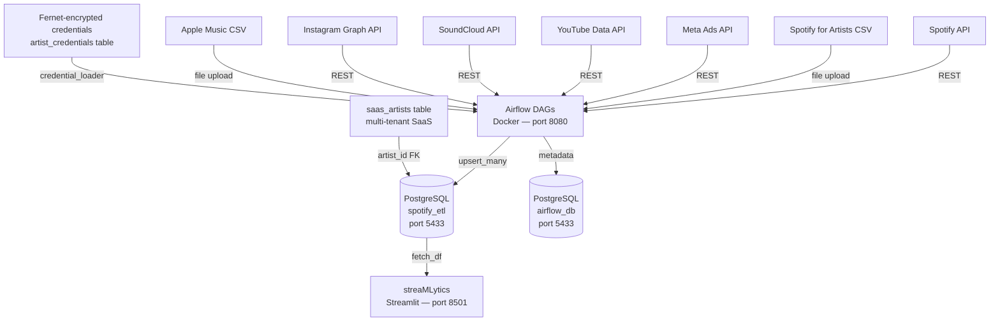
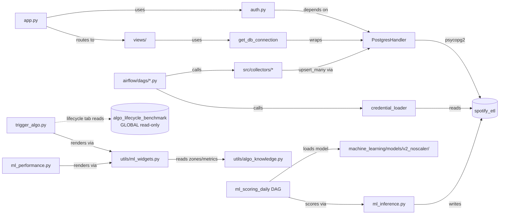
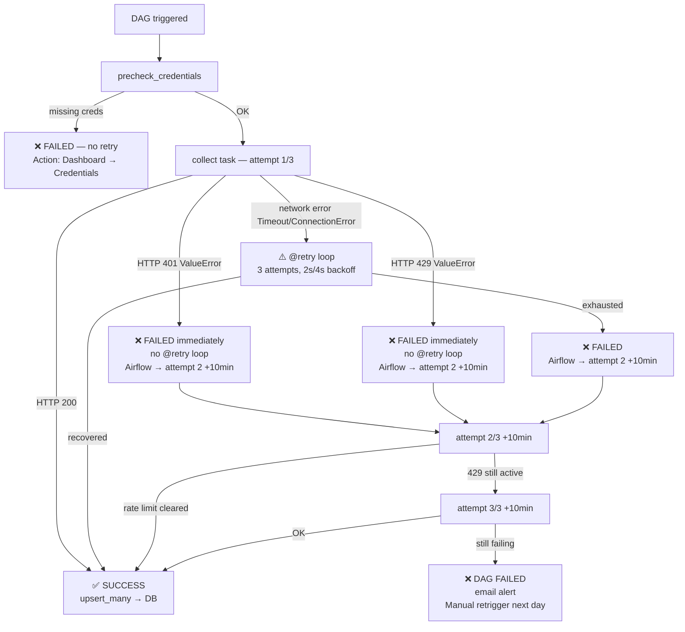

# Architecture Diagrams

*Auto-updated by the `strategic-plan-architect` background agent after each session.*
*Last updated: 2026-05-30 (Road to Algorithms: volume/regressor decision layer — new ALGO_VOLUME_ZONES + regressor render helpers in the existing utils modules; no service topology change)*

---

## Macro Architecture (Service Level)

---

## Micro Architecture (Module Dependencies)

---

## Relational Classification Map

| Module | Type | Key Dependencies |
|---|---|---|
| `postgres_handler.py` | Core | psycopg2 |
| `app.py` | Core | auth.py, all views, get_db_connection |
| `init_db.sql` | Core | Docker entrypoint (runs once) |
| `auth.py` | Core | PostgresHandler, saas_artists table |
| `views/*.py` | Feature | get_db_connection, st.session_state |
| `dashboard/utils/geo.py` | Utility | pycountry (ISO-2→ISO-3 for choropleth) |
| `dashboard/utils/charts.py` | Utility | plotly (shared `pareto_spend_cpr`) |
| `dashboard/utils/algo_knowledge.py` | Utility | PURE (no st/DB) — classification: algo-keyed `ALGO_FEATURE_ZONES` (DW + Radio + RR populated)/`RADIO_FEATURE_ZONES`/`RR_FEATURE_ZONES`/`ALGO_CALIBRATION_BANDS` (DW only)/`ALGO_MODEL_METRICS`/`ALGO_LABELS`; volume/regressor: `ALGO_VOLUME_ZONES` (DW only)/`ALGO_REGRESSOR_METRICS`/`FORECAST_FLOOR_DISCLAIMER`/`volume_scaling_threshold`; helpers `populated_algos`/`build_coach_actions`/`velocity_penalty_threshold` + registry-aware `_spec`/`zone_for_value`/`decode_feature_value` (serve both zone registries) |
| `dashboard/utils/ml_widgets.py` | Utility | streamlit + plotly — classification scorecard + feature gauges + `render_coach` ranked to-do list; volume layer: `render_floor_forecast`/`floor_forecast_text`/`render_regressor_badge`/`render_volume_gauges`/`render_shap_narrative` (registry-threaded `_render_one_gauge`/`_live_value`). Consumes algo_knowledge |
| `airflow/dags/*.py` | Feature | collectors, credential_loader |
| `src/collectors/*.py` | Sub | platform APIs, PostgresHandler |
| `airflow/debug_dag/*.py` | Sub | mirrors its production DAG |
| `src/database/*_schema.py` | Sub | PostgresHandler |
| `src/transformers/*.py` | Sub | CSV input, feeds collectors |
| `retry.py` | Utility | — |
| `error_handler.py` | Utility | email_alerts |
| `config_loader.py` | Utility | config/config.yaml |
| `credential_loader.py` | Utility | PostgresHandler, Fernet |
| `freshness_monitor.py` | Utility | PostgresHandler |
| `.claude/hooks/*.py` | Hook | system events (PostToolUse, Stop, UserPromptSubmit) |

---

## Data Flow by Platform

| Platform | Collector | Table(s) | DAG |
|---|---|---|---|
| Spotify API | `spotify_api.py` | `spotify_tracks`, `spotify_top_tracks` | `spotify_api_daily` |
| Spotify for Artists | `s4a_csv_watcher.py` | `s4a_songs_global`, `s4a_song_timeline`, `s4a_audience` | `s4a_csv_watcher` |
| Meta Ads (API — **sole writer** since 2026-05-29) | `meta_ads_api_collector.py` | `meta_campaigns`, `meta_adsets` (+ 10 targeting cols), `meta_ads` (+ title/body/cta), campaign-grain: `meta_insights_performance` + `_day/_age/_country/_placement`, `meta_insights_engagement` + `_day/_age/_country/_placement`; **ad/adset-grain (NEW): `meta_insights_{performance,engagement}_{ad,adset}_{country,placement,age}`** (12 tables, migration 032 — lifetime aggregates, no date col) | `meta_ads_api_daily` |
| YouTube | `youtube_collector.py` | `youtube_channels`, `youtube_channel_history`, `youtube_videos` | `youtube_daily` |
| SoundCloud | `soundcloud_api_collector.py` | `soundcloud_tracks` | `soundcloud_daily` |
| Instagram | `instagram_api_collector.py` | `instagram_media`, `instagram_stories` | `instagram_daily` |
| Apple Music | `apple_music_csv_parser.py` | `apple_songs_performance`, `apple_daily_plays`, `apple_listeners` | `apple_music_csv_watcher` |
| iMusician | manual entry + CSV import | `imusician_sales_detail` (raw, per-line) → `imusician_monthly_revenue` (DERIVED, rolled up) | `imusician_csv_watcher` |
| ML scoring | `ml_inference.py` (**v3**, group-CV rebuild 2026-06-05) | `ml_song_predictions` (+`pi_forecast_7d`), `s4a_song_saves_daily` (saves history → resurrection radar) | `ml_scoring_daily` |
| ML outcome labelling (NEW 2026-06-12) | `ml_outcome_labeling.py` | `s4a_song_algo_outcomes` (manual realized DW/RR/Radio streams, windowed 7d/28d/custom — capture in Saisie S4A), `ml_prediction_outcomes` (training-ready labelled pairs; labels use **28d only**) | `ml_outcome_labeling` (weekly Mon 06:00) |
| Algo lifecycle benchmark | `machine_learning/export_lifecycle_benchmark.py` (offline) | `algo_lifecycle_benchmark` (GLOBAL / non-tenant, read-only, NOT in `_ALLOWED_TABLES`) | none (manual seed via migration 035; PROVISIONAL) |

> **Song-title convention boundary (since 2026-06-08, error class `song-name-convention-mismatch`):**
> Filename-derived tables (`s4a_song_timeline`, `ml_song_predictions`, the manual-entry tables) carry
> `_` because S4A replaces the Windows-reserved set `< > : " / \ | ? *` in export filenames, while
> CSV/API-derived tables (`s4a_songs_global`, `s4a_song_saves_daily`, `tracks`,
> `track_popularity_history`, `campaign_track_mapping`) keep the real characters. Any **exact-match
> title join across this boundary** must route the CSV/API side through `canonical_song_sql()` (or
> normalise on write via `canonical_song()`) — both single-sourced in `src/utils/track_matching.py`
> (preserve accents/remix, unlike `normalize_track_title()`). Applied: `parse_songs_global`
> (write-side), `_tab_algos.py`, `meta_cpr_optimizer.py`, `router.py` (query-side); migration 043
> backfilled existing `?`-titled rows. `track_release_reference` was already immune.

> **Meta Ads — SINGLE ingestion path (since 2026-05-29 — legacy CSV stack archived):**
>
> ⚠️ **Single-writer consolidation (2026-05-29, P2 fix):** the Meta tables previously had a DUAL WRITER — the API collector AND the one-time Dec-2025 legacy Meta CSV stack — writing with incompatible conventions (aggregate `'All'` total rows + French placement labels vs API snake_case), inflating campaign-grain breakdown spend ~2×. The entire redundant CSV stack (8 files: DAGs `meta_config_dag`/`meta_insights_dag`, watchers `meta_csv_watcher`/`meta_insight_watcher`, parsers, debug scripts) is now ARCHIVED to `archive/legacy_meta_csv/`; all dashboard/alerting references repointed to the canonical `meta_ads_api_daily`; `archive/` added to `.dockerignore`. **The Meta tables now have exactly ONE writer (`meta_ads_api_collector` / `meta_ads_api_daily`) → the double-count cannot recur.** Residual (low risk): campaign-grain breakdowns key on `campaign_name`, so a future campaign RENAME could re-introduce stale rows (ad/adset grains key by ID, immune). The spurious rows were already cleaned (all grains reconcile to the day total).
>
> **API (daily, automatic):** `meta_ads_api_daily` DAG runs at 05:00 UTC via `meta_ads_api_collector.py`. Uses `facebook_business` SDK. Fetches campaigns / adsets / ads / creatives, then the insight breakdown tables: campaign-grain (performance + engagement, each with _day / _age / _country / _placement) PLUS, since 2026-05-29, **ad-grain and adset-grain breakdowns** `meta_insights_{performance,engagement}_{ad,adset}_{country,placement,age}` (12 tables, migration 032 — lifetime aggregates, no date col) via the new `_fetch_breakdown(level, id_field, breakdown, goal_by_entity)` helper (`_build_goal_maps` now also returns `goal_by_adset`; +6 API calls/run). Since 2026-05-29 SDK list/get calls go through the generic `_meta_retry()` (retries throttle codes `{4,17,32,80004}` with 60→120→240s exponential backoff, 4 attempts, materialising the cursor inside the retry); `_meta_list()` delegates to it. `run(insights_only=True)` mode skips the config fetch and loads campaign list from DB instead, reducing API calls by ~75% — intended for repeated manual runs to avoid triggering the hourly quota. `run(fetch_creatives=False)` skips the per-creative content fetch (title/body/CTA — one call per creative, the dominant rate-limit driver). Breakdown rows are trimmed to their slim schema before upsert.
>
> **Paused/archived scope + retention clamp (since 2026-05-29, P2 fix):** the config fetch previously filtered `effective_status: ['ACTIVE','PAUSED']` for all three levels. A PAUSED campaign propagates `CAMPAIGN_PAUSED`/`ADSET_PAUSED` to its ad sets/ads, so those ads were excluded from `meta_ads`; `_build_goal_maps` lacked them and `_fetch_ad_insights` silently dropped the ad-level insights the API returned via the FK guard `if ad_id not in goal_by_ad: continue` — campaign spend present, per-creative breakdown missing. Fix: per-level allowlists `_CAMPAIGN_STATUSES` / `_ADSET_STATUSES` / `_AD_STATUSES` (incl. CAMPAIGN_PAUSED, ADSET_PAUSED, ARCHIVED, IN_PROCESS, WITH_ISSUES). Including ARCHIVED surfaced an aberrant start_time → backfill `since=1970-01-01` → Meta error #3018 (start beyond 37 months); `history_start` is now clamped to `today − _META_INSIGHTS_RETENTION_MONTHS` (36). To backfill paused campaigns: a FULL full-history collection is required (not insights_only). **Known limitation:** a throttle on a late aggregate call discards all already-fetched insights of the run (no per-chunk persistence).
>
> **CSV path — REMOVED (archived 2026-05-29):** `meta_config_dag` + `meta_insights_dag` (and their watchers/parsers) are no longer active — moved to `archive/legacy_meta_csv/`. Artists without API credentials must configure the Meta API (no CSV fallback remains). The CSV parser was patched to skip aggregate/total rows before archival (defense), and `TestMetaCSVParser` was removed from the suite.
>
> **Schema state (migration 017):** `meta_insights_performance` and 4 breakdown tables have `custom_conversions INT DEFAULT 0`. `results = custom_conversions` (alias, backward-compat). `link_click` removed from `_RESULT_ACTION_TYPES` — was double-counting fans who clicked the ad AND the Spotify button on Hypeddit. CPR = `spend / custom_conversions` (offsite_conversion.custom only). `lp_views` = landing_page_view action count. Full funnel: impressions → link_clicks → lp_views → custom_conversions.
>
> **Meta CAPI (Hypeddit native):** Hypeddit supports server-side CAPI natively. Token generated in Events Manager → Dataset Quality API integration. Once configured, `custom_conversions` is populated with ~95%+ signal coverage (vs ~65% pixel-only on iOS/Safari). No code change required — collector already captures `offsite_conversion.custom`.
>
> **iMusician — derived monthly-revenue table (since 2026-05-29, P2 fix):** CSV imports
> write raw per-line rows to `imusician_sales_detail`; `imusician_monthly_revenue` is a
> DERIVED table rolled up from it by `src/utils/imusician_rollup.py::rollup_sales_to_monthly`.
> The roll-up must fire from ALL THREE import paths: Streamlit upload (`upload_csv.py`),
> the watcher DAG (`imusician_csv_watcher.py::process_csv_files`), and the debug script
> (`debug_imusician_csv.py::step_5_real_upsert`). It originally lived only in the Streamlit
> path, so files imported by the DAG left `monthly_revenue` stale (showed ~5% of real
> revenue, no error). Both the Distributeur view (`imusician.py`) and the revenue-forecast
> KPIs read `monthly_revenue` only. The `source` column (`manual|import`, migration 031)
> distinguishes hand-entered months from rolled-up ones; the roll-up writes `source='import'`.
>
> **Objective-driven `results` (since 2026-05-28, P2 fix):** the dashboard "Résultats" metric is now Meta's native result *per campaign objective* (user-confirmed decision), not a fixed conversion action. `meta_ads_api_collector.py` previously hardcoded `results` to count only `offsite_conversion.custom`; on the test account all 15 campaigns are `OUTCOME_ENGAGEMENT` (0 custom conversions) so `results` was written `0` every day and the daily upsert overwrote correct CSV-imported values. Fix: `_OBJECTIVE_RESULT_ACTION` maps objective → action type (`OUTCOME_ENGAGEMENT→post_engagement`, `OUTCOME_TRAFFIC→link_click`, `OUTCOME_LEADS/SALES→offsite_conversion.custom`, `OUTCOME_APP_PROMOTION→app_install`; unknown/NULL/awareness → fallback to `custom_conversions`). Objective is propagated from `meta_campaigns` into `_extract_perf` via `objective_by_name` across all 4 `_call_insights` calls + the `insights_only` DB query. Requires a `full_history` re-collection of the Meta DAG to backfill historical `results`. `meta_x_spotify.py` CPR now reads the real `cpr` column from Meta, falling back to `spend/results` only where `cpr` is null but `results>0`.

---

## DAG Failure & Rate-Limit Management

### Strategy per platform

| Collector | Rate-limit exception | @retry behavior | Airflow retry | Notes |
|---|---|---|---|---|
| SoundCloud | `ValueError` (non-retriable) | Bypasses 3-attempt loop immediately | 2× / 10 min delay | 429 → Airflow handles |
| Instagram | `ValueError` (non-retriable) | Bypasses 3-attempt loop immediately | 2× / 10 min delay | Same pattern |
| Meta Ads | `_meta_retry()` (since 2026-05-29) | codes {4,17,32,80004} → 60/120/240s exp backoff, 4 attempts | 2× / 10 min delay | BUC 80004 needs cooldown — re-running harder pins the score |
| Spotify | SDK exception (no explicit 429) | Caught as generic Exception → 3 retries | 2× / 10 min delay | Spotipy handles internally |
| YouTube | SDK exception (no explicit 429) | Caught as generic Exception → 3 retries | 2× / 10 min delay | googleapiclient handles |

### Failure flow diagram

### Root causes for 429 spikes to avoid

- **Infinite pagination loop** — fixed 2026-03-27: `if data.get('next_href') and collection`
- **Multiple manual triggers in rapid succession** — each run = N API calls, compounding quickly
- **@retry rapid re-attempts on 429** — fixed 2026-03-27: 429 raises `ValueError` (non-retriable), bypasses local retry

### Safe retrigger rule

After a 429 DAG failure : wait **minimum 30 minutes** before manual retrigger. The daily schedule (9h) is safe by design — 24h between runs = no rate-limit risk under normal operation.

---

## Dashboard Views Map

| View file | Page name | Data sources | Role |
|---|---|---|---|
| `home.py` | Home | All tables (KPI + freshness) | all |
| `spotify_s4a_combined.py` | Spotify + S4A | spotify_tracks, s4a_* | all |
| `meta_ads_overview.py` | Meta Ads | meta_insights_performance (+ custom_conversions, lp_views), meta_insights_performance_day/age/country/placement, meta_insights_engagement, meta_adsets (targeting × CPR — "🎯 Ciblage vs Performance") | all |
| `meta_creatives.py` | Créatives Meta — 6 tabs (Classement/Comparaison/Funnel/Évolution/Fatigue/Activité) + per-creative multi-metric timeline since 2026-05-29 | meta_insights (ad grain), meta_ads | all |
| `meta_breakdowns.py` | 🌍 Breakdowns Meta (since 2026-05-29) — campaign→adset→creative cascade, dimension (country/placement/age) × metric-family (perf/engagement); choropleth (utils/geo.py) + Pareto (utils/charts.py::pareto_spend_cpr) | all |
| `perf_monitor.py` | Perf. Dashboard | st.session_state._perf_log, psutil, DB ping | admin |
| `meta_x_spotify.py` | Meta × Spotify | meta_insights, spotify_tracks, campaign_track_mapping (read-only) | all |
| `meta_mapping.py` | Mapping Spotify × Meta Ads (nom de campagne) — under "Données" section since 2026-05-28 | campaign_track_mapping (read+write, artist_id NOT NULL) | all |
| `youtube.py` | YouTube | youtube_* | all |
| `soundcloud.py` | SoundCloud | soundcloud_tracks | all |
| `instagram.py` | Instagram | instagram_* | all |
| `apple_music.py` | Apple Music | apple_* | all |
| `hypeddit.py` | Hypeddit | hypeddit_* | all |
| `imusician.py` | iMusician (Distributeur) | imusician_monthly_revenue (derived from imusician_sales_detail) | all |
| `revenue_forecast.py` | 📈 Prévisions revenus | imusician_monthly_revenue (derived), ml_song_predictions | basic+ |
| `trigger_algo.py` | Trigger Algo — 7 tabs (Global/Suivi Algos/Budget/Explainabilité/Modèle/Cycle de vie & Benchmark/**Streams algos générés** — last one NEW 2026-06-12: stacked bar of realized DW/RR/Radio streams, cumulative total + per-playlist, 7d/28d/custom, from `s4a_song_algo_outcomes`); Modèle + Explainabilité tabs stack ALL populated algos (DW + Radio + RR — all 3 populated as of 2026-05-30) via `ml_widgets` scorecard / feature gauges + `algo_knowledge` zones; volume layer (2026-05-30): floor wording in `_display_prob_bar`, `render_volume_gauges` in the coach loop, regressor SHAP autopsy (`render_shap_narrative`/`render_regressor_badge`) in Explainabilité, organic budget-scaling section in Budget; Budget tab `_show_velocity_budget_advice` cross-link routes through `algo_knowledge.velocity_penalty_threshold` | ml_song_predictions, algo_lifecycle_benchmark (lifecycle tab, GLOBAL read-only) | all |
| `ml_performance.py` | ML Performance — + "Scorecard classification" tab (shared `ml_widgets`) since 2026-05-29; scorecard grid loops `ak.populated_algos()` (no hardcoded algo tuple) since 2026-05-30 | ml_song_predictions, mlruns | admin |
| `airflow_kpi.py` | Airflow KPI | Airflow REST API | admin |
| `admin.py` | Admin | saas_artists, artist_credentials | admin |
| `credentials/` (package) | Credentials API — under "Données" section since 2026-05-28 (above Import CSV) | artist_credentials | all |
| `process_guide.py` | 📋 Guide de démarrage (since 2026-05-28) — downloadable PDF (WeasyPrint, HTML fallback) | static | all |
| `billing.py` | Billing — 3-column Free/Basic/Premium since 2026-05-28 | subscription_plans, artist_subscriptions, subscription_plan_history | all |
| `alerts.py` | Alerting — + plan-evolution stacked-area + users table (admin) since 2026-05-28 | subscription_plan_history, saas_artists, circuit/freshness/billing alerts | admin |
| `saisie_s4a.py` | 📝 Saisie S4A (since 2026-06-08, "Prédiction algos" section, above Road to Algo) — bulk `st.data_editor` grid (track × 7j/28j/12m + Discovery Mode) with grouped save + a custom date-range section for the days after a release. Replaced the short-lived `reglages.py` standalone view (deleted same session). S4A-UI-only signals, no API. | s4a_song_timeline + tracks (read) → s4a_song_playlist_adds (windowed, migration 044), s4a_song_discovery_mode (write) | all |
| `upload_csv.py` | Upload CSV | all CSV-sourced tables | all |
| `export_csv.py` | Export CSV (ZIP or Excel) | all tables | all |
| `export_pdf.py` | Export PDF (WeasyPrint; promoted right after Accueil since 2026-06-08) — full visual redesign 2026-06-08: branded cover + headline KPIs, "Dernière sortie" spotlight, charts embedded via `utils/pdf_charts.py` (matplotlib→base64 PNG, no new dep); emoji stripped before `write_pdf` (WeasyPrint base fonts lack glyphs); "Depuis le début" all-time period; sections all-checked by default, song selectors auto-focus latest release | all tables | all |
| `useful_links.py` | Useful Links | static | admin |

> **`credentials/` package (since 2026-05-15, commit `acf8b6f` — refactor R1):**
> The former 892-line single-file `views/credentials.py` was split into a package
> (pure cut/paste, zero logic change). Public surface unchanged:
> `from views.credentials import show`.
>
> | Module | Role |
> |---|---|
> | `__init__.py` | re-exports `show` (stable import path) |
> | `router.py` | slim `show()` entry point |
> | `_core.py` | Fernet crypto + DB load/save + Airflow-state + constants |
> | `_registry.py` | `PLATFORMS` dict + `CONNECTION_TESTS` + guide dispatch |
> | `_render.py` | Streamlit render/form helpers + `_handle_save`; renders the per-platform setup guide inline (since 2026-06-08, from the content modules — replaces the old prose `_guide_*`) |
> | `_platform_spotify.py` / `_platform_youtube.py` / `_platform_soundcloud.py` / `_platform_meta.py` | per-platform connection test. SoundCloud/Meta tests fall back to env app creds (ADDITIVE, since 2026-06-08) when the artist supplied only `user_id`/`account_id` |
>
> **Shared-app credentials + single-source guides (since 2026-06-08, commits `8d17fb3`/`53ca6d8`):**
> Setup-guide content lives in `src/dashboard/content/credential_guides.py` (+ `_st.py` render helper) —
> one source for Spotify/YouTube/SoundCloud/Meta (steps, screenshots under `assets/credential_guide/`,
> URLs, example values), rendered per-platform tab. The app creds for the *shared* SoundCloud/Meta app
> resolve from env (`SOUNDCLOUD_CLIENT_ID/SECRET`, `META_ACCESS_TOKEN/APP_ID/APP_SECRET`) when the artist
> supplied only the per-tenant pointer; stored per-artist creds always win (existing tenants unchanged).
> Token lifecycle (type / expiry / refresh / who acts) is documented in the admin "🔑 Tokens" tab, not the
> artist view.
>
> The `_fetch_dag_last_states` Airflow N+1 helper moved from `credentials.py:118`
> to `credentials/_core.py` (referenced in the P3 perf item). This is R1 of the
> sequenced dashboard refactor program — full R1–R6 queue, guardrails and DoD
> live in `.claude/dev-docs/roadmap/refactor-program.md` (spec:
> `refactor-audit-dashboard.md` #3). Not duplicated here.

> **Subscription plan history + welcome trial (since 2026-05-28, migration 029):**
> `subscription_plan_history` is an append-only audit table (migration 029, with an
> idempotent backfill of existing artists). Every plan-mutation path now writes a row via
> `src/utils/plan_history.py:log_plan_change()`: `register.py` (welcome_trial + promo),
> `admin.py` (admin_edit), `api/routers/stripe_webhook.py` (stripe_webhook). New signups
> auto-receive a 30-day premium trial (`WELCOME_TRIAL_DAYS`) resolved via `promo_plan`
> precedence in `get_artist_plan()`, plus a `send_welcome_email()` recap. `alerts.py`
> renders a plan-evolution stacked-area chart + a users table from this table. Tiering
> (2026-06-09): **2 tiers only** — `free` (analytics + Export PDF) and `premium`
> (`{'*'}`: Road to Algo/ML, revenue_forecast, Meta advanced). The retired `basic`
> collapses onto premium via `stripe_schema.normalize_plan()`; PDF export gates
> Premium-only sections (`PREMIUM_SECTIONS`).
>
> **Road to Algorithms knowledge layer (since 2026-05-29 — WAVE 2/3/4):**
> `dashboard/utils/algo_knowledge.py` is the PURE, algo-keyed source of truth
> (`ALGO_FEATURE_ZONES`, `RADIO_FEATURE_ZONES`, `RR_FEATURE_ZONES`,
> `ALGO_CALIBRATION_BANDS`, `ALGO_MODEL_METRICS`, `ALGO_LABELS` + pure helpers
> `populated_algos`, `build_coach_actions`, `velocity_penalty_threshold`; no
> Streamlit/DB import — unit-tested, 29 tests). **Discover Weekly**, **Radio**
> (WAVE 3, 2026-05-30) and **Release Radar** (WAVE 4, 2026-05-30) are now all
> populated (registration order DW/RR/RADIO). RR was the reserved-but-empty slot
> already wired everywhere structurally; WAVE 4 added only `RR_FEATURE_ZONES`
> (6 features) + `ALGO_MODEL_METRICS["RR"]` so the UI (trigger_algo Algos/Modèle
> tabs + ml_performance scorecard grid) lights up with ZERO view-code changes.
> RR zones were sourced from the offline SHAP zoom ARTIFACTS
> (`mlruns/4/.../5_SHAP_Zoom_*_RR.png`), not the prose notes — the plots refined
> them: `DaysSinceRelease` is a firing WINDOW (dip 0–7d, sweet 7–40d, then closes)
> not an on/off cliff; `ReleaseConsistencyNum` is feature #4 (absent from notes,
> rewards spaced releases); `DiscoveryMode` is dead-flat. RR scorecard is
> pixel-verified vs `1_Dashboard_Performances_RR.png` (confusion {TN76,FP6,FN4,TP16},
> AUC 0.961, AP 0.88, lift_top10 5.1). RR's `PlaylistAddsLast28Days` is
> `divergent + actionable:False` — its negative SHAP is a chronological song-age
> confound (not a causal lever), so it shows in gauges with a warning but is
> excluded from coach actions (same class as the `ListenersStreamRatio`
> inverted-bug). RR carries NO calibration bands (no `Calibration_Curve_RR.png`
> artifact exists — only DW has one; `test_rr_has_no_calibration_bands` documents
> the gap). Radio's zones differ from and partly INVERT DW's — `DaysSinceRelease` honeymoon 0–50d
> bonus → flat-negative-but-stable (opposite of DW), velocity penalty stricter
> (1.5 vs DW 1.2), catalog sweet-spot 10–20. Radio's metrics show real lift
> (AUC 0.941, n=102, balanced baseline 0.529) but carry NO calibration bands
> (honest — no calibration curve in the source notes). The hyper-growth velocity
> cutoff is a SINGLE SOURCE OF TRUTH: `velocity_penalty_threshold(algo)` — views
> (e.g. `trigger_algo._show_velocity_budget_advice`) route both the gate and the
> displayed number through it, never re-encoding 1.2/1.5 as literals.
> `dashboard/utils/ml_widgets.py` is the render layer (Streamlit + Plotly): a
> classification scorecard reused by BOTH the `trigger_algo` Modèle tab and the
> admin `ml_performance.py` "Scorecard classification" tab, plus the feature
> decision gauges + `render_coach` (ranked prescriptive to-do list, Discovery-Mode
> prompt for Radio — formerly `render_next_best_lever`) + fake-buzz guard +
> calibration badge in the `trigger_algo` Explainabilité tab, which now stacks
> ALL populated algos (loop over `populated_algos`). Render layer consumes the
> knowledge layer — dependency is one-way (`ml_widgets → algo_knowledge`), never
> the reverse.
>
> ✅ **`ListenersStreamRatio28Days_adj` — inverted/clamped bug RESOLVED (audited 2026-05-30):**
> previously a P2 candidate (computed `float(min(ratio, 1.0))` with `ratio =
> listeners/streams` — inverted AND clamped). Now `streams/listeners` at
> `src/utils/ml_inference.py:176`, aligned with both training and the dashboard zone.
> No longer a bug candidate.
>
> **Volume / regressor decision layer (since 2026-05-30):**
> Distinct from the classification/entry-zone story above, the volume layer answers
> "once a song triggers, how much volume?". The DW regressor's `*_streams_forecast_7d`
> is reframed everywhere as a conservative FLOOR (worst-case, not a point estimate) —
> wording single-sourced in `algo_knowledge.FORECAST_FLOOR_DISCLAIMER`, surfaced via
> `ml_widgets.render_floor_forecast`, wired into `trigger_algo._display_prob_bar` and the
> `revenue_forecast` ML table ("(plancher ≥)" columns). `ALGO_VOLUME_ZONES` (DW only) holds
> the regressor-SHAP zones where raw fuel (StreamsLast7Days, NonAlgoStreams28Days) drives
> volume while saves/playlist-adds are `volume_flat` ("quality buys the ticket, volume
> writes the cheque"), rendered by `render_volume_gauges`. The Budget & ROI tab adds a
> static organic-budget-scaling section (≥6000 organic/28j via `volume_scaling_threshold`),
> labelled "cible, pas écart live". Tier B (zones + scaling target) runs in
> rule+static-target mode and auto-upgrades at Phase 2: the regressor's #1 SHAP driver
> `NonAlgoStreams28Days_log`, plus `DiscoveryMode`/`RadioCount`, are imputed to 0.0 until
> Phase 2 — hence the floor reframing and "target not live" labelling. A regressor badge
> (`render_regressor_badge`, "hungry/conservative") + natural-language SHAP autopsy
> (`render_shap_narrative`, `ALGO_REGRESSOR_METRICS`) live in the Explainabilité tab. The
> zone helpers (`_spec`/`zone_for_value`/`decode_feature_value`) take a `registry=` arg so
> the same machinery serves both the classification and volume zone sets. Phase-2 dependency
> tracked by the `ml-phase2-features` brick.
>
> **YouTube collector — silent-success compliance (since 2026-05-15, commit `3b63984`):**
> `youtube_collector.py` `get_video_comments()` and `get_playlists()` previously
> `return [partial]` inside their `except` blocks — a P2 collector-silent-success
> bug (a partial fetch could mark a DAG SUCCESS with truncated data). Both now
> `raise`, matching CLAUDE.md cross-cutting rule #6. The YouTube collector is now
> fully compliant; `audit-collectors.md` status table corrected and
> `error-classes.md` `collector-silent-success` History appended.
