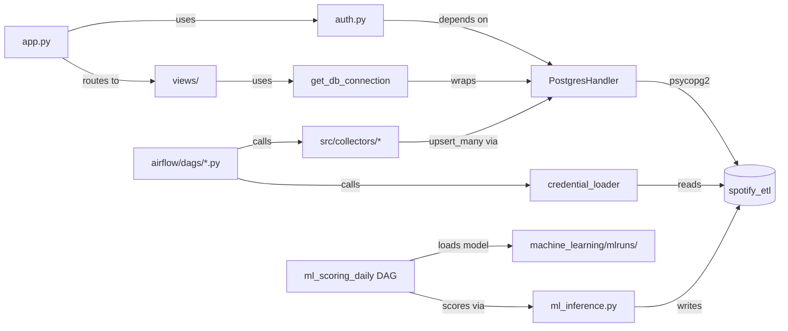

# Architecture Diagrams

*Auto-updated by the `strategic-plan-architect` background agent after each session.*
*Last updated: 2026-03-23*

---

## Macro Architecture (Service Level)

---

## Micro Architecture (Module Dependencies)

---

## Relational Classification Map

| Module | Type | Key Dependencies |
|---|---|---|
| `postgres_handler.py` | Core | psycopg2 |
| `app.py` | Core | auth.py, all views, get_db_connection |
| `init_db.sql` | Core | Docker entrypoint (runs once) |
| `auth.py` | Core | PostgresHandler, saas_artists table |
| `views/*.py` | Feature | get_db_connection, st.session_state |
| `airflow/dags/*.py` | Feature | collectors, credential_loader |
| `src/collectors/*.py` | Sub | platform APIs, PostgresHandler |
| `airflow/debug_dag/*.py` | Sub | mirrors its production DAG |
| `src/database/*_schema.py` | Sub | PostgresHandler |
| `src/transformers/*.py` | Sub | CSV input, feeds collectors |
| `retry.py` | Utility | — |
| `error_handler.py` | Utility | email_alerts |
| `config_loader.py` | Utility | config/config.yaml |
| `credential_loader.py` | Utility | PostgresHandler, Fernet |
| `freshness_monitor.py` | Utility | PostgresHandler |
| `.claude/hooks/*.py` | Hook | system events (PostToolUse, Stop, UserPromptSubmit) |

---

## Data Flow by Platform

| Platform | Collector | Table(s) | DAG |
|---|---|---|---|
| Spotify API | `spotify_api.py` | `spotify_tracks`, `spotify_top_tracks` | `spotify_api_daily` |
| Spotify for Artists | `s4a_csv_watcher.py` | `s4a_songs_global`, `s4a_song_timeline`, `s4a_audience` | `s4a_csv_watcher` |
| Meta Ads | `meta_csv_watcher.py` | `meta_campaigns`, `meta_adsets`, `meta_ads` | `meta_config_dag` |
| Meta Insights | `meta_insight_watcher.py` | `meta_insights_*` | `meta_insights_dag` |
| YouTube | `youtube_collector.py` | `youtube_channels`, `youtube_channel_history`, `youtube_videos` | `youtube_daily` |
| SoundCloud | `soundcloud_api_collector.py` | `soundcloud_tracks` | `soundcloud_daily` |
| Instagram | `instagram_api_collector.py` | `instagram_media`, `instagram_stories` | `instagram_daily` |
| Apple Music | `meta_csv_watcher.py` (reused) | `apple_songs_performance`, `apple_daily_plays`, `apple_listeners` | `apple_music_csv_watcher` |
| iMusician | manual entry | `imusician_monthly_revenue` | — |
| ML scoring | `ml_inference.py` | `ml_song_predictions` | `ml_scoring_daily` |

---

## Dashboard Views Map

| View file | Page name | Data sources | Role |
|---|---|---|---|
| `home.py` | Home | All tables (KPI + freshness) | all |
| `spotify_s4a_combined.py` | Spotify + S4A | spotify_tracks, s4a_* | all |
| `meta_ads_overview.py` | Meta Ads | meta_campaigns, meta_adsets | all |
| `meta_x_spotify.py` | Meta × Spotify | meta_insights, spotify_tracks | all |
| `youtube.py` | YouTube | youtube_* | all |
| `soundcloud.py` | SoundCloud | soundcloud_tracks | all |
| `instagram.py` | Instagram | instagram_* | all |
| `apple_music.py` | Apple Music | apple_* | all |
| `hypeddit.py` | Hypeddit | hypeddit_* | all |
| `imusician.py` | iMusician | imusician_monthly_revenue | all |
| `trigger_algo.py` | Trigger Algo | ml_song_predictions | all |
| `ml_performance.py` | ML Performance | ml_song_predictions, mlruns | admin |
| `airflow_kpi.py` | Airflow KPI | Airflow REST API | admin |
| `admin.py` | Admin | saas_artists, artist_credentials | admin |
| `credentials.py` | Credentials API | artist_credentials | all |
| `upload_csv.py` | Upload CSV | all CSV-sourced tables | all |
| `export_csv.py` | Export CSV | all tables | all |
| `export_pdf.py` | Export PDF | all tables | all |
| `useful_links.py` | Useful Links | static | admin |
