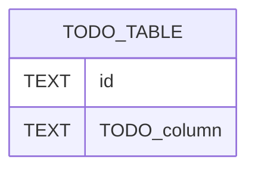

# Database Schema — Dashboard_music_platform_algo_spotify

> Auto-populated by `generate-dev-docs.py`. Add relationships manually.

## Table Inventory

<!-- AUTO:TABLES_BEGIN -->
TODO: run generate-dev-docs.py to populate
<!-- AUTO:TABLES_END -->

## ERD

<!-- AUTO:ERD_BEGIN -->

<!-- AUTO:ERD_END -->

## Key constraints

- TODO: list FK constraints, unique constraints, indexes
