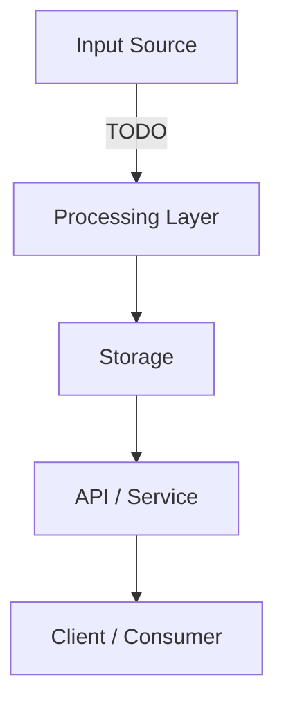
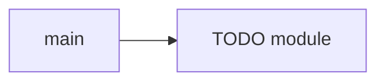
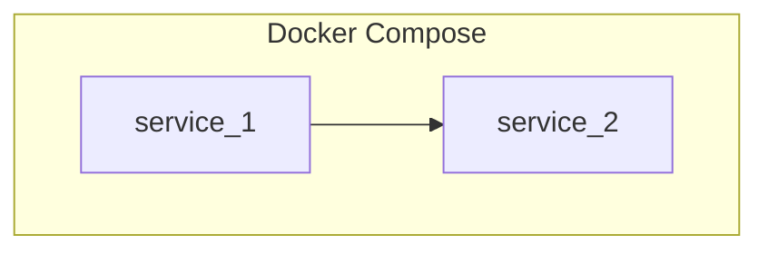

# System Architecture — Dashboard_music_platform_algo_spotify

> TODO: Run `python3 tools/generate-dev-docs.py` then `/dev-docs-init` to populate.

## Data Flow

## Module Dependencies

$([ "$HAS_DOCKER" -eq 1 ] && cat << 'DOCKER_SECTION'
## Docker Services

<!-- AUTO:DOCKER_SERVICES_BEGIN -->
TODO: run generate-dev-docs.py --has-docker to populate
<!-- AUTO:DOCKER_SERVICES_END -->

## Docker Architecture

DOCKER_SECTION
)
