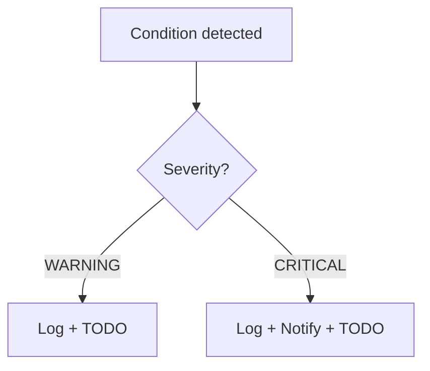

# Alerting — Dashboard_music_platform_algo_spotify

## Alert thresholds

| Alert | Condition | Severity | Action |
|-------|-----------|----------|--------|
| TODO | TODO | WARNING | TODO |

## Alert flow

## Cooldown / deduplication rules

- TODO: describe cooldown windows, dedup logic
