# System Audit — Music Analytics Platform
> Generated: 2026-03-28 | 51 tables · 15 DAGs · 7 collectors · 14 dashboard views

---

## Table of Contents
1. [PostgreSQL Schema — Full ERD by Domain](#1-postgresql-schema--full-erd-by-domain)
2. [DAG Execution Schedule & Workflows](#2-dag-execution-schedule--workflows)
3. [KPI Workflows with Thresholds](#3-kpi-workflows-with-thresholds)
4. [Charts Catalog with Thresholds](#4-charts-catalog-with-thresholds)
5. [Alert System with Thresholds](#5-alert-system-with-thresholds)
6. [API Endpoints with Rate Limits & Retry](#6-api-endpoints-with-rate-limits--retry)
7. [Credential Pipelines](#7-credential-pipelines)

---

## 1. PostgreSQL Schema — Full ERD by Domain

### 1.1 Core SaaS Infrastructure

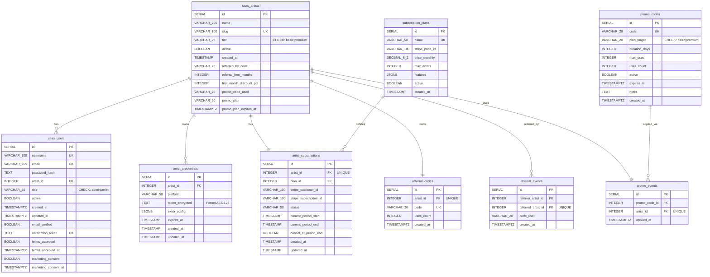
```mermaid
erDiagram
    saas_artists {
        SERIAL id PK
        VARCHAR_255 name
        VARCHAR_100 slug UK
        VARCHAR_20 tier "CHECK: basic|premium"
        BOOLEAN active
        TIMESTAMP created_at
        VARCHAR_20 referred_by_code
        INTEGER referral_free_months
        INTEGER first_month_discount_pct
        VARCHAR_20 promo_code_used
        VARCHAR_20 promo_plan
        TIMESTAMPTZ promo_plan_expires_at
    }
    saas_users {
        SERIAL id PK
        VARCHAR_100 username UK
        VARCHAR_255 email UK
        TEXT password_hash
        INTEGER artist_id FK
        VARCHAR_20 role "CHECK: admin|artist"
        BOOLEAN active
        TIMESTAMPTZ created_at
        TIMESTAMPTZ updated_at
        BOOLEAN email_verified
        TEXT verification_token UK
        BOOLEAN terms_accepted
        TIMESTAMPTZ terms_accepted_at
        BOOLEAN marketing_consent
        TIMESTAMPTZ marketing_consent_at
    }
    artist_credentials {
        SERIAL id PK
        INTEGER artist_id FK
        VARCHAR_50 platform
        TEXT token_encrypted "Fernet AES-128"
        JSONB extra_config
        TIMESTAMP expires_at
        TIMESTAMP created_at
        TIMESTAMP updated_at
    }
    subscription_plans {
        SERIAL id PK
        VARCHAR_50 name UK
        VARCHAR_100 stripe_price_id
        DECIMAL_8_2 price_monthly
        INTEGER max_artists
        JSONB features
        BOOLEAN active
        TIMESTAMP created_at
    }
    artist_subscriptions {
        SERIAL id PK
        INTEGER artist_id FK "UNIQUE"
        INTEGER plan_id FK
        VARCHAR_100 stripe_customer_id
        VARCHAR_100 stripe_subscription_id
        VARCHAR_50 status
        TIMESTAMP current_period_start
        TIMESTAMP current_period_end
        BOOLEAN cancel_at_period_end
        TIMESTAMP created_at
        TIMESTAMP updated_at
    }
    referral_codes {
        SERIAL id PK
        INTEGER artist_id FK "UNIQUE"
        VARCHAR_20 code UK
        INTEGER uses_count
        TIMESTAMPTZ created_at
    }
    referral_events {
        SERIAL id PK
        INTEGER referrer_artist_id FK
        INTEGER referred_artist_id FK "UNIQUE"
        VARCHAR_20 code_used
        TIMESTAMPTZ created_at
    }
    promo_codes {
        SERIAL id PK
        VARCHAR_20 code UK
        VARCHAR_20 plan_target "CHECK: basic|premium"
        INTEGER duration_days
        INTEGER max_uses
        INTEGER uses_count
        BOOLEAN active
        TIMESTAMPTZ expires_at
        TEXT notes
        TIMESTAMPTZ created_at
    }
    promo_events {
        SERIAL id PK
        INTEGER promo_code_id FK
        INTEGER artist_id FK "UNIQUE"
        TIMESTAMPTZ applied_at
    }

    saas_artists ||--o{ saas_users : "has"
    saas_artists ||--o{ artist_credentials : "owns"
    saas_artists ||--|| artist_subscriptions : "has"
    saas_artists ||--|| referral_codes : "owns"
    saas_artists ||--o{ referral_events : "referred_by"
    saas_artists ||--|| promo_events : "used"
    subscription_plans ||--o{ artist_subscriptions : "defines"
    promo_codes ||--o{ promo_events : "applied_via"
```

### 1.2 Spotify Domain

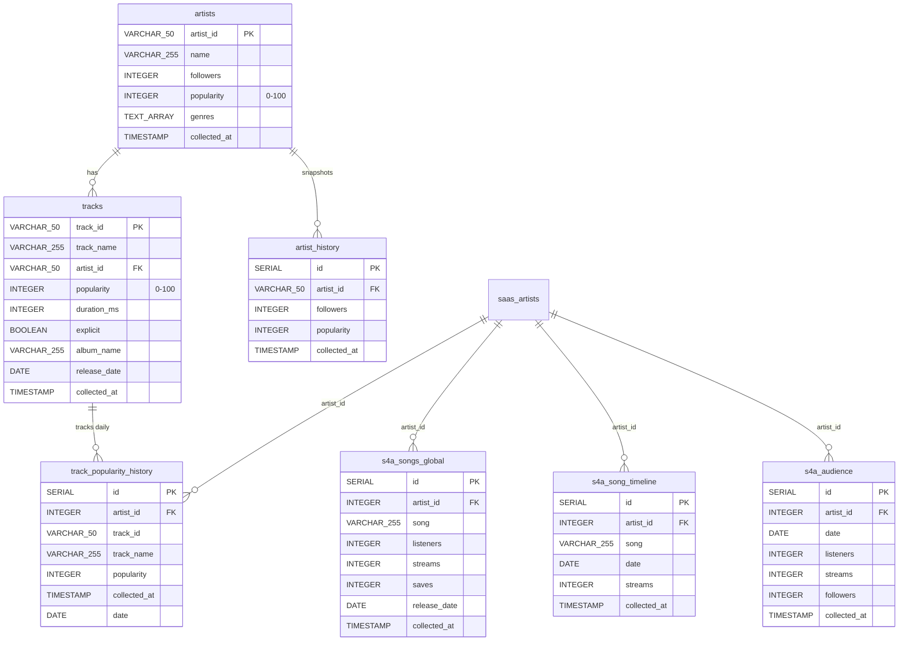
```mermaid
erDiagram
    artists {
        VARCHAR_50 artist_id PK
        VARCHAR_255 name
        INTEGER followers
        INTEGER popularity "0-100"
        TEXT_ARRAY genres
        TIMESTAMP collected_at
    }
    tracks {
        VARCHAR_50 track_id PK
        VARCHAR_255 track_name
        VARCHAR_50 artist_id FK
        INTEGER popularity "0-100"
        INTEGER duration_ms
        BOOLEAN explicit
        VARCHAR_255 album_name
        DATE release_date
        TIMESTAMP collected_at
    }
    track_popularity_history {
        SERIAL id PK
        INTEGER artist_id FK
        VARCHAR_50 track_id
        VARCHAR_255 track_name
        INTEGER popularity
        TIMESTAMP collected_at
        DATE date
    }
    artist_history {
        SERIAL id PK
        VARCHAR_50 artist_id FK
        INTEGER followers
        INTEGER popularity
        TIMESTAMP collected_at
    }
    s4a_songs_global {
        SERIAL id PK
        INTEGER artist_id FK
        VARCHAR_255 song
        INTEGER listeners
        INTEGER streams
        INTEGER saves
        DATE release_date
        TIMESTAMP collected_at
    }
    s4a_song_timeline {
        SERIAL id PK
        INTEGER artist_id FK
        VARCHAR_255 song
        DATE date
        INTEGER streams
        TIMESTAMP collected_at
    }
    s4a_audience {
        SERIAL id PK
        INTEGER artist_id FK
        DATE date
        INTEGER listeners
        INTEGER streams
        INTEGER followers
        TIMESTAMP collected_at
    }

    artists ||--o{ tracks : "has"
    artists ||--o{ artist_history : "snapshots"
    tracks ||--o{ track_popularity_history : "tracks daily"
    saas_artists ||--o{ track_popularity_history : "artist_id"
    saas_artists ||--o{ s4a_songs_global : "artist_id"
    saas_artists ||--o{ s4a_song_timeline : "artist_id"
    saas_artists ||--o{ s4a_audience : "artist_id"
```

**UNIQUE constraints:**
- `track_popularity_history`: `(artist_id, track_id, date)`
- `s4a_songs_global`: `(artist_id, song)`
- `s4a_song_timeline`: `(artist_id, song, date)` ← critical for upsert
- `s4a_audience`: `(artist_id, date)`

### 1.3 Meta Ads Domain (API + CSV)

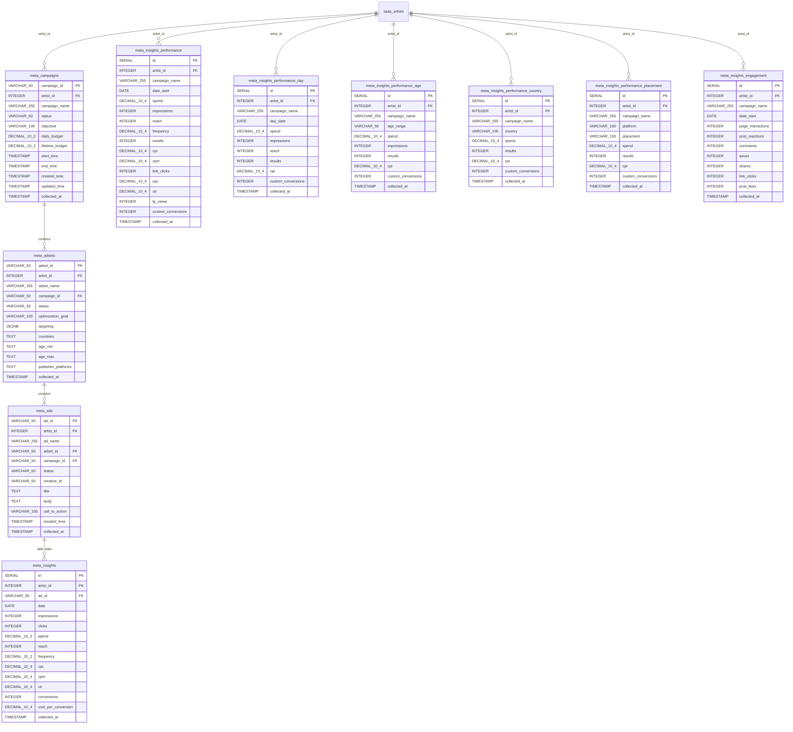
```mermaid
erDiagram
    meta_campaigns {
        VARCHAR_50 campaign_id PK
        INTEGER artist_id FK
        VARCHAR_255 campaign_name
        VARCHAR_50 status
        VARCHAR_100 objective
        DECIMAL_10_2 daily_budget
        DECIMAL_10_2 lifetime_budget
        TIMESTAMP start_time
        TIMESTAMP end_time
        TIMESTAMP created_time
        TIMESTAMP updated_time
        TIMESTAMP collected_at
    }
    meta_adsets {
        VARCHAR_50 adset_id PK
        INTEGER artist_id FK
        VARCHAR_255 adset_name
        VARCHAR_50 campaign_id FK
        VARCHAR_50 status
        VARCHAR_100 optimization_goal
        JSONB targeting
        TEXT countries
        TEXT age_min
        TEXT age_max
        TEXT publisher_platforms
        TIMESTAMP collected_at
    }
    meta_ads {
        VARCHAR_50 ad_id PK
        INTEGER artist_id FK
        VARCHAR_255 ad_name
        VARCHAR_50 adset_id FK
        VARCHAR_50 campaign_id FK
        VARCHAR_50 status
        VARCHAR_50 creative_id
        TEXT title
        TEXT body
        VARCHAR_100 call_to_action
        TIMESTAMP created_time
        TIMESTAMP collected_at
    }
    meta_insights {
        SERIAL id PK
        INTEGER artist_id FK
        VARCHAR_50 ad_id FK
        DATE date
        INTEGER impressions
        INTEGER clicks
        DECIMAL_10_2 spend
        INTEGER reach
        DECIMAL_10_2 frequency
        DECIMAL_10_4 cpc
        DECIMAL_10_4 cpm
        DECIMAL_10_4 ctr
        INTEGER conversions
        DECIMAL_10_4 cost_per_conversion
        TIMESTAMP collected_at
    }
    meta_insights_performance {
        SERIAL id PK
        INTEGER artist_id FK
        VARCHAR_255 campaign_name
        DATE date_start
        DECIMAL_10_4 spend
        INTEGER impressions
        INTEGER reach
        DECIMAL_10_4 frequency
        INTEGER results
        DECIMAL_10_4 cpr
        DECIMAL_10_4 cpm
        INTEGER link_clicks
        DECIMAL_10_4 cpc
        DECIMAL_10_4 ctr
        INTEGER lp_views
        INTEGER custom_conversions
        TIMESTAMP collected_at
    }
    meta_insights_performance_day {
        SERIAL id PK
        INTEGER artist_id FK
        VARCHAR_255 campaign_name
        DATE day_date
        DECIMAL_10_4 spend
        INTEGER impressions
        INTEGER reach
        INTEGER results
        DECIMAL_10_4 cpr
        INTEGER custom_conversions
        TIMESTAMP collected_at
    }
    meta_insights_performance_age {
        SERIAL id PK
        INTEGER artist_id FK
        VARCHAR_255 campaign_name
        VARCHAR_50 age_range
        DECIMAL_10_4 spend
        INTEGER impressions
        INTEGER results
        DECIMAL_10_4 cpr
        INTEGER custom_conversions
        TIMESTAMP collected_at
    }
    meta_insights_performance_country {
        SERIAL id PK
        INTEGER artist_id FK
        VARCHAR_255 campaign_name
        VARCHAR_100 country
        DECIMAL_10_4 spend
        INTEGER results
        DECIMAL_10_4 cpr
        INTEGER custom_conversions
        TIMESTAMP collected_at
    }
    meta_insights_performance_placement {
        SERIAL id PK
        INTEGER artist_id FK
        VARCHAR_255 campaign_name
        VARCHAR_100 platform
        VARCHAR_100 placement
        DECIMAL_10_4 spend
        INTEGER results
        DECIMAL_10_4 cpr
        INTEGER custom_conversions
        TIMESTAMP collected_at
    }
    meta_insights_engagement {
        SERIAL id PK
        INTEGER artist_id FK
        VARCHAR_255 campaign_name
        DATE date_start
        INTEGER page_interactions
        INTEGER post_reactions
        INTEGER comments
        INTEGER saves
        INTEGER shares
        INTEGER link_clicks
        INTEGER post_likes
        TIMESTAMP collected_at
    }

    meta_campaigns ||--o{ meta_adsets : "contains"
    meta_adsets ||--o{ meta_ads : "contains"
    meta_ads ||--o{ meta_insights : "daily stats"
    saas_artists ||--o{ meta_campaigns : "artist_id"
    saas_artists ||--o{ meta_insights_performance : "artist_id"
    saas_artists ||--o{ meta_insights_performance_day : "artist_id"
    saas_artists ||--o{ meta_insights_performance_age : "artist_id"
    saas_artists ||--o{ meta_insights_performance_country : "artist_id"
    saas_artists ||--o{ meta_insights_performance_placement : "artist_id"
    saas_artists ||--o{ meta_insights_engagement : "artist_id"
```

**Note:** `meta_insights_performance_*` = CSV watcher (manual upload). `meta_campaigns/adsets/ads/insights` = API collector (daily).

### 1.4 YouTube Domain

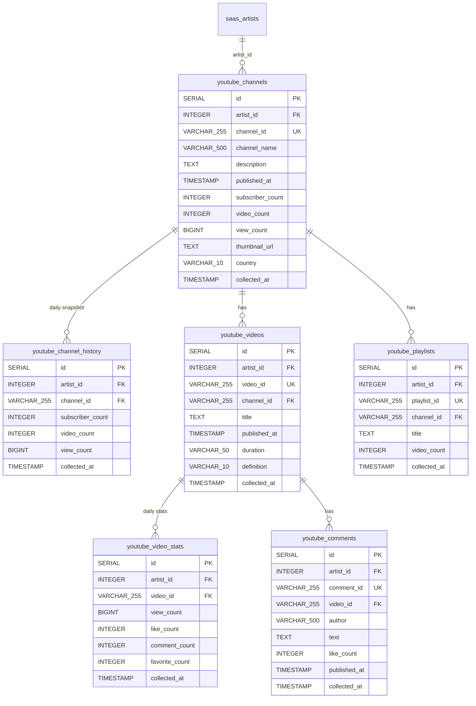
```mermaid
erDiagram
    youtube_channels {
        SERIAL id PK
        INTEGER artist_id FK
        VARCHAR_255 channel_id UK
        VARCHAR_500 channel_name
        TEXT description
        TIMESTAMP published_at
        INTEGER subscriber_count
        INTEGER video_count
        BIGINT view_count
        TEXT thumbnail_url
        VARCHAR_10 country
        TIMESTAMP collected_at
    }
    youtube_channel_history {
        SERIAL id PK
        INTEGER artist_id FK
        VARCHAR_255 channel_id FK
        INTEGER subscriber_count
        INTEGER video_count
        BIGINT view_count
        TIMESTAMP collected_at
    }
    youtube_videos {
        SERIAL id PK
        INTEGER artist_id FK
        VARCHAR_255 video_id UK
        VARCHAR_255 channel_id FK
        TEXT title
        TIMESTAMP published_at
        VARCHAR_50 duration
        VARCHAR_10 definition
        TIMESTAMP collected_at
    }
    youtube_video_stats {
        SERIAL id PK
        INTEGER artist_id FK
        VARCHAR_255 video_id FK
        BIGINT view_count
        INTEGER like_count
        INTEGER comment_count
        INTEGER favorite_count
        TIMESTAMP collected_at
    }
    youtube_playlists {
        SERIAL id PK
        INTEGER artist_id FK
        VARCHAR_255 playlist_id UK
        VARCHAR_255 channel_id FK
        TEXT title
        INTEGER video_count
        TIMESTAMP collected_at
    }
    youtube_comments {
        SERIAL id PK
        INTEGER artist_id FK
        VARCHAR_255 comment_id UK
        VARCHAR_255 video_id FK
        VARCHAR_500 author
        TEXT text
        INTEGER like_count
        TIMESTAMP published_at
        TIMESTAMP collected_at
    }

    youtube_channels ||--o{ youtube_channel_history : "daily snapshot"
    youtube_channels ||--o{ youtube_videos : "has"
    youtube_channels ||--o{ youtube_playlists : "has"
    youtube_videos ||--o{ youtube_video_stats : "daily stats"
    youtube_videos ||--o{ youtube_comments : "has"
    saas_artists ||--o{ youtube_channels : "artist_id"
```

**UNIQUE constraints:**
- `youtube_channel_history`: `(artist_id, channel_id, collected_at::date)`
- `youtube_video_stats`: `(artist_id, video_id, collected_at::date)`

### 1.5 Social & Other Platforms

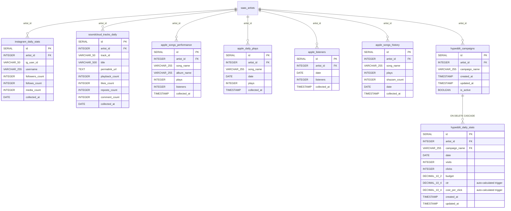
```mermaid
erDiagram
    instagram_daily_stats {
        SERIAL id PK
        INTEGER artist_id FK
        VARCHAR_50 ig_user_id
        VARCHAR_255 username
        INTEGER followers_count
        INTEGER follows_count
        INTEGER media_count
        DATE collected_at
    }
    soundcloud_tracks_daily {
        SERIAL id PK
        INTEGER artist_id FK
        VARCHAR_50 track_id
        VARCHAR_500 title
        TEXT permalink_url
        INTEGER playback_count
        INTEGER likes_count
        INTEGER reposts_count
        INTEGER comment_count
        DATE collected_at
    }
    apple_songs_performance {
        SERIAL id PK
        INTEGER artist_id FK
        VARCHAR_255 song_name
        VARCHAR_255 album_name
        INTEGER plays
        INTEGER listeners
        TIMESTAMP collected_at
    }
    apple_daily_plays {
        SERIAL id PK
        INTEGER artist_id FK
        VARCHAR_255 song_name
        DATE date
        INTEGER plays
        TIMESTAMP collected_at
    }
    apple_listeners {
        SERIAL id PK
        INTEGER artist_id FK
        DATE date
        INTEGER listeners
        TIMESTAMP collected_at
    }
    apple_songs_history {
        SERIAL id PK
        INTEGER artist_id FK
        VARCHAR_255 song_name
        INTEGER plays
        INTEGER shazam_count
        DATE date
        TIMESTAMP collected_at
    }
    hypeddit_campaigns {
        SERIAL id PK
        INTEGER artist_id FK
        VARCHAR_255 campaign_name
        TIMESTAMP created_at
        TIMESTAMP updated_at
        BOOLEAN is_active
    }
    hypeddit_daily_stats {
        SERIAL id PK
        INTEGER artist_id FK
        VARCHAR_255 campaign_name FK
        DATE date
        INTEGER visits
        INTEGER clicks
        DECIMAL_10_2 budget
        DECIMAL_10_4 ctr "auto-calculated trigger"
        DECIMAL_10_4 cost_per_click "auto-calculated trigger"
        TIMESTAMP created_at
        TIMESTAMP updated_at
    }

    saas_artists ||--o{ instagram_daily_stats : "artist_id"
    saas_artists ||--o{ soundcloud_tracks_daily : "artist_id"
    saas_artists ||--o{ apple_songs_performance : "artist_id"
    saas_artists ||--o{ apple_daily_plays : "artist_id"
    saas_artists ||--o{ apple_listeners : "artist_id"
    saas_artists ||--o{ apple_songs_history : "artist_id"
    saas_artists ||--o{ hypeddit_campaigns : "artist_id"
    hypeddit_campaigns ||--o{ hypeddit_daily_stats : "ON DELETE CASCADE"
```

**Trigger:** `calculate_hypeddit_metrics` auto-computes `ctr = clicks/visits` and `cost_per_click = budget/clicks`.

### 1.6 ML & Monitoring

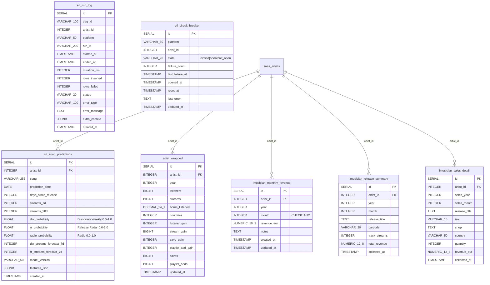
```mermaid
erDiagram
    ml_song_predictions {
        SERIAL id PK
        INTEGER artist_id FK
        VARCHAR_255 song
        DATE prediction_date
        INTEGER days_since_release
        INTEGER streams_7d
        INTEGER streams_28d
        FLOAT dw_probability "Discovery Weekly 0.0-1.0"
        FLOAT rr_probability "Release Radar 0.0-1.0"
        FLOAT radio_probability "Radio 0.0-1.0"
        INTEGER dw_streams_forecast_7d
        INTEGER rr_streams_forecast_7d
        VARCHAR_50 model_version
        JSONB features_json
        TIMESTAMP created_at
    }
    artist_wrapped {
        SERIAL id PK
        INTEGER artist_id FK
        INTEGER year
        BIGINT listeners
        BIGINT streams
        DECIMAL_14_1 hours_listened
        INTEGER countries
        INTEGER listener_gain
        BIGINT stream_gain
        INTEGER save_gain
        INTEGER playlist_add_gain
        BIGINT saves
        BIGINT playlist_adds
        TIMESTAMP updated_at
    }
    imusician_monthly_revenue {
        SERIAL id PK
        INTEGER artist_id FK
        INTEGER year
        INTEGER month "CHECK: 1-12"
        NUMERIC_10_2 revenue_eur
        TEXT notes
        TIMESTAMP created_at
        TIMESTAMP updated_at
    }
    imusician_release_summary {
        SERIAL id PK
        INTEGER artist_id FK
        INTEGER year
        INTEGER month
        TEXT release_title
        VARCHAR_20 barcode
        INTEGER track_streams
        NUMERIC_12_8 total_revenue
        TIMESTAMP collected_at
    }
    imusician_sales_detail {
        SERIAL id PK
        INTEGER artist_id FK
        INTEGER sales_year
        INTEGER sales_month
        TEXT release_title
        VARCHAR_15 isrc
        TEXT shop
        VARCHAR_50 country
        INTEGER quantity
        NUMERIC_12_8 revenue_eur
        TIMESTAMP collected_at
    }
    etl_run_log {
        SERIAL id PK
        VARCHAR_100 dag_id
        INTEGER artist_id
        VARCHAR_50 platform
        VARCHAR_200 run_id
        TIMESTAMP started_at
        TIMESTAMP ended_at
        INTEGER duration_ms
        INTEGER rows_inserted
        INTEGER rows_failed
        VARCHAR_20 status
        VARCHAR_100 error_type
        TEXT error_message
        JSONB extra_context
        TIMESTAMP created_at
    }
    etl_circuit_breaker {
        SERIAL id PK
        VARCHAR_50 platform
        INTEGER artist_id
        VARCHAR_20 state "closed|open|half_open"
        INTEGER failure_count
        TIMESTAMP last_failure_at
        TIMESTAMP opened_at
        TIMESTAMP reset_at
        TEXT last_error
        TIMESTAMP updated_at
    }

    saas_artists ||--o{ ml_song_predictions : "artist_id"
    saas_artists ||--o{ artist_wrapped : "artist_id"
    saas_artists ||--o{ imusician_monthly_revenue : "artist_id"
    saas_artists ||--o{ imusician_release_summary : "artist_id"
    saas_artists ||--o{ imusician_sales_detail : "artist_id"
```

**UNIQUE constraints:**
- `ml_song_predictions`: `(artist_id, song, prediction_date, model_version)`
- `etl_circuit_breaker`: `(platform, artist_id)`

---

## 2. DAG Execution Schedule & Workflows

### 2.1 Daily Timeline (UTC)

```mermaid
gantt
    title DAG Execution Timeline (UTC)
    dateFormat HH:mm
    axisFormat %H:%M

    section ML
    ml_scoring_daily          :done, 06:00, 30m

    section API Collection
    meta_ads_api_daily         :active, 05:00, 45m
    spotify_api_daily          :active, 07:00, 20m
    youtube_daily              :active, 08:00, 30m
    soundcloud_daily           :active, 09:00, 20m
    instagram_daily            :active, 10:00, 15m

    section CSV Watchers (continuous)
    s4a_csv_watcher            :crit, 00:00, 24h
    apple_music_csv_watcher    :crit, 00:00, 24h
    imusician_csv_watcher      :crit, 00:00, 24h

    section Monitoring
    data_quality_check         :done, 22:00, 30m
    alert_monitor              :done, 23:00, 15m

    section Weekly
    meta_token_refresh         :milestone, 07:00, 1m
    weekly_digest              :milestone, 08:00, 1m
```

### 2.2 DAG Dependency & Retry Matrix

| DAG | Schedule | Retries | Retry Delay | on_failure_callback |
|-----|----------|---------|-------------|---------------------|
| `meta_ads_api_daily` | `0 5 * * *` | 2 | 10 min | dag_failure_callback |
| `ml_scoring_daily` | `0 6 * * *` | 1 | 15 min | dag_failure_callback |
| `spotify_api_daily` | `0 7 * * *` | 2 | 10 min | dag_failure_callback |
| `meta_token_refresh` | `0 7 * * 1` | 2 | 10 min | _failure_callback |
| `youtube_daily` | `0 8 * * *` | 2 | 10 min | dag_failure_callback |
| `weekly_digest` | `0 8 * * 1` | 2 | 10 min | dag_failure_callback |
| `soundcloud_daily` | `0 9 * * *` | 2 | 10 min | dag_failure_callback |
| `instagram_daily` | `0 10 * * *` | 2 | 10 min | dag_failure_callback |
| `data_quality_check` | `0 22 * * *` | 2 | 10 min | _failure_callback |
| `alert_monitor` | `0 23 * * *` | 0 | 5 min | dag_failure_callback |
| `s4a_csv_watcher` | `*/15 * * * *` | 1 | 5 min | dag_failure_callback |
| `apple_music_csv_watcher` | `*/15 * * * *` | 1 | 5 min | dag_failure_callback |
| `imusician_csv_watcher` | `*/15 * * * *` | 2 | 10 min | dag_failure_callback |
| `meta_insights_dag` | Manual | 0 | 5 min | dag_failure_callback |
| `meta_config_dag` | Manual | 0 | 5 min | dag_failure_callback |

### 2.3 Spotify DAG Flow

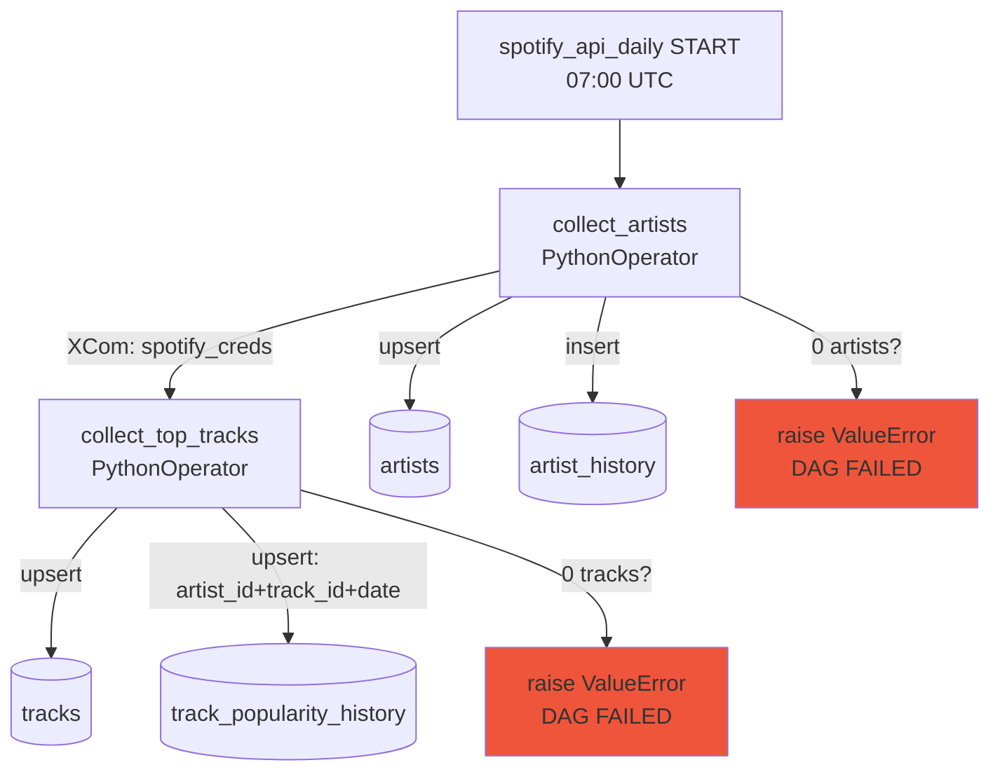
```mermaid
flowchart TD
    A[spotify_api_daily START\n07:00 UTC] --> B[collect_artists\nPythonOperator]
    B --> |XCom: spotify_creds| C[collect_top_tracks\nPythonOperator]
    B --> |upsert| D[(artists)]
    B --> |insert| E[(artist_history)]
    C --> |upsert| F[(tracks)]
    C --> |upsert: artist_id+track_id+date| G[(track_popularity_history)]
    B --> |0 artists?| ERR1[raise ValueError\nDAG FAILED]
    C --> |0 tracks?| ERR2[raise ValueError\nDAG FAILED]

    style ERR1 fill:#EF553B
    style ERR2 fill:#EF553B
```

### 2.4 Meta Ads API DAG Flow

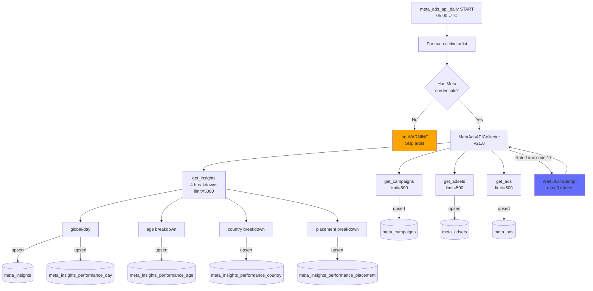
```mermaid
flowchart TD
    A[meta_ads_api_daily START\n05:00 UTC] --> B[For each active artist]
    B --> C{Has Meta\ncredentials?}
    C --> |No| W[log WARNING\nSkip artist]
    C --> |Yes| D[MetaAdsAPICollector\nv21.0]
    D --> E[get_campaigns\nlimit=500]
    D --> F[get_adsets\nlimit=500]
    D --> G[get_ads\nlimit=500]
    D --> H[get_insights\n4 breakdowns\nlimit=5000]
    H --> H1[global/day]
    H --> H2[age breakdown]
    H --> H3[country breakdown]
    H --> H4[placement breakdown]
    E --> |upsert| I[(meta_campaigns)]
    F --> |upsert| J[(meta_adsets)]
    G --> |upsert| K[(meta_ads)]
    H1 --> |upsert| L[(meta_insights)]
    H1 --> |upsert| M[(meta_insights_performance_day)]
    H2 --> |upsert| N[(meta_insights_performance_age)]
    H3 --> |upsert| O[(meta_insights_performance_country)]
    H4 --> |upsert| P[(meta_insights_performance_placement)]
    D --> |Rate Limit code 17| RL[Wait 60s×attempt\nmax 3 retries]
    RL --> D

    style W fill:#FFA500
    style RL fill:#636EFA
```

### 2.5 Alert Monitor DAG Flow

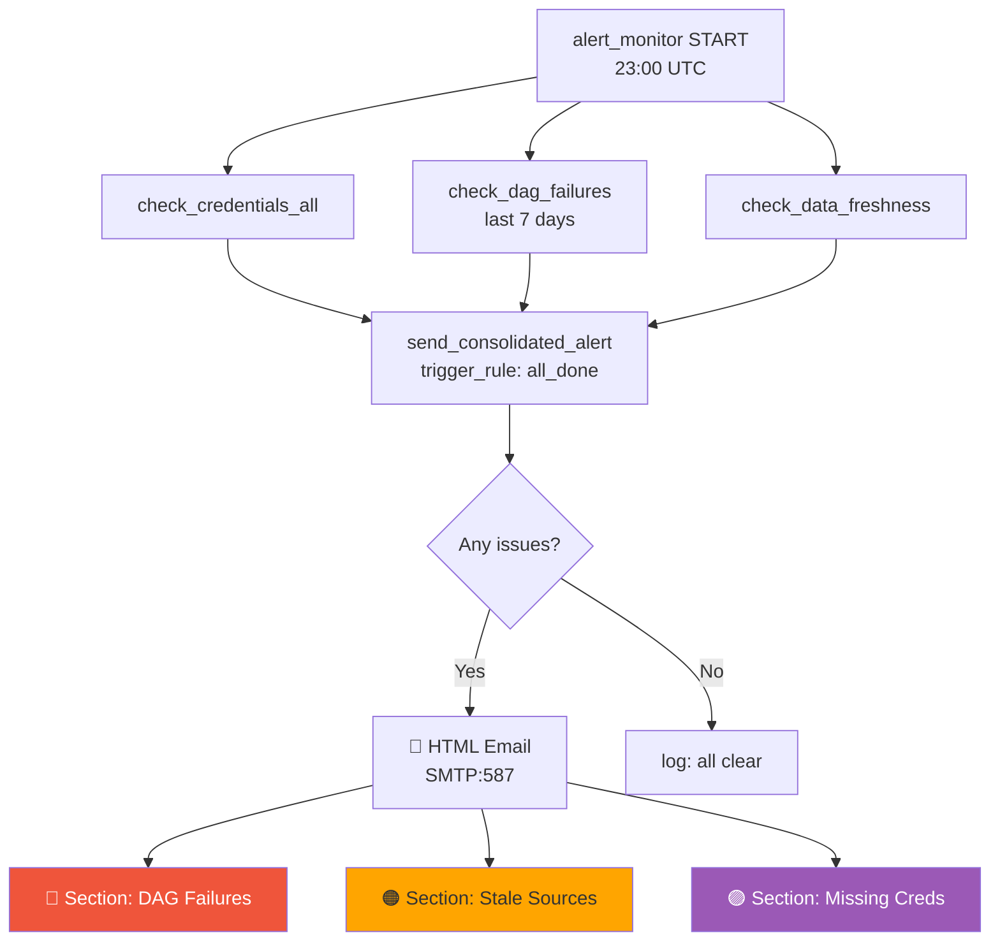
```mermaid
flowchart TD
    A[alert_monitor START\n23:00 UTC] --> B[check_credentials_all]
    A --> C[check_dag_failures\nlast 7 days]
    A --> D[check_data_freshness]
    B --> E[send_consolidated_alert\ntrigger_rule: all_done]
    C --> E
    D --> E
    E --> F{Any issues?}
    F --> |Yes| G[📧 HTML Email\nSMTP:587]
    F --> |No| H[log: all clear]

    G --> G1[🔴 Section: DAG Failures]
    G --> G2[🟠 Section: Stale Sources]
    G --> G3[🟣 Section: Missing Creds]

    style G1 fill:#EF553B,color:#fff
    style G2 fill:#FFA500
    style G3 fill:#9B59B6,color:#fff
```

### 2.6 Data Quality Check Flow

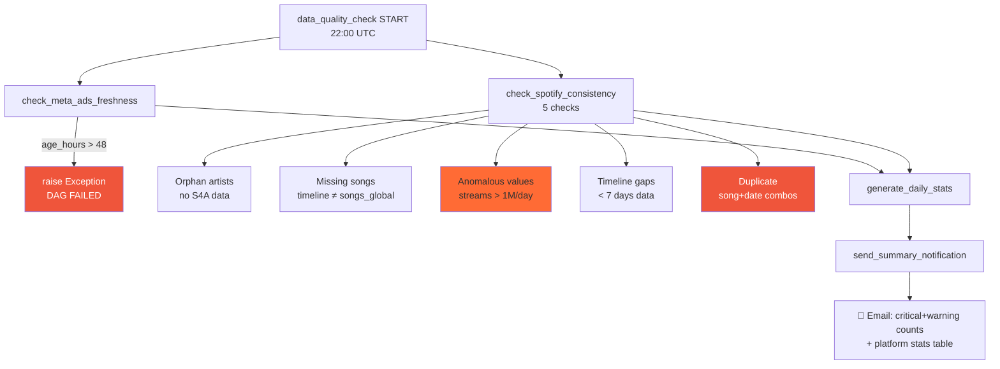
```mermaid
flowchart TD
    A[data_quality_check START\n22:00 UTC] --> B[check_meta_ads_freshness]
    A --> C[check_spotify_consistency\n5 checks]
    B --> |age_hours > 48| ERR[raise Exception\nDAG FAILED]
    C --> C1[Orphan artists\n no S4A data]
    C --> C2[Missing songs\ntimeline ≠ songs_global]
    C --> C3[Anomalous values\nstreams > 1M/day]
    C --> C4[Timeline gaps\n< 7 days data]
    C --> C5[Duplicate\nsong+date combos]
    B --> D[generate_daily_stats]
    C --> D
    D --> E[send_summary_notification]
    E --> F[📧 Email: critical+warning counts\n+ platform stats table]

    style ERR fill:#EF553B,color:#fff
    style C3 fill:#FF6B35
    style C5 fill:#EF553B,color:#fff
```

### 2.7 CSV Watcher Flow (S4A / Apple / iMusician)

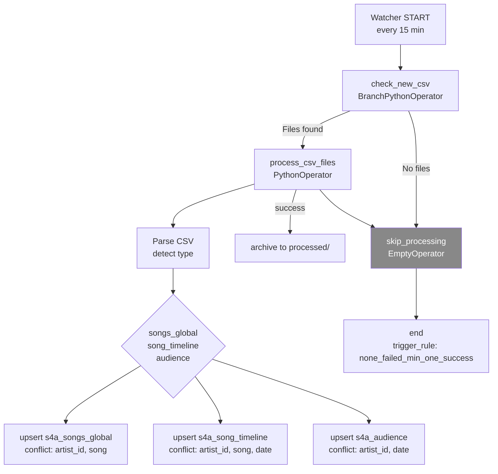
```mermaid
flowchart TD
    A[Watcher START\nevery 15 min] --> B[check_new_csv\nBranchPythonOperator]
    B --> |Files found| C[process_csv_files\nPythonOperator]
    B --> |No files| D[skip_processing\nEmptyOperator]
    C --> C1[Parse CSV\ndetect type]
    C1 --> C2{songs_global\nsong_timeline\naudience}
    C2 --> E1[upsert s4a_songs_global\nconflict: artist_id, song]
    C2 --> E2[upsert s4a_song_timeline\nconflict: artist_id, song, date]
    C2 --> E3[upsert s4a_audience\nconflict: artist_id, date]
    C --> |success| F[archive to processed/]
    C --> D
    D --> G[end\ntrigger_rule: none_failed_min_one_success]

    style D fill:#888,color:#fff
```

---

## 3. KPI Workflows with Thresholds

### 3.1 Global Freshness Thresholds (kpi_helpers.py)

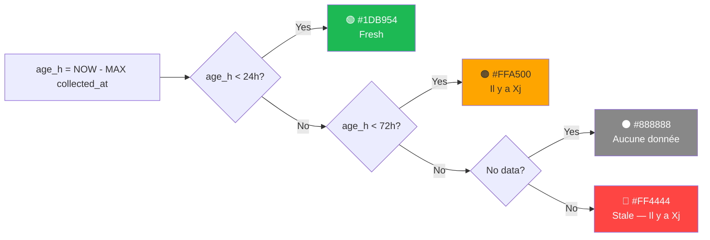
```mermaid
flowchart LR
    A[age_h = NOW - MAX collected_at] --> B{age_h < 24h?}
    B --> |Yes| C[🟢 #1DB954\nFresh]
    B --> |No| D{age_h < 72h?}
    D --> |Yes| E[🟠 #FFA500\nIl y a Xj]
    D --> |No| F{No data?}
    F --> |Yes| G[⚫ #888888\nAucune donnée]
    F --> |No| H[🔴 #FF4444\nStale — Il y a Xj]

    style C fill:#1DB954,color:#fff
    style E fill:#FFA500
    style G fill:#888,color:#fff
    style H fill:#FF4444,color:#fff
```

| Source | Table | Column | Stale Threshold (kpi_helpers) | Stale Threshold (freshness_monitor) |
|--------|-------|---------|-------------------------------|--------------------------------------|
| Spotify S4A | `s4a_song_timeline` | `collected_at` | 72h (orange) | 168h (7d) |
| YouTube | `youtube_channel_history` | `collected_at` | 72h | 48h |
| SoundCloud | `soundcloud_tracks_daily` | `collected_at` | 72h | 48h |
| Instagram | `instagram_daily_stats` | `collected_at` | 72h | 48h |
| Apple Music | `apple_songs_performance` | `collected_at` | 72h | 168h (7d) |
| Meta Ads | `meta_insights_performance_day` | `collected_at` | 72h | 48h |
| iMusician | `imusician_monthly_revenue` | `updated_at` | 72h | — |

### 3.2 KPI Computation Workflows

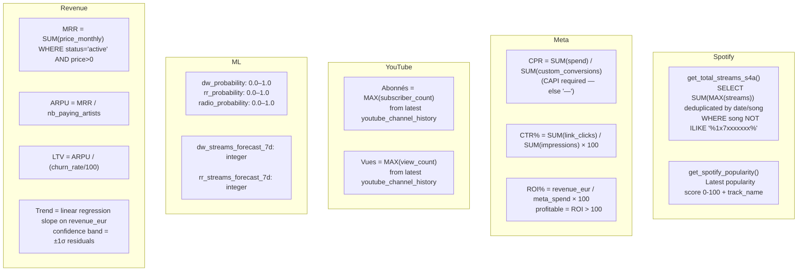
```mermaid
flowchart TD
    subgraph Spotify
        S1["get_total_streams_s4a()
        SELECT SUM(MAX(streams)) deduplicated by date/song
        WHERE song NOT ILIKE '%1x7xxxxxxx%'"]
        S2["get_spotify_popularity()
        Latest popularity score 0-100 + track_name"]
    end

    subgraph Meta
        M1["CPR = SUM(spend) / SUM(custom_conversions)
        (CAPI required — else '—')"]
        M2["CTR% = SUM(link_clicks) / SUM(impressions) × 100"]
        M3["ROI% = revenue_eur / meta_spend × 100
        profitable = ROI > 100"]
    end

    subgraph YouTube
        Y1["Abonnés = MAX(subscriber_count)
        from latest youtube_channel_history"]
        Y2["Vues = MAX(view_count)
        from latest youtube_channel_history"]
    end

    subgraph ML
        ML1["dw_probability: 0.0–1.0
        rr_probability: 0.0–1.0
        radio_probability: 0.0–1.0"]
        ML2["dw_streams_forecast_7d: integer
        rr_streams_forecast_7d: integer"]
    end

    subgraph Revenue
        R1["MRR = SUM(price_monthly) WHERE status='active' AND price>0"]
        R2["ARPU = MRR / nb_paying_artists"]
        R3["LTV = ARPU / (churn_rate/100)"]
        R4["Trend = linear regression slope on revenue_eur
        confidence band = ±1σ residuals"]
    end
```

### 3.3 Home Dashboard KPI Flow

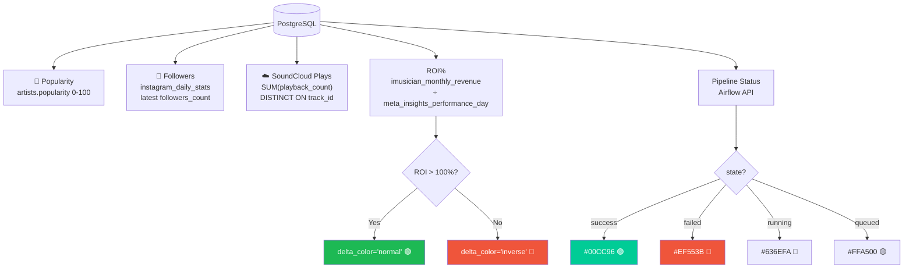
```mermaid
flowchart TD
    DB[(PostgreSQL)] --> K1["🎵 Popularity\nartists.popularity 0-100"]
    DB --> K2["📸 Followers\ninstagram_daily_stats\nlatest followers_count"]
    DB --> K3["☁️ SoundCloud Plays\nSUM(playback_count)\nDISTINCT ON track_id"]
    DB --> K4["ROI%\nimusician_monthly_revenue\n÷ meta_insights_performance_day"]

    K4 --> T1{ROI > 100%?}
    T1 --> |Yes| G[delta_color='normal' 🟢]
    T1 --> |No| R[delta_color='inverse' 🔴]

    DB --> P[Pipeline Status\nAirflow API]
    P --> P1{state?}
    P1 --> |success| GG[#00CC96 🟢]
    P1 --> |failed| RR[#EF553B 🔴]
    P1 --> |running| BB[#636EFA 🔵]
    P1 --> |queued| OO[#FFA500 🟡]

    style G fill:#1DB954,color:#fff
    style R fill:#EF553B,color:#fff
    style GG fill:#00CC96,color:#fff
    style RR fill:#EF553B,color:#fff
```

### 3.4 Revenue Forecast KPI Thresholds

| KPI | Formula | Warning Threshold | Visual |
|-----|---------|-------------------|--------|
| MRR | `SUM(price_monthly) WHERE status='active'` | — | — |
| ARPU | `MRR / nb_paying` | — | — |
| Churn | `cancel_at_period_end > 0` | Any cancellation | `delta_color="inverse"` |
| LTV | `ARPU / (churn_rate/100)` | churn > 10% → LTV < 1 year ARPU | — |
| Revenue Trend | `slope < 0` | Declining | delta_color inverse |
| ROI | `revenue / meta_spend × 100` | ROI < 100% | Bar turns red |

---

## 4. Charts Catalog with Thresholds

### 4.1 Home View

| Chart | Type | Library | Data Source | Key Config |
|-------|------|---------|------------|-----------|
| S4A Cumulative Streams | Area | Plotly | `s4a_song_timeline` SUM(MAX(streams)) by date | Color #1DB954, cumsum |
| ROI Breakeven | Dual Bar | Plotly | `imusician_monthly_revenue` + `meta_insights_performance_day` | Revenue #1DB954, Spend #FF4444 |
| Pipeline Status | HTML Cards | HTML | Airflow API `/api/v1/dags` | state color coding |

### 4.2 Spotify S4A View

| Chart | Type | SQL Key | Threshold/Config |
|-------|------|---------|-----------------|
| Top Songs | Horizontal Bar | `SUM(streams) GROUP BY song LIMIT 10` | viridis color scale |
| Audience Evolution | Area | `SUM(streams) GROUP BY date` | Last 365d default, fill tozeroy |
| Song Detail | Line | `DISTINCT ON (date) streams WHERE song = %s` | Per-song, deduped |

### 4.3 YouTube View

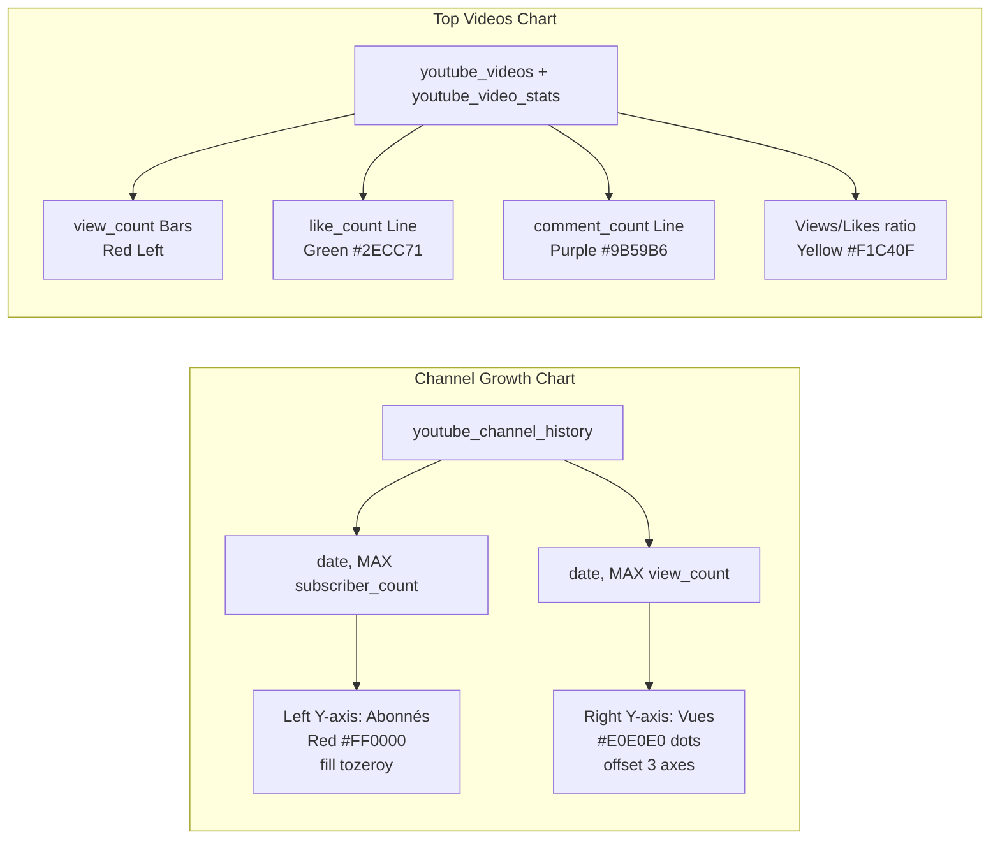
```mermaid
flowchart LR
    subgraph Channel Growth Chart
        Y1[youtube_channel_history] --> A1[date, MAX subscriber_count]
        Y1 --> A2[date, MAX view_count]
        A1 --> L1[Left Y-axis: Abonnés\nRed #FF0000\nfill tozeroy]
        A2 --> L2[Right Y-axis: Vues\n#E0E0E0 dots\noffset 3 axes]
    end
    subgraph Top Videos Chart
        Y2[youtube_videos + youtube_video_stats] --> B1[view_count Bars\nRed Left]
        Y2 --> B2[like_count Line\nGreen #2ECC71]
        Y2 --> B3[comment_count Line\nPurple #9B59B6]
        Y2 --> B4[Views/Likes ratio\nYellow #F1C40F]
    end
```

**Top Videos filters:** period (30/90/180/365d), type (Video >60s / Short ≤60s), Top N (5–50 slider, default 10).

### 4.4 Meta Ads View

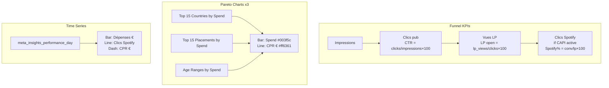
```mermaid
flowchart TD
    subgraph Funnel KPIs
        F1[Impressions] --> F2[Clics pub\nCTR = clicks/impressions×100]
        F2 --> F3[Vues LP\nLP open = lp_views/clicks×100]
        F3 --> F4[Clics Spotify\nif CAPI active\nSpotify% = conv/lp×100]
    end
    subgraph Pareto Charts x3
        P1[Top 15 Countries by Spend]
        P2[Top 15 Placements by Spend]
        P3[Age Ranges by Spend]
        P1 --> PL1[Bar: Spend #003f5c\nLine: CPR €  #ff6361]
        P2 --> PL1
        P3 --> PL1
    end
    subgraph Time Series
        T1[meta_insights_performance_day] --> TS1[Bar: Dépenses €\nLine: Clics Spotify\nDash: CPR €]
    end
```

### 4.5 Revenue Forecast Charts

| Chart | Type | Data | Key Feature |
|-------|------|------|------------|
| MRR by Plan | Bar | `artist_subscriptions` JOIN `subscription_plans` | Basic/Premium/Enterprise bars |
| MRR Projection | Line | Linear extrapolation | hline target + vline target month |
| LTV Scenarios | Bar | ARPU / churn × duration | Multiple duration scenarios |
| Artist Revenue | Multi-line | `imusician_monthly_revenue` + regression | ±1σ confidence band |
| ROI Historical | Dual Bar + Line | `imusician` + `meta_insights` | Revenue/Spend bars + ROI% line |
| Net Margin Waterfall | Waterfall | Revenue → Meta Spend → VPS → Net | increasing #1DB954, decreasing #FF6B35 |

---

## 5. Alert System with Thresholds

### 5.1 Full Alert Architecture

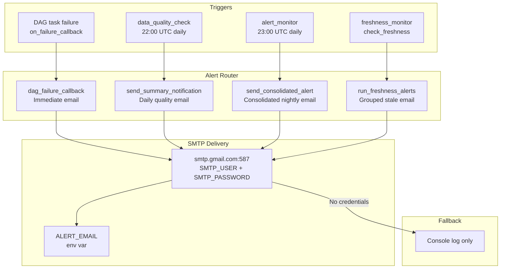
```mermaid
flowchart TD
    subgraph Triggers
        T1[DAG task failure\non_failure_callback]
        T2[data_quality_check\n22:00 UTC daily]
        T3[alert_monitor\n23:00 UTC daily]
        T4[freshness_monitor\ncheck_freshness]
    end

    subgraph Alert Router
        T1 --> E1[dag_failure_callback\nImmediate email]
        T2 --> E2[send_summary_notification\nDaily quality email]
        T3 --> E3[send_consolidated_alert\nConsolidated nightly email]
        T4 --> E4[run_freshness_alerts\nGrouped stale email]
    end

    subgraph SMTP Delivery
        E1 --> SMTP[smtp.gmail.com:587\nSMTP_USER + SMTP_PASSWORD]
        E2 --> SMTP
        E3 --> SMTP
        E4 --> SMTP
        SMTP --> ALERT_EMAIL[ALERT_EMAIL\nenv var]
    end

    subgraph Fallback
        SMTP --> |No credentials| LOG[Console log only]
    end
```

### 5.2 Freshness Alert Thresholds

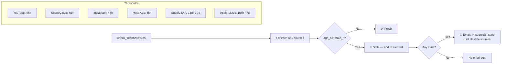
```mermaid
flowchart LR
    A[check_freshness runs] --> B[For each of 6 sources]
    B --> C{age_h > stale_h?}
    C --> |No| D[✅ Fresh]
    C --> |Yes| E[🔴 Stale — add to alert list]
    E --> F{Any stale?}
    F --> |Yes| G["📧 Email: 'N source(s) stale'\nList all stale sources"]
    F --> |No| H[No email sent]

    subgraph Thresholds
        TH1[YouTube: 48h]
        TH2[SoundCloud: 48h]
        TH3[Instagram: 48h]
        TH4[Meta Ads: 48h]
        TH5[Spotify S4A: 168h / 7d]
        TH6[Apple Music: 168h / 7d]
    end
```

### 5.3 Circuit Breaker Thresholds

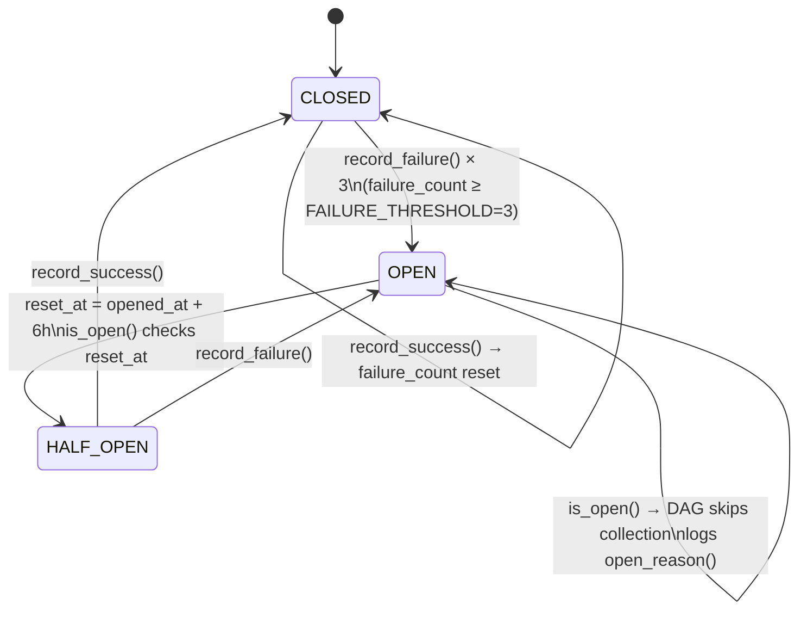
```mermaid
stateDiagram-v2
    [*] --> CLOSED
    CLOSED --> CLOSED : record_success() → failure_count reset
    CLOSED --> OPEN : record_failure() × 3\n(failure_count ≥ FAILURE_THRESHOLD=3)
    OPEN --> HALF_OPEN : reset_at = opened_at + 6h\nis_open() checks reset_at
    HALF_OPEN --> CLOSED : record_success()
    HALF_OPEN --> OPEN : record_failure()
    OPEN --> OPEN : is_open() → DAG skips collection\nlogs open_reason()
```

**Storage table:** `etl_circuit_breaker`
**Failure threshold:** 3 consecutive failures → OPEN
**Reset window:** 6 hours → HALF_OPEN (1 test request allowed)

### 5.4 Data Quality Alert Thresholds

```mermaid
flowchart TD
    subgraph Meta Freshness Check
        M1[MAX collected_at FROM meta_campaigns] --> M2{hours_since > 48h?}
        M2 --> |Yes| ERR[raise Exception\nDAG FAILED + email]
        M2 --> |No| OK1[✅ Pass]
    end

    subgraph Spotify Consistency Checks
        C1[Orphan artists\nno S4A data] --> W1[⚠️ WARNING logged]
        C2[Missing songs\ntimeline ≠ songs_global] --> W2[⚠️ WARNING]
        C3[Anomalous streams\n> 1,000,000 / day] --> W3[⚠️ WARNING]
        C4[Timeline gaps\n< 7 days data] --> W4[⚠️ WARNING]
        C5[Duplicates\nDISTINCT song+date ≠ COUNT] --> ERR2[🔴 CRITICAL]
    end

    subgraph Weekly Digest Metrics
        WD1[Streams delta: +/- vs prev 7d]
        WD2[Meta CTR: clicks/impressions×100]
        WD3[IG Followers delta: latest - 7d ago]
        WD4[ML Top Prediction: MAX dw_probability]
    end
```

### 5.5 Alert Email Templates

| Alert Type | Subject Format | Trigger | Color Coding |
|-----------|----------------|---------|--------------|
| DAG failure | `"🚨 Dashboard Alert: DAG {dag_id} — task {task_id} FAILED"` | Any task failure | Red |
| Data quality | `"📊 Rapport Qualité Données — {date}"` | Daily 22:00 | Critical=red, Warning=orange |
| Freshness | `"⚠️ {N} source(s) stale — Dashboard Music"` | Any stale source | Orange |
| Consolidated | `"📋 Rapport Monitoring — {date}"` | Daily 23:00 | Sectioned: red/orange/purple |
| Weekly digest | Per-artist HTML table | Monday 08:00 | Per-metric color |

### 5.6 Root Cause Detection (26 patterns)

| Pattern | Root Cause | Action |
|---------|-----------|--------|
| `401` | Expired/invalid credentials | Dashboard → Credentials → renew token |
| `403` | Insufficient permissions | Verify OAuth scopes |
| `429` | Rate limit exceeded | Reduce frequency or wait 1h |
| `token/expired/invalid_token` | Invalid token | Dashboard → Credentials → new token |
| `connection refused` | Docker service down | `docker-compose up -d` |
| `could not connect` | PostgreSQL inaccessible | Check `docker-compose ps` |
| `relation does not exist` | Missing table | Apply migrations |
| `no module named` | Missing dependency | `docker-compose build && up -d` |
| `fernet` | FERNET_KEY not configured | Add FERNET_KEY to .env |
| `timeout` | Network/API timeout | Check connection and retry |
| `soundcloud` (platform override) | API closed 2021 | Use unofficial credentials |
| `instagram/meta` (platform override) | Token expires 60d | Renew token in Dashboard |
| `youtube` (platform override) | Refresh Token invalid | Regenerate OAuth token |
| `spotify` (platform override) | Refresh Token invalid | Regenerate OAuth token |

---

## 6. API Endpoints with Rate Limits & Retry

### 6.1 Spotify API

```mermaid
flowchart TD
    SC[SpotifyCollector\nclient_id + client_secret] --> AUTH[SpotifyClientCredentials\nClient Credentials Grant]
    AUTH --> SP[spotipy.Spotify instance]
    SP --> E1["sp.artist(artist_id)\nGET /v1/artists/{id}"]
    SP --> E2["sp.artist_top_tracks(artist_id, country='FR')\nGET /v1/artists/{id}/top-tracks"]
    SP --> E3["sp.search(q, type='artist', limit=1)\nGET /v1/search"]
    E1 --> R1["@retry(3, exponential)\nbase_delay=2s: 2s→4s→8s"]
    E2 --> R1
    E3 --> R1
    R1 --> |ValueError: no artist| FAIL[raise — DAG FAILED]
```

**No explicit rate limit handling** — spotipy library manages internally.

### 6.2 YouTube Data API v3

```mermaid
flowchart TD
    YC[YouTubeCollector\napi_key] --> BUILD["build('youtube','v3',developerKey=api_key)"]
    BUILD --> E1["channels().list(part='statistics,snippet,contentDetails', id=channel_id)"]
    BUILD --> E2["playlistItems().list(playlistId=..., maxResults=50, pageToken=...)"]
    BUILD --> E3["videos().list(part='statistics,contentDetails,snippet', id='...')\n⚠️ MAX 50 IDs PER REQUEST"]
    BUILD --> E4["commentThreads().list(videoId=..., maxResults=100, order='relevance')"]
    BUILD --> E5["playlists().list(channelId=..., maxResults=50, pageToken=...)"]

    E1 --> R["@retry(3, exponential) on ALL methods"]
    E2 --> R
    E3 --> R
    E4 --> R
    E5 --> R
    E4 --> |partial failure| CONTINUE[Continue with partial list\nnon-blocking for comments]
```

**Rate limits:**
- Max 50 video IDs per `videos().list()` call (explicit batching)
- Max 50 playlists per page
- Max 100 comments per request
- Pagination via `nextPageToken`

### 6.3 Instagram / Meta Graph API

```mermaid
flowchart TD
    IC[InstagramCollector\nartist_id] --> ENV[os.getenv\nINSTAGRAM_ACCESS_TOKEN\nINSTAGRAM_USER_ID\nMETA_APP_ID\nMETA_APP_SECRET]
    ENV --> PRECHECK{expires_at\n<= 15 days?}
    PRECHECK --> |Yes| REFRESH[_refresh_access_token()\nGET graph.facebook.com/v18.0/oauth/access_token\ngrant=fb_exchange_token]
    PRECHECK --> |No| FETCH
    REFRESH --> |new token| PERSIST[update_platform_secret()\nartist_credentials table]
    PERSIST --> FETCH["fetch_stats()\nGET /v18.0/{ig_user_id}\nfields=username,followers_count,follows_count,media_count"]
    FETCH --> |401| RAISE401[raise ValueError\nToken expired — no retry]
    FETCH --> |400 code 190| RAISE400[raise ValueError\nToken expired — no retry]
    FETCH --> |400 code 100| RAISE400B[raise ValueError\nWrong user_id — no retry]
    FETCH --> |2xx| DATA[Return stats dict]
    FETCH --> R["@retry(3, exponential)"]
```

**Token lifecycle:**
- Long-lived token: ~60 days
- Proactive refresh: at ≤15 days remaining
- Weekly DAG refresh: `meta_token_refresh` every Monday 07:00 UTC (threshold=30 days)

### 6.4 SoundCloud API

```mermaid
flowchart TD
    SCC[SoundCloudCollector\nclient_id + client_secret + user_id] --> TOKEN["_get_access_token()\nPOST api.soundcloud.com/oauth2/token\ngrant=client_credentials"]
    TOKEN --> EXPIRY[expires_in default 3600s\n_token_expires_at = now + expires_in - 60s]
    EXPIRY --> ENSURE[_ensure_token()\nbefore each request]
    ENSURE --> |expired| TOKEN
    ENSURE --> |valid| FETCH["fetch_tracks()\nGET api.soundcloud.com/users/{user_id}/tracks\nlimit=50&offset=N&linked_partitioning=1"]
    FETCH --> PAG{nextPageToken?}
    PAG --> |Yes| FETCH
    PAG --> |No| DATA[Return all tracks]
    FETCH --> |401| RAISE401[raise ValueError\nInvalid credentials — no retry]
    FETCH --> |429| RAISE429["raise ValueError\nRate limit — Retry-After: Xs\nAirflow handles delay"]
    FETCH --> |other 4xx/5xx| ERR[raise RuntimeError\ntriggers retry]
    FETCH --> R["@retry(3, exponential)"]
```

**Note:** SoundCloud closed public API in 2021. Unofficial credentials (`client_credentials` grant) still work for some accounts.

### 6.5 Meta Ads API (v21.0)

```mermaid
flowchart TD
    MAC[MetaAdsAPICollector\nartist_id] --> CREDS[credential_loader\nload_platform_credentials\nartist_id, 'meta']
    CREDS --> VALIDATE{access_token\napp_id\napp_secret\naccount_id\nall present?}
    VALIDATE --> |No| RAISE[raise ValueError\nMissing fields]
    VALIDATE --> |Yes| INIT["FacebookAdsApi.init()\nAPI version: v21.0"]
    INIT --> CAMP["_meta_list(get_campaigns)\nlimit=500"]
    INIT --> ADSETS["_meta_list(get_adsets)\nlimit=500"]
    INIT --> ADS["_meta_list(get_ads)\nlimit=500"]
    INIT --> INSIGHTS["_fetch_all_insights()\nMonthly chunks\n4 breakdowns"]

    INSIGHTS --> I1[global/day\nlimit=5000]
    INSIGHTS --> I2[breakdown=age\nlimit=5000]
    INSIGHTS --> I3[breakdown=country\nlimit=5000]
    INSIGHTS --> I4[breakdown=publisher_platform+position\nlimit=5000]

    subgraph Rate Limit Handling
        RL["_meta_list() wrapper\nFacebookRequestError.api_error_code() == 17"]
        RL --> |attempt 1| W1[wait 60s]
        RL --> |attempt 2| W2[wait 120s]
        RL --> |attempt 3| FAIL[raise]
    end

    CAMP --> RL
```

**API limits per call:**
| Endpoint | limit param | Notes |
|----------|-------------|-------|
| `get_campaigns()` | 500 | Per ad account |
| `get_ad_sets()` | 500 | Per ad account |
| `get_ads()` | 500 | Per ad account |
| `get_insights()` | 5000 | Monthly chunked |
| Rate limit code 17 | — | 60s × attempt backoff |

### 6.6 Credential Test Endpoints (Dashboard)

| Platform | Test URL | Method | Auth |
|----------|----------|--------|------|
| Spotify | `https://accounts.spotify.com/api/token` | POST | HTTP Basic (client_id:secret) |
| YouTube | `https://oauth2.googleapis.com/token` | POST | Body params (refresh_token grant) |
| SoundCloud | `https://api.soundcloud.com/oauth2/token` | POST | Body params (client_credentials) |
| SoundCloud verify | `https://api.soundcloud.com/users/{id}/tracks` | GET | OAuth header |
| Meta | `https://graph.facebook.com/v18.0/me` | GET | `?access_token=...` |
| Meta refresh | `https://graph.facebook.com/v18.0/oauth/access_token` | GET | `?fb_exchange_token=...` |

---

## 7. Credential Pipelines

### 7.1 Credential Storage Architecture

```mermaid
flowchart TD
    USER[Dashboard User] --> CREDS_VIEW[credentials.py view]
    CREDS_VIEW --> SPLIT{Field type?}

    SPLIT --> |secret: True| ENC[_encrypt_secrets()\nFernet AES-128\nFERNET_KEY from config.yaml]
    SPLIT --> |secret: False| PLAIN[extra_config JSONB\nplain text]

    ENC --> BLOB[token_encrypted TEXT]
    PLAIN --> JSON[extra_config JSONB]

    BLOB --> DB[(artist_credentials\nartist_id, platform UNIQUE)]
    JSON --> DB

    subgraph Retrieval path
        DAG[Airflow DAG task] --> CL[credential_loader\nload_platform_credentials\nartist_id, platform]
        CL --> DB
        DB --> DEC[Fernet.decrypt()\ntoken_encrypted → dict]
        DEC --> MERGE[merge extra_config + secrets]
        MERGE --> COLLECTOR[Collector constructor]
    end

    subgraph Fernet Key
        KEY[FERNET_KEY env var] --> DEC
        KEY --> ENC
    end
```

### 7.2 Per-Platform Credential Fields

| Platform | secret=True | secret=False | Token Lifecycle |
|----------|-------------|--------------|-----------------|
| **Spotify** | `client_secret`, `refresh_token` | `client_id`, `redirect_uri` | No expiry (client credentials) |
| **YouTube** | `client_secret`, `refresh_token` | `client_id` | Refresh tokens (persistent) |
| **SoundCloud** | `client_secret` | `client_id`, `user_id` | Client credentials, auto-renew 3600s |
| **Meta / Instagram** | `access_token`, `app_secret` | `app_id`, `account_id`, `ig_user_id` | 60 days, refresh at ≤15d remaining |

### 7.3 Credential Retrieval Flow (DAG Context)

```mermaid
sequenceDiagram
    participant DAG as Airflow DAG task
    participant CL as credential_loader
    participant DB as artist_credentials table
    participant F as Fernet (FERNET_KEY)
    participant C as Collector

    DAG->>CL: load_platform_credentials(artist_id, 'meta')
    CL->>DB: SELECT token_encrypted, extra_config WHERE artist_id=%s AND platform=%s
    DB-->>CL: Row {token_encrypted: "gAAA...", extra_config: {...}}
    CL->>F: decrypt(token_encrypted)
    F-->>CL: {"access_token": "EAA...", "app_secret": "abc..."}
    CL-->>DAG: {**extra_config, **secrets} merged dict
    DAG->>C: Collector(**credentials)
    C->>API: API call with credentials
    API-->>C: Response
    C-->>DAG: data rows
```

### 7.4 Token Refresh Flows

```mermaid
flowchart TD
    subgraph Instagram Proactive Refresh
        A1[InstagramCollector.__init__] --> B1[fetch expires_at\nfrom artist_credentials]
        B1 --> C1{days_left <= 15?}
        C1 --> |Yes| D1["GET graph.facebook.com/v18.0/oauth/access_token\ngrant=fb_exchange_token"]
        D1 --> E1[new_token + new_expires_at\n= now + 5,184,000s (~60d)]
        E1 --> F1[update_platform_secret()\nartist_id, 'meta', 'access_token']
        C1 --> |No| SKIP[Skip refresh]
    end

    subgraph meta_token_refresh DAG Weekly
        A2[Every Monday 07:00 UTC] --> B2[For each active artist\nwith Meta credentials]
        B2 --> C2{expires_at NULL\nor <= 30 days?}
        C2 --> |NULL + System User| SKIP2[Skip — requires manual]
        C2 --> |Yes| D2["GET graph.facebook.com/v18.0/oauth/access_token\ngrant=fb_exchange_token"]
        D2 --> E2[Update artist_credentials\ntoken_encrypted + expires_at]
        C2 --> |No| SKIP3[Token still valid]
    end

    subgraph Dashboard Manual Refresh
        A3[User clicks 'Rafraîchir token Meta'] --> D3["GET graph.facebook.com/v18.0/oauth/access_token"]
        D3 --> E3[Save to DB via _save_credentials()]
    end
```

### 7.5 Credential Access Control

```mermaid
flowchart LR
    USER[Session User] --> CHECK{is_admin()?}
    CHECK --> |Yes| ADMIN[SELECT all active artists\nManage any artist's credentials]
    CHECK --> |No| ARTIST[get_artist_id()\nOwn credentials only]

    ADMIN --> DB[(artist_credentials)]
    ARTIST --> DB

    DB --> GUARD{artist_id matches\nif artist role?}
    GUARD --> |Mismatch| BLOCK[st.error + st.stop()]
    GUARD --> |OK| SHOW[Show credential form]
```

### 7.6 config.yaml vs Environment Variables

| Data | Source | Used By |
|------|--------|---------|
| DB host/port/user/password | `config/config.yaml` → `get_database_config()` | Dashboard only |
| DB connection (DAGs) | `.env` → `DATABASE_HOST/PORT/USER/PASSWORD` | DAGs + collectors |
| Fernet key | `config/config.yaml` → `fernet_key` | credentials.py, credential_loader |
| Spotify API keys | `artist_credentials` table (via credential_loader) | DAG tasks |
| YouTube API key | `artist_credentials` table | DAG tasks |
| Meta access_token | `artist_credentials` table (encrypted) | DAG tasks |
| SoundCloud creds | `artist_credentials` table OR env fallback | DAG tasks |
| SMTP credentials | `.env` → `SMTP_USER/PASSWORD/ALERT_EMAIL` | email_alerts.py |
| Airflow credentials | `.env` → `AIRFLOW_USERNAME/PASSWORD` | airflow_monitor.py |

---

## Summary: Complete System at a Glance

```mermaid
flowchart TD
    subgraph External Sources
        SP[Spotify API]
        YT[YouTube API v3]
        SC[SoundCloud API]
        IG[Meta/Instagram Graph API v18]
        MA[Meta Ads API v21]
        CSV1[S4A CSV exports]
        CSV2[Apple Music CSVs]
        CSV3[iMusician CSVs]
        CSV4[Meta Ads CSVs]
    end

    subgraph Airflow DAGs
        D1[spotify_api_daily 07:00]
        D2[youtube_daily 08:00]
        D3[soundcloud_daily 09:00]
        D4[instagram_daily 10:00]
        D5[meta_ads_api_daily 05:00]
        D6[s4a_csv_watcher every 15m]
        D7[apple_music_csv_watcher every 15m]
        D8[imusician_csv_watcher every 15m]
        D9[meta_config_dag + meta_insights_dag manual]
        D10[ml_scoring_daily 06:00]
        D11[data_quality_check 22:00]
        D12[alert_monitor 23:00]
        D13[weekly_digest Mon 08:00]
        D14[meta_token_refresh Mon 07:00]
    end

    subgraph PostgreSQL spotify_etl
        DB[(51 tables\n3 SaaS core\n4 Spotify\n1 SoundCloud\n1 Instagram\n4 Apple Music\n4 Meta API\n10 Meta CSV\n6 YouTube\n3 iMusician\n2 Hypeddit\n2 Billing\n2 Referral\n2 Promo\n2 ETL Monitor\n1 ML\n1 Wrapped)]
    end

    subgraph Streamlit Dashboard
        V1[Home KPI]
        V2[Spotify S4A]
        V3[YouTube]
        V4[SoundCloud]
        V5[Apple Music]
        V6[Instagram]
        V7[Meta Ads]
        V8[iMusician]
        V9[Revenue Forecast]
        V10[ML Performance]
        V11[ETL Logs]
        V12[Admin]
        V13[Credentials]
    end

    subgraph Alerts
        A1[📧 Immediate: DAG failures]
        A2[📧 Daily 22:00: Data quality]
        A3[📧 Daily 23:00: Consolidated monitor]
        A4[📧 Ad-hoc: Stale sources]
        A5[📧 Weekly Mon: Digest]
    end

    SP --> D1
    YT --> D2
    SC --> D3
    IG --> D4
    MA --> D5
    CSV1 --> D6
    CSV2 --> D7
    CSV3 --> D8
    CSV4 --> D9
    D1 & D2 & D3 & D4 & D5 & D6 & D7 & D8 & D9 & D10 --> DB
    DB --> V1 & V2 & V3 & V4 & V5 & V6 & V7 & V8 & V9 & V10 & V11 & V12 & V13
    D11 & D12 & D13 --> A1 & A2 & A3 & A4 & A5
    D14 --> DB
```
