# Unified ML + SoftEng Checklist
> Single source of truth — ML pipeline, MLOps, Software Engineering, Architecture decisions.
> Anchored in the reference project's REX but designed to be reusable across personal and professional ML projects.

---

## Table of Contents

1. [Architecture & Use Case Matrix](#1-architecture--use-case-matrix)
2. [Data Preparation & EDA](#2-data-preparation--eda)
3. [Feature Engineering & Preprocessing](#3-feature-engineering--preprocessing)
4. [Modeling & Optimization](#4-modeling--optimization)
5. [Evaluation & Interpretation (XAI)](#5-evaluation--interpretation-xai)
6. [Dimensionality Reduction & Clustering](#6-dimensionality-reduction--clustering)
7. [Time Series & Deep Learning](#7-time-series--deep-learning)
8. [Reinforcement Learning (Predictive Maintenance)](#8-reinforcement-learning-predictive-maintenance)
9. [Deployment & MLOps](#9-deployment--mlops)
   - 9.0 ETL Pipeline | 9.0b Data Pipeline Orchestration
   - 9.1 Model Packaging | 9.1b MLflow Registry Workflow
   - 9.2 MLOps Pipeline | 9.2b Environment Promotion (dev→staging→prod)
   - 9.3 Drift Detection | 9.4 Retraining Strategy | 9.4b CI/CD→MLflow Loop
   - 9.5 Monitoring Metrics | 9.5b Model Validation Gates | 9.5c Prometheus+Grafana
   - 9.6 IPC Industrial Deployment
   - 9.7 Load Testing (Locust) | 9.8 Deployment Strategies | 9.8b Rollback Procedure
   - 9.9 Observability (Logs+Traces) | 9.10 Production Compose Template
   - 9.11 Disaster Recovery | 9.12 Kubernetes (optional)
10. [Security](#10-security) — 10.1 App Security | 10.2 ML Fairness | 10.3 Adversarial Threats
11. [Software Engineering — Architecture](#11-software-engineering--architecture)
12. [Software Engineering — Data & Tests](#12-software-engineering--data--tests)
13. [Development Environment & Tooling](#13-development-environment--tooling) — venv | requirements.txt | Docker Hub | VM testing | pre-commit | Makefile

---

## 1. Architecture & Use Case Matrix

### 1.1 Problem Type → Algorithm Selection

| Problem | Data | Recommended Algorithms | Notes |
|---------|------|------------------------|-------|
| Binary classification (fault / no-fault) | Tabular, labeled | XGBoost, LightGBM, LogisticRegression, SVM | Cost-sensitive weights, threshold tuning |
| Multiclass classification (NEAI classes) | Tabular, labeled | XGBoost, Random Forest, CatBoost | Stratified split |
| Regression (RUL, wear) | Tabular, labeled | XGBoost, SVR, LightGBM, Linear Regression | RMSE / MAE metric |
| Anomaly detection (no fault labels) | Tabular, unlabeled healthy | Isolation Forest, PCA-GMM, One-Class SVM, Autoencoder | Percentile threshold on healthy train set |
| Clustering (operating regimes) | Tabular, unlabeled | K-Means, DBSCAN, Hierarchical | Elbow + Silhouette validation |
| Time-series forecasting | Sequential, temporal | ARIMA, LSTM, TCN, Prophet | No random shuffle, TimeSeriesSplit |
| Maintenance policy optimization | Sequential decisions | Q-Learning, PPO, SAC (RL) | Reward = -cost_downtime - cost_maintenance |
| Drift detection | Production features | KS-Test, PSI, Chi², Jensen-Shannon | Track per-feature + target drift |

---

### 1.2 Technology & Tool Selection Matrix

| Layer | Choice A | Choice B | When to choose A | When to choose B |
|-------|----------|----------|-----------------|-----------------|
| **Time-series DB** | QuestDB OSS | SQLite | High write throughput, Apache 2.0, SQL-native, long retention | Simple prototype, low volume, single machine |
| **API** | FastAPI | Flask | Async needed, auto-docs, modern projects | Legacy, minimal setup |
| **Container orchestration** | Kubernetes (k8s) | Docker Compose | Multi-node, auto-scaling, production HA | Single machine, dev/staging |
| **Container UI / ops** | Portainer | `docker` CLI only | Need GUI for non-dev ops (site engineer restarting a container) | Fully scripted + CI |
| **Dashboard** | Streamlit | React | Python-native, ML visualizations, fast iteration | Production UX, complex interactivity |
| **Monitoring** | Grafana | Custom Streamlit | Real-time, alerting, multi-source | ML-specific metrics, Python pipeline integration |
| **SCADA/HMI** | WinCC Unified | Streamlit | PLC integration, industrial real-time, safety-critical | Data science analysis, post-hoc review |
| **Experiment tracking** | MLflow | W&B | Self-hosted, open-source, air-gapped industrial | Managed SaaS, team collaboration, rich UI out of the box |
| **Hyperparameter tuning** | Optuna | Ray Tune | Single-machine, Bayesian TPE, simple API | Distributed, large search spaces, advanced schedulers (ASHA, PBT) |
| **Data versioning** | DVC | MLflow artifacts | Git-integrated, large files, pipeline reproducibility | Coupled to MLflow runs |
| **Data quality / schema** | Great Expectations | Pandera | Batch validation, rich expectation library, docs site generator | Inline pandas schema, lightweight, type-hint-friendly |
| **Config management** | Hydra | dotenv / argparse | Nested configs, multirun sweeps, composition | Flat env vars, single-script projects |
| **Drift monitoring** | Evidently AI | Custom KS/PSI | Reports + dashboards out of the box, test suite API | Full control, embedded in own monitoring stack |
| **Data annotation** | Label Studio | CVAT | Generic modalities (time-series, audio, tabular, text, image) | Image/video-heavy, CV-focused |
| **Pipeline orchestration** | Airflow / Prefect / Dagster | APScheduler | DAGs, retries, lineage, many tasks | In-process scheduling, < 10 jobs |
| **Model serving** | BentoML / Seldon Core / KServe | Plain FastAPI | Multi-model, batching, A/B routing, k8s-native | Single model, simple endpoint |
| **ML platform (full)** | Kubeflow / Metaflow | DIY (FastAPI + MLflow + Airflow) | k8s-heavy org, standard patterns, central team | Small team, full stack control |
| **Feature store** | Feast | DIY tables | Multi-project reuse, online/offline parity | Single project, no re-serving |
| **Logging** | Loguru | stdlib `logging` | Colorized, zero-config, structured out of the box | Standard ecosystem, no extra dep, enterprise logging tooling |
| **Load testing** | Locust | k6 | Python ecosystem | JS ecosystem, scripted scenarios |
| **Secret management** | HashiCorp Vault | .env + Docker secrets | Multi-service, production | Single project, prototype |
| **Model compression** | Quantization (PTQ/QAT) | Pruning | Edge deployment, STM32 | Server, moderate size reduction |

**1.2b — Specialized tools quick-reference** (non-competing; pick per need)

| Need | Tool | One-liner |
|------|------|-----------|
| Structured logging in Python | **Loguru** | `from loguru import logger` — no handler boilerplate, built-in rotation, JSON mode, colorized |
| Docker operations GUI for non-devs | **Portainer** | web UI for compose/container/volume lifecycle; useful for on-site engineers without CLI fluency |
| Labeling any modality | **Label Studio** | multi-modal annotation (time-series windows, audio, image, text); exports to JSON/COCO/CSV |
| Distributed compute (training, tuning) | **Ray** (+ Ray Tune, Ray Serve, RLlib) | unifies distributed training, tuning, serving, RL under one API |
| Config / experiment composition | **Hydra** | hierarchical YAML configs, CLI overrides, multirun sweeps |
| Drift + data quality dashboards | **Evidently AI** | pre-built drift/perf reports (HTML + JSON); integrates with Airflow/MLflow |
| Schema on ingestion | **Great Expectations** / **Pandera** | declarative data contracts; GE = batch + docs, Pandera = inline schema |
| Feature store | **Feast** | keeps training features and serving features in sync |
| High-perf model serving | **Triton Inference Server** | multi-framework (PyTorch / TF / ONNX), dynamic batching, GPU scheduling |
| k8s-native ML workflows | **Kubeflow** / **KServe** | pipelines + serving on Kubernetes |
| Python-friendly ML workflows | **Metaflow** | decorator-based flows, versioned artifacts, cloud-ready |
| Infra-as-code workflows | **Argo Workflows** | k8s-native DAGs, sibling to Kubeflow Pipelines |

**Selection rule**: every tool introduced here must be justified by a concrete §1.3 question it answers. Do NOT add a tool because it is fashionable.

### 1.2c Vector Databases & Specialized Storage

> Needed as soon as you store **dense embeddings** for k-NN retrieval: RAG (retrieval augmented generation), similarity search over sensor-embedding patterns ("find 10 windows most similar to this unusual one"), semantic search over logs.

| Store | Type | Licence | Strengths | When |
|-------|------|---------|-----------|------|
| **FAISS** (Meta) | library | MIT | in-process, CPU+GPU, billion-scale ANN indices (IVF, HNSW, PQ) | no service, no persistence needed; embedded in a Python script |
| **pgvector** (PostgreSQL ext.) | extension | PostgreSQL | piggyback on existing PG; IVFFlat + HNSW indexes | already using PG and the vector workload is moderate (≤ 10 M vectors) |
| **Qdrant** | managed + OSS | Apache 2.0 | Rust-fast, rich filtering, payload schemas, REST + gRPC | production RAG, filtering required (metadata + vector) |
| **Milvus** (Zilliz) | managed + OSS | Apache 2.0 | cloud-native, scales to billions, many index types | huge corpora, k8s deployment |
| **Weaviate** | managed + OSS | BSD-3 | hybrid search (BM25 + vector) baked in, modular vectorizer modules | multi-modal RAG, graph-like filtering |
| **Chroma** | managed + OSS | Apache 2.0 | dead-simple Python API, good for prototypes | prototype, personal RAG, ≤ 10 M vectors |
| **LanceDB** | OSS | Apache 2.0 | columnar, zero-copy integration with Arrow/Parquet, serverless | analytics + vector on the same lake |
| **Vald** | OSS | Apache 2.0 | k8s-native distributed ANN | very large scale, k8s-first org |
| **Elasticsearch / OpenSearch** | managed + OSS | Elastic / Apache 2.0 | hybrid keyword + dense vector in existing cluster | already running ES / OS |
| **Redis (with RediSearch)** | managed + OSS | Redis Source Available + Apache 2.0 | microsecond latency, built-in TTL | low-latency, short-lived caches |

**Index types — pick by size / recall / latency**

| Index | Memory | Recall | Latency | Build time |
|-------|--------|--------|---------|------------|
| Flat (brute force) | O(N·d) | 1.0 | O(N·d) | 0 | prototypes, ≤ 1 M |
| IVF / IVFPQ | small (quantized) | 0.90–0.98 | fast | medium | 1 M – 1 B |
| HNSW | large (graph) | 0.95–0.99 | very fast | slow | ≤ 100 M, latency critical |
| ScaNN (Google) | medium | 0.95+ | fast | medium | high recall with quantization |

**Gates when adding a vector store**

- [ ] Why NOT pgvector? (if PG exists, start there)
- [ ] Embedding dimension + model + version logged alongside each vector
- [ ] Index rebuild procedure documented (HNSW is slow to rebuild; IVF faster)
- [ ] Quality measured: recall@k on a ground-truth eval set (never trust vendor benchmarks)

**Anti-patterns**

- ❌ Adopting Milvus/Weaviate for 50 k vectors — pgvector is enough
- ❌ Storing embeddings without model version — stale vectors can't be compared to new ones
- ❌ Mixing vectors from different models in the same collection — geometrically meaningless

---

### 1.3 Stack Selection Decision Checklist

> Answer these questions **before** finalising the technology stack. Each answer eliminates one or more options from §1.2.
> Anchored in reference project REX — updated 2026-04-15.

#### Category 1 — Data Volume & Compression

| # | Question | Why it matters |
|---|----------|----------------|
| 1.1 | What is the peak ingest rate (bytes/s)? Account for every sensor, axis, and sampling frequency. | Drives DB compression requirements and disk lifecycle planning |
| 1.2 | Does the chosen DB compress time-series natively? At what ratio? | InfluxDB TSM: 10-20×. QuestDB: 4-8×. PostgreSQL vanilla: 2-4×. MongoDB: 2-3× |
| 1.3 | How many GB/day of **raw** data vs **feature-level** data? | Raw BLOBs in SQLite ≠ downsampled features in TSDB |
| 1.4 | At what point does the disk saturate (months)? Does the DB have a native retention/downsampling policy? | InfluxDB: Tasks API. QuestDB: manual. PostgreSQL: triggers. Plan before deployment |

#### Category 2 — Data Joining & Cross-Source Correlation

| # | Question | Why it matters |
|---|----------|----------------|
| 2.1 | Do you need to join time-series data with relational metadata (tools, sessions, holes)? | Yes → keep a relational store alongside the TSDB (SQLite or PostgreSQL) |
| 2.2 | Are these joins complex (≥2 tables, aggregations, window functions)? | Simple lookups → SQLite OK. Complex analytics → PostgreSQL |
| 2.3 | Will you need to link your data to external enterprise databases (ERP, CMMS, prod scheduler)? | External link → PostgreSQL or REST API bridge. SQLite is local-only |
| 2.4 | Is schema strict in input (SQL) or flexible tags sufficient (InfluxDB)? | Strict schema → SQL. Flexible sensor tags → InfluxDB/QuestDB |

#### Category 3 — Scale-Out & Multi-Machine

| # | Question | Why it matters |
|---|----------|----------------|
| 3.1 | How many IPC instances will run simultaneously in production (now vs 3-year horizon)? | 1 IPC → SQLite OK for metadata. ≥2 IPC → PostgreSQL for central metadata |
| 3.2 | Will all IPCs write to a central server or keep local stores? | Local → SQLite+InfluxDB per IPC. Central → PostgreSQL+InfluxDB cluster |
| 3.3 | Does the TSDB support horizontal replication or clustering? | InfluxDB OSS: single-node. InfluxDB Enterprise/Cloud: clustered. QuestDB: replication (v7+) |

#### Category 4 — Network Resilience & Industrial Constraints

| # | Question | Why it matters |
|---|----------|----------------|
| 4.1 | Can the OT network experience micro-cuts? How long? | Yes → MQTT broker with QoS 1+ + Telegraf disk persistence buffer |
| 4.2 | Does the broker (Mosquitto) persist messages to disk across restarts? | `persistence=true` in mosquitto.conf mandatory for industrial use |
| 4.3 | What is the maximum buffering capacity needed (message count × size)? | Size Telegraf `metric_buffer_limit` accordingly |
| 4.4 | Is the IPC network air-gapped from the internet (for CI/CD updates)? | Air-gapped → local Docker registry (Gitea/Harbor) + VPN sideload pipeline |

#### Category 5 — Licensing & IT Authorization

| # | Question | Why it matters |
|---|----------|----------------|
| 5.1 | Has the IT/Cyber department reviewed the license of each tool? | InfluxDB 2.x: BSL (not fully open source). MongoDB: SSPL (restrictive). QuestDB: Apache 2.0. Grafana: AGPL-3.0 |
| 5.2 | Is "free for single-instance production use" sufficient, or does the policy require OSI-approved open source? | BSL allows production use but forbids reselling as a service |
| 5.3 | Are there export control or data sovereignty constraints on the tool's cloud features? | Self-hosted OSS tools (InfluxDB, Grafana) avoid cloud concerns |

#### Category 6 — Sampling Frequency & Inference Latency

| # | Question | Why it matters |
|---|----------|----------------|
| 6.1 | What is the minimum frame inter-arrival time (ms)? | Frame budget = 1000 / ODR × samples. Must exceed total inference time |
| 6.2 | How long does feature extraction + model inference take end-to-end? | XGBoost on 27 features: <5 ms. Autoencoder: ~20 ms. Budget ≥ 150 ms at 1666 Hz / 256 |
| 6.3 | Can the FastAPI server process one frame before the next arrives? | If no: add async queue or reduce model complexity |

#### Category 7 — Edge Hardware Budget (RAM/CPU)

| # | Question | Why it matters |
|---|----------|----------------|
| 7.1 | What is the RAM total of all Docker containers combined? | Each service: receiver ~200MB, api ~500MB, dashboard ~300MB, InfluxDB ~500MB, MLflow ~300MB |
| 7.2 | What is the IPC's available RAM and CPU budget? | BX-39A: 16GB RAM, Intel i5/i7 → ~2GB Docker footprint is fine |
| 7.3 | Can the chosen TSDB run in Docker on the IPC without OOM risk? | InfluxDB OSS 2.7 is stable at 512MB–1GB on light workloads |

#### Category 8 — Model Lifecycle & Hot-Swap

| # | Question | Why it matters |
|---|----------|----------------|
| 8.1 | Can a new model be loaded without restarting the API (hot-swap)? | Pattern: load new bundle into temp var, atomic `_xgb_bundle = new_bundle` |
| 8.2 | Can historical data be replayed to retrain models? | Requires raw BLOBs in SQLite (not just features in TSDB) — keep raw for N days |
| 8.3 | How is a retrained model rolled back if it degrades? | MLflow model registry: promote/demote stages (Staging → Production → Archived) |

#### Category 9 — Grafana & Observability

| # | Question | Why it matters |
|---|----------|----------------|
| 9.1 | Does the TSDB have an **official, maintained** Grafana plugin? | InfluxDB: ✅ official. QuestDB: ⚠️ community. PostgreSQL: ✅ official. MongoDB: ⚠️ limited |
| 9.2 | Is Flux (InfluxDB's query language) acceptable, or does the team prefer SQL? | Flux: powerful but niche. QuestDB/PostgreSQL: familiar SQL for all engineers |
| 9.3 | Are Prometheus metrics exposed by FastAPI for Grafana scraping? | Add `prometheus-fastapi-instrumentator` if Grafana Alerting rules are needed |

#### Category 10.b — Historical Data, Retention & Backup

| # | Question | Why it matters |
|---|----------|----------------|
| 10b.1 | What is the retention policy per store? (raw BLOBs, features, labels, model artifacts, logs) | Without an explicit policy, disks saturate silently or useful history gets purged by default |
| 10b.2 | What is the RPO per store? (max acceptable data loss in minutes/hours/days) | Drives backup cadence — hourly WAL ≠ daily snapshot ≠ weekly archive |
| 10b.3 | What is the RTO per disaster scenario? (disk fail / host fail / region loss / ransomware) | Each scenario has a different restore path; RTO target drives infra choice (hot standby vs cold restore) |
| 10b.4 | Where do backups physically live? | Same-disk snapshot ≠ backup; require off-host + off-site copy |
| 10b.5 | Is the retrain look-back window ≤ retention window? | Training on data no longer backupable creates unreproducible models |
| 10b.6 | Is every backup tagged with schema / migration head / code version? | Restoring a dump without its migration head onto future code = broken DB |
| 10b.7 | Is there a rehearsed restore runbook with measured RTO? | Untested backup = 50% chance of working under pressure |
| 10b.8 | Are historical ML training datasets immutable or do they mutate? (DVC hash / dataset version) | Mutable training tables break reproducibility and model auditability |

#### Category 10 — Decision Summary Template

```
Stack Selection Record — <project> — <date>

TSDB choice    : ______   Rationale: ___________
Metadata DB    : ______   Rationale: ___________
API framework  : ______   Rationale: ___________
Message broker : ______   Rationale: ___________
Dashboard      : ______   Rationale: ___________
ML tracking    : ______   Rationale: ___________
License review : ☐ done by: __________ on: __________
IT validation  : ☐ done by: __________ on: __________

Peak ingest    : ______ KB/s raw  /  ______ KB/s feature-level
Disk usage/day : ______ MB raw  /  ______ MB compressed
RAM footprint  : ______ GB total Docker
Frame budget   : ______ ms available  /  ______ ms inference
Multi-IPC plan : Phase 1: ___ IPC (___ local store)  → Phase 2: ___ IPC (___ central store)
```

---

### 1.4 Architecture Decision Flow

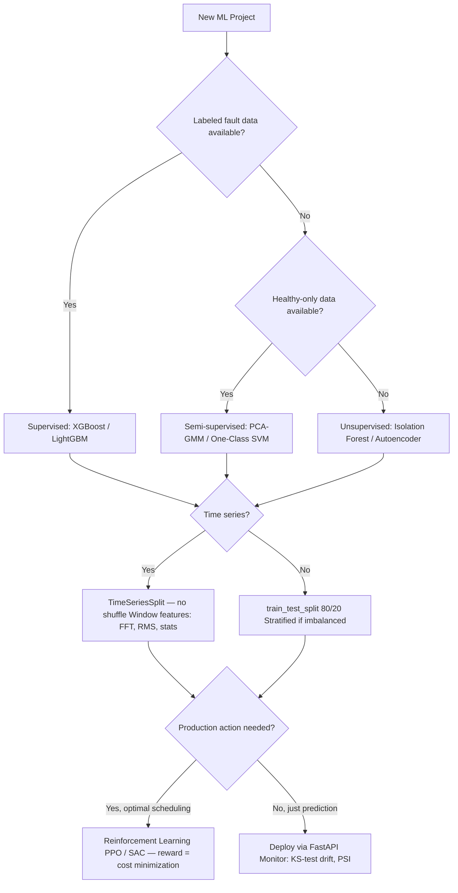

---

### 1.4 Final System Architecture (Reference project)

> Canonical system diagram lives in `architecture/macro_architecture.md` — keep this one in sync when it moves.

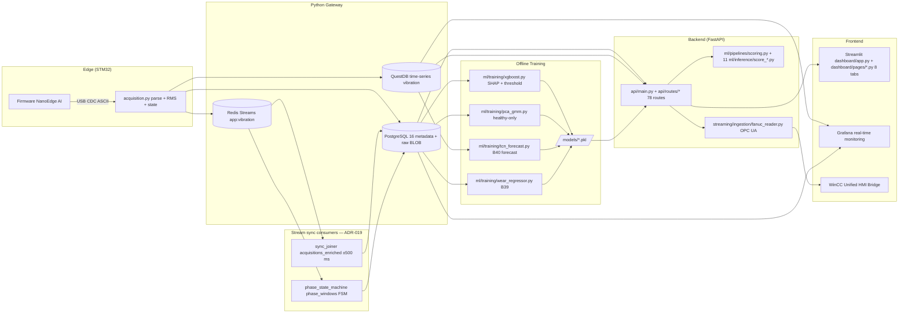

---

### 1.5 Use Case Data Flow Template

> Fill one row per use case **before any coding**. Forces the team to name every hop (sensor → features → DB → model → alert → human action) and commit to a latency SLA. The macro architecture in §1.4 is the system view; this section is the per-use-case contract.

| Field | Description | Example — UC11 (drilling, tool wear) "tool wear" |
|---|---|---|
| ID & name | slug used in code, dashboards, alerts | `uc11_tool_wear` |
| Business question | what decision does the human make? | "Should I replace this drill bit now?" |
| Signal source | capteur/API + sampling rate | STM32 STWIN, 1666 Hz, 3-axis accel |
| Ingestion module | script + protocol | `acquisition.py` via USB CDC |
| Raw DB write | table + backend + retention | `vibration` (QuestDB, 30 d) + BLOB in `raw_acquisitions` (PG, 7 d) |
| Feature extraction | module + output schema | `ml/features/extract.py` → 27 features, joined with `acquisitions_enriched` (PG) |
| Model | algo + input → output contract | XGBoost regressor → `wear_index` ∈ [0, 1] |
| Scoring module | sync/async + cadence | `ml/pipelines/scoring.py` hourly APScheduler job (orchestrates 11 `ml/inference/score_*.py`) |
| Score DB write | table + backend | `wear_predictions` (PG) + `tool_wear_ts` (QuestDB) |
| Alert trigger | rule + channel + cooldown | `wear_index > 0.80` → email + Grafana annotation, cooldown 60 min |
| Human action | who, what, SLA | Technician replaces drill bit within 4 h |
| End-to-end latency SLA | frame → score → alert | ≤ 2 s frame→score, ≤ 30 s score→alert |
| Ship gate | KPI threshold blocking release | See §9.5 KPI catalog row for this use case |

**Mandatory outputs per use case:**

- [ ] One row added to the project's `use_cases.md` (or equivalent) with all fields above
- [ ] One named KPI added to §9.5 KPI catalog (same ID slug)
- [ ] At least 5 scenarios added to §2.3 Scenario Library for this use case
- [ ] End-to-end integration test `tests/test_uc_<id>_e2e.py` covering the happy path

**Anti-patterns:**

- ❌ "We'll figure out the alert after training" — alert rule + cooldown must be decided up front, else drift-vs-alert thresholds are post-hoc rationalized
- ❌ Use case with no named human action — if nobody acts on it, the use case has no business value
- ❌ Skipping the latency SLA — you cannot design the pipeline (sync vs batch, stream vs polling) without it
- ❌ Implicit DB routing — "it goes in the DB" hides which DB and which retention; QuestDB vs PG vs Redis Streams are NOT interchangeable

---

## 2. Data Preparation & EDA

### 2.1 Checklist

| # | Task | Methods / Tools | Pitfalls |
|---|------|-----------------|---------|
| 2.1 | **Environment setup** | `pandas`, `numpy`, `sklearn`, `seaborn`, `matplotlib` | Pin versions in `requirements.txt` |
| 2.2 | **Load data** | `pd.read_csv`, `pd.read_excel`, `sqlite3`, InfluxDB client | Check encoding (UTF-8), separator |
| 2.3 | **Structural audit** | `df.head()`, `df.tail()`, `df.dtypes`, `df.shape` | int vs float ambiguity, object columns hiding numbers |
| 2.4 | **Duplicate detection** | `df.duplicated().sum()` | Deduplicate before split |
| 2.5 | **Column normalization** | `.str.lower().str.strip().str.replace(' ', '_')` | Consistency with DB schema |
| 2.6 | **Descriptive stats** | `df.describe()`, ydata-profiling / pandas-profiling | Great Expectations for schema validation |
| 2.7 | **Outlier identification** | IQR, Z-score, boxplot, scatter unreasonable pairs | Check sensor saturation (accel > 16g) |
| 2.7b | **Zeros masking missing data** | `(df == 0).sum()` — distinguish true zero from missing-coded-as-zero using domain knowledge | e.g. RMS = 0 is physically impossible → recode as NaN before imputation |
| 2.7c | **Impossible inter-variable relationships** | Detect domain-impossible combinations via scatter plots and business rules — e.g. listeners > streams is physically impossible | Flag or remove rows violating hard domain constraints |
| 2.8 | **Spoiler / leakage detection** | Manual column audit: does feature know the future? | "repair_date", "maintenance_done" columns |
| 2.9 | **Missing value analysis** | `df.isna().sum() / len(df)`, Missingno matrix, dendogram | MCAR vs MAR vs MNAR → different strategies |
| 2.10 | **Univariate distributions** | Histograms, KDE, violinplot, boxplot | Heavy tail? → log-transform candidate |
| 2.11 | **Bivariate analysis** | Pairplot, jointplot, Pearson heatmap, Spearman ranking | Pearson assumes linearity → use Spearman for monotone relations |
| 2.11b | **Non-parametric tests** | Mann-Whitney U (compare 2 groups), Kruskal-Wallis (compare 3+ groups), Wilcoxon signed-rank (paired samples) — use when normality assumption is violated | `scipy.stats.mannwhitneyu`, `scipy.stats.kruskal`, `scipy.stats.wilcoxon` |
| 2.12 | **Power law check** | Log-log plot | Frequency data (streams, followers) often power-law |
| 2.13 | **Feature dependency matrix** | Correlation matrix, Lasso path, RFE | Detect multicollinearity before modeling |
| 2.14 | **Interactive viz** | Bokeh, Plotly, UMAP 3D | Use for demo / presentation |

### 2.2 Missing Data Decision Tree

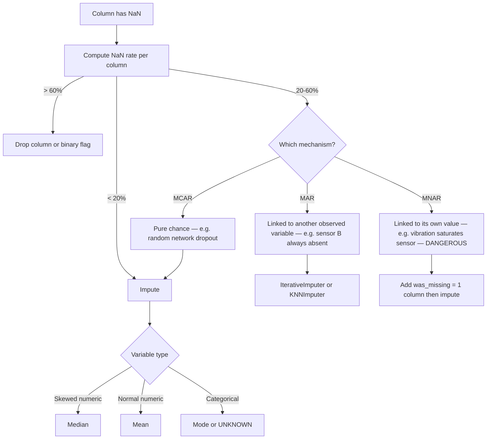

---

### 2.3 Fictional Scenario Library (narrative drift + alert + reco)

> Statistical drift metrics (PSI, KS-test) tell you **that** something changed, not **whether the alert chain works**. Before any production release, each use case defined in §1.5 must have a library of synthetic scenarios that exercise the full pipeline: generate fake data → check feature drift → check alert fires (or does not) → check recommended action matches expectation.

**5 mandatory scenario types per use case:**

| # | Scenario | Input | Expected drift | Expected alert | Expected recommendation |
|---|----------|-------|----------------|----------------|-------------------------|
| 1 | **Nominal** | baseline synthetic stream, healthy distribution | PSI < 0.1 on all features | none | no action |
| 2 | **Slow degradation** | progressive drift over N cycles | PSI crosses warn (0.1) then drift (0.2) in order | `drift_status=warn` then `drift_status=drift` before any fault alert | schedule maintenance window |
| 3 | **Abrupt fault** | step change in 1+ critical features | sudden PSI > 0.25 | fault alert within expected latency (e.g. ≤ 30 s) | stop machine immediately |
| 4 | **Sensor fault** | axis stuck / biased / saturated | `sensor_health` drift; feature distribution degenerate | `sensor_health=drift` fires BEFORE model fault alert | check sensor, do not blame the tool |
| 5 | **Adversarial/boundary** | NaN, inf, future timestamps, duplicates, TZ-naïve records | pipeline rejects gracefully | no false alert | DLQ row + structured log |

**Format per scenario** (template):

```markdown
## Scenario — <uc_id>_<scenario_type>
**State initial**: <description>
**Event**: <what is injected and how>
**Generator**: `tools/scenarios/<uc_id>_<type>.py --duration <N> --seed <K>`
**Expected drift trace**: <named features, direction, magnitude>
**Expected alert**: <alert name, channel, latency bound>
**Expected recommendation**: <human action>
**Verification**: `pytest tests/test_scenarios/test_<uc_id>_<type>.py`
```

**Gate** — before release:

- [ ] Every use case from §1.5 has all 5 scenarios generated + tested
- [ ] Scenario generators are deterministic (`--seed` flag) and reproducible in CI
- [ ] Scenario test runtime ≤ 10 min total (use sampling, not full-length replay)
- [ ] Adversarial scenario covers: NaN, ±inf, future timestamp, duplicate, TZ-naïve (see §2.4)

**Anti-patterns:**

- ❌ Only testing the nominal path — you will never observe your alert chain under drift until production
- ❌ Reusing production data snapshots as "scenarios" — not reproducible, privacy risk, no labeled drift
- ❌ Sensor-fault and model-fault indistinguishable in alerts — human gets paged to the wrong place
- ❌ No latency bound on expected alert — "fires eventually" is not a contract

---

### 2.4 Multi-Database Temporal Synchronization Checklist

> Applies as soon as the pipeline writes to **≥ 2 stores** (e.g. relational + time-series + stream queue) AND joins them by timestamp. Violations fail silently: joins return `NULL` instead of errors, off-by-TZ offsets stay within sane-looking magnitudes, and the model trains on misaligned pairs. Consolidated from reference project REX on `/etc/localtime` bind-mount, `fetch_plc_context_at` ±500 ms window, and Pilier 4 sync health snapshots.

**Clock discipline**

- [ ] NTP or PTP client configured on **all** hosts (dev, CI, prod) — `chrony` preferred; alert on offset > N ms (project-defined, e.g. 50 ms)
- [ ] OS timezone = UTC on all hosts (`timedatectl show → Timezone=UTC`)
- [ ] **All** Docker services declare `TZ=UTC` in compose `environment:` — parsed by a CI invariant test
- [ ] **Never** bind-mount `/etc/localtime` into a container — it imports the host TZ and breaks time-window joins silently on non-UTC hosts (e.g. `Europe/Paris` = +3600 s offset, no SQL error)

**Canonical timestamp format** (producers)

- [ ] All producers emit `datetime.now(timezone.utc).isoformat(timespec="milliseconds")` — never bare `datetime.now()`, never `utcnow()` (deprecated + naïve)
- [ ] Schema columns are `TIMESTAMPTZ` (PG), ISO-8601 TEXT (SQLite), or native µs epoch (QuestDB) — never wall-clock local strings
- [ ] Linter forbids `datetime.now()` / `datetime.utcnow()` outside the allow-list of cosmetic contexts (filenames, email subject)

**Join window discipline** (consumers)

- [ ] Every cross-store join has an explicit `WINDOW_MS` constant, justified by source jitter (USB buffering, OPC UA polling, network RTT)
- [ ] Record `diff_ms` per matched pair in the enriched row (debug + ship rule)
- [ ] Outside-window rows: do NOT silently drop — write with `null_<src>_reason='timeout'` so the null ratio is observable
- [ ] KPI `null_<src>_ratio` exported to Grafana with project-defined ship threshold (e.g. ≤ 0.5 %)
- [ ] KPI `p95(diff_ms)` exported with ship threshold (e.g. ≤ 20 ms on synthetic bench)

**DLQ (dead letter queue)**

- [ ] Append-only JSONL file for bulk-insert failures and parse errors (never drop, never overwrite)
- [ ] Backlog size alert (e.g. > 50 rows) — early signal that downstream is stuck
- [ ] DLQ drain procedure documented (who, how, retention)

**Mandatory invariant tests**

- [ ] `test_timezone_invariant.py` (or equivalent) asserting:
  - (a) UTC-aware producer + UTC-aware consumer → join succeeds
  - (b) Naïve-local producer vs UTC-aware consumer → join returns `None` cleanly, not a silent wrong match
  - (c) Docker compose parsed: every long-running service has `TZ=UTC`, zero `/etc/localtime` bind-mounts
- [ ] Round-trip test: write timestamp in service A, read in service B, assert ISO string bit-identical

**Anti-patterns:**

- ❌ Storing local wall-clock "because Grafana shows UTC anyway" — Grafana converts on display, but joins run on raw stored bytes
- ❌ Silent `LEFT JOIN` with no null-reason column — you lose the ability to measure sync health
- ❌ Widening the join window to reduce null ratio instead of fixing the producer's jitter — hides the real problem
- ❌ One service on localtime "for log readability" — heterogeneous TZ = non-deterministic ordering under lexicographic comparison

> Concrete example: see `.claude/rules/timesync.md` + `src/Application/tests/test_timezone_invariant.py` + §9.6.5 for the IPC-specific NTP config.

---

### 2.5 Statistical Tests — Workflow Catalog

> Every statistical test has the same 5-part contract: **objective · null hypothesis H₀ · method · expected result · next action**. Running a test without being able to state the next action is a waste. The table below is the project's exhaustive reference; use the decision tree at the end to pick.

**General interpretation rule** for all frequentist tests below:

- `p < α` (typically α = 0.05, or α = 0.01 for strict) → **reject H₀** → the effect is statistically significant at the chosen level
- `p ≥ α` → **fail to reject H₀** → the data is compatible with H₀ (NOT "H₀ is true")
- Always report **effect size** alongside p-value — a tiny p on a huge sample with a negligible effect is not actionable

#### 2.5.a Normality tests (is this column ~Gaussian?)

| Test | H₀ | scipy / statsmodels | When to use | Output you act on |
|------|----|---------------------|-------------|-------------------|
| **Shapiro-Wilk** | sample is drawn from N(μ, σ²) | `scipy.stats.shapiro(x)` | n ≤ 5 000; most powerful for small samples | p < α → non-normal → use non-parametric tests / log-transform / Box-Cox |
| **D'Agostino K²** | normal (skew + kurtosis) | `scipy.stats.normaltest(x)` | 20 ≤ n ≤ 50 000; robust | same action as Shapiro-Wilk |
| **Anderson-Darling** | normal (weights tails) | `scipy.stats.anderson(x, dist='norm')` | detecting tail deviations | returns statistic + critical values per α; reject if stat > crit |
| **Jarque-Bera** | skew=0, excess kurt=0 | `scipy.stats.jarque_bera(x)` | finance / large n (> 2 000) | rejects easily on large n — combine with Q-Q plot |
| **Lilliefors** (KS + est. μ,σ) | normal | `statsmodels.stats.diagnostic.lilliefors(x)` | normality with unknown μ, σ | prefer to raw KS when μ, σ estimated from sample |

**Example**

```python
from scipy import stats
stat, p = stats.shapiro(df["rms_norm"])
if p < 0.05:
    print("Non-normal → use Mann-Whitney U, not t-test")
```

**Workflow** — run normality BEFORE choosing a mean-comparison test. Combine with Q-Q plot (`scipy.stats.probplot`). On n > 10 000, formal tests reject even trivial deviations — visual Q-Q is more informative.

#### 2.5.b Stationarity & autocorrelation (time series)

| Test | H₀ | Library | When to use | Action |
|------|----|---------|-------------|--------|
| **ADF** (Augmented Dickey-Fuller) | series has a unit root (non-stationary) | `statsmodels.tsa.stattools.adfuller(x)` | before ARIMA / linear time-series models | p < α → stationary → OK to fit ARIMA(p,0,q) |
| **KPSS** | series is stationary (around deterministic trend) | `statsmodels.tsa.stattools.kpss(x)` | pair with ADF for cross-confirmation | p < α → non-stationary → difference the series |
| **Phillips-Perron** | unit root, robust to heteroscedasticity | `arch.unitroot.PhillipsPerron` | ADF alt with serial correlation | same as ADF |
| **Zivot-Andrews** | unit root with unknown break | `statsmodels.tsa.stattools.zivot_andrews` | suspect a structural break | locates break date in output |
| **Durbin-Watson** | no autocorrelation in residuals | `statsmodels.stats.stattools.durbin_watson(resid)` | residual diagnostics after regression | DW ≈ 2 = OK; DW < 1.5 = positive autocorr |
| **Ljung-Box** | joint autocorrelation = 0 up to lag k | `statsmodels.stats.diagnostic.acorr_ljungbox` | model residuals white noise? | p < α → residuals still autocorrelated → model under-specified |
| **ACF / PACF plots** | — | `statsmodels.graphics.tsaplots.plot_acf/pacf` | choose ARIMA (p, q) | read decay + cutoffs |

**Example — ADF + KPSS cross-check**

```python
from statsmodels.tsa.stattools import adfuller, kpss
adf_stat, adf_p, *_ = adfuller(series)
kpss_stat, kpss_p, *_ = kpss(series, regression="c")
# Case 1: ADF rejects + KPSS fails to reject → stationary ✅
# Case 2: ADF fails + KPSS rejects → non-stationary → difference
# Case 3: both reject → trend-stationary → detrend
# Case 4: both fail → not enough data, be cautious
```

#### 2.5.c Variance / homoscedasticity tests

| Test | H₀ | scipy | When | Action |
|------|----|-------|------|--------|
| **Levene** | equal variances across k groups | `scipy.stats.levene(*groups, center='median')` | robust to non-normality | p < α → heteroscedastic → Welch t-test instead of Student |
| **Bartlett** | equal variances | `scipy.stats.bartlett(*groups)` | ONLY if all groups normal | stricter than Levene |
| **Fligner-Killeen** | equal variances | `scipy.stats.fligner(*groups)` | most robust to departures from normality | same action |
| **F-test** | σ₁² = σ₂² | manual or `scipy.stats.f` | two groups, both normal | sensitive to non-normality |

#### 2.5.d Mean / median comparison (two groups)

| Test | H₀ | Parametric? | scipy | When | Action |
|------|----|-------------|-------|------|--------|
| **Student t-test (indep.)** | μ₁ = μ₂ | yes (normal + equal var) | `scipy.stats.ttest_ind(a, b)` | n₁,n₂ ≥ 30 OR normal + equal var | p < α → means differ |
| **Welch t-test** | μ₁ = μ₂, unequal var | yes | `ttest_ind(a, b, equal_var=False)` | unequal variances (Levene rejected) | same, **default recommended** over Student |
| **Paired t-test** | μ_diff = 0 | yes | `scipy.stats.ttest_rel(a, b)` | same subject before/after | p < α → intervention changed the mean |
| **Mann-Whitney U** | distributions equal (→ medians) | no | `scipy.stats.mannwhitneyu(a, b)` | non-normal, independent groups | p < α → distributions differ |
| **Wilcoxon signed-rank** | median_diff = 0 | no | `scipy.stats.wilcoxon(a, b)` | paired, non-normal | p < α → paired diff not centered on 0 |

**Example — choose automatically**

```python
def compare_two(a, b, alpha=0.05):
    from scipy import stats
    _, pa = stats.shapiro(a)
    _, pb = stats.shapiro(b)
    if pa > alpha and pb > alpha:
        _, plev = stats.levene(a, b)
        return stats.ttest_ind(a, b, equal_var=(plev > alpha))
    return stats.mannwhitneyu(a, b, alternative="two-sided")
```

#### 2.5.e Mean / median comparison (≥ 3 groups)

| Test | H₀ | Parametric? | scipy | When | Post-hoc |
|------|----|-------------|-------|------|----------|
| **One-way ANOVA** | μ₁ = μ₂ = ... = μ_k | yes (normal + equal var) | `scipy.stats.f_oneway(*groups)` | normal, homoscedastic | Tukey HSD (`statsmodels.stats.multicomp.pairwise_tukeyhsd`) |
| **Welch ANOVA** | same, unequal var | yes | `pingouin.welch_anova` | normal, heteroscedastic | Games-Howell |
| **Kruskal-Wallis** | distributions equal | no | `scipy.stats.kruskal(*groups)` | non-normal, independent | Dunn test (`scikit-posthocs`) |
| **Friedman** | treatment effect = 0 | no | `scipy.stats.friedmanchisquare(*groups)` | paired / repeated measures, non-normal | Nemenyi |
| **Two-way ANOVA** | main + interaction effects | yes | `statsmodels.formula.api.ols + anova_lm` | 2 factors | simple effects analysis |

#### 2.5.f Proportions & categorical

| Test | H₀ | scipy / statsmodels | When | Action |
|------|----|---------------------|------|--------|
| **Chi² goodness-of-fit** | observed = expected distribution | `scipy.stats.chisquare(obs, exp)` | single categorical vs reference | p < α → distribution differs from expected |
| **Chi² independence** | two categorical variables independent | `scipy.stats.chi2_contingency(table)` | contingency table, n ≥ 5 per cell | p < α → variables associated |
| **Fisher's exact** | rows × cols independent | `scipy.stats.fisher_exact(table)` | 2×2, small n (< 5 per cell) | exact p-value, no large-sample approx |
| **McNemar** | marginal homogeneity | `statsmodels.stats.contingency_tables.mcnemar` | paired 2×2 (before/after on same subjects) | p < α → change |
| **Cochran's Q** | k paired proportions equal | `statsmodels.stats.contingency_tables.cochrans_q` | repeated binary measures | p < α → at least one differs |

#### 2.5.g Correlation & association

| Test | Scale | scipy | Assumes | Output |
|------|-------|-------|---------|--------|
| **Pearson r** | interval/ratio, linear | `scipy.stats.pearsonr(x, y)` | linearity + normality of (x,y) | r ∈ [−1, 1] + p |
| **Spearman ρ** | ordinal / non-linear monotonic | `scipy.stats.spearmanr(x, y)` | monotone relation | rank correlation |
| **Kendall τ** | ordinal, small n | `scipy.stats.kendalltau(x, y)` | concordance-based | more robust than Spearman on ties |
| **Point-biserial** | continuous vs binary | `scipy.stats.pointbiserialr(x, y)` | normality within each binary group | same as Pearson on encoded binary |
| **φ (phi) / Cramér's V** | two categorical | `scipy.stats.contingency.association(table)` | — | strength of association on [0, 1] |
| **Mutual Information** | any, non-linear | `sklearn.feature_selection.mutual_info_regression` | — | non-negative, not bounded above |

> Rule: never report **only** Pearson. Heteroscedastic / non-linear relations are invisible in r but obvious in Spearman or MI.

#### 2.5.h Distribution comparison (core for drift detection)

| Test | Two-sample question | scipy | Output | Threshold |
|------|---------------------|-------|--------|-----------|
| **KS two-sample** | same distribution? (EDF max gap) | `scipy.stats.ks_2samp(ref, prod)` | D, p | p < 0.05 → drifted |
| **Anderson-Darling k-sample** | same distribution (tail-sensitive) | `scipy.stats.anderson_ksamp([ref, prod])` | stat, critical values | compare stat to crit |
| **Cramér-von Mises** | same distribution (integrated square gap) | `scipy.stats.cramervonmises_2samp` | stat, p | p < 0.05 → drifted |
| **Epps-Singleton** | same distribution (char. func.) | `scipy.stats.epps_singleton_2samp` | stat, p | robust to discrete data |
| **PSI** (Population Stability Index) | distribution shift (binned) | manual | PSI scalar | < 0.1 stable · 0.1–0.2 warn · > 0.2 drift |
| **KL divergence** | Σ p·log(p/q) | `scipy.special.rel_entr(p, q).sum()` | ≥ 0 | relative — pick project threshold |
| **Jensen-Shannon** | symmetric KL, bounded [0, log 2] | `scipy.spatial.distance.jensenshannon(p, q)` | [0, 1] | < 0.1 / < 0.2 typical |
| **Wasserstein / Earth Mover** | transport cost | `scipy.stats.wasserstein_distance` | ≥ 0 (same units as x) | project-specific |
| **MMD** (Maximum Mean Discrepancy) | RKHS distance | `alibi-detect` | scalar | reject H₀ of equal dist if permutation p < α |

**Example — PSI**

```python
import numpy as np
def psi(ref, prod, bins=10):
    edges = np.quantile(ref, np.linspace(0, 1, bins+1))
    edges[0], edges[-1] = -np.inf, np.inf
    p = np.histogram(ref, edges)[0] / len(ref) + 1e-6
    q = np.histogram(prod, edges)[0] / len(prod) + 1e-6
    return np.sum((q - p) * np.log(q / p))
```

#### 2.5.i Multiple-testing correction (critical if > 5 tests)

| Method | Trade-off | statsmodels |
|--------|-----------|-------------|
| **Bonferroni** | very conservative, family-wise error rate (FWER) | `multipletests(pvals, method="bonferroni")` |
| **Holm-Bonferroni** | step-down, uniformly more powerful than Bonferroni | `method="holm"` |
| **Šidák** | slightly less conservative | `method="sidak"` |
| **Benjamini-Hochberg (BH FDR)** | controls false discovery rate, more powerful | `method="fdr_bh"` |
| **Benjamini-Yekutieli** | BH under dependence | `method="fdr_by"` |

> Default recommendation: **BH FDR** for exploratory testing (e.g. 27 features × drift = 27 p-values). Bonferroni for confirmatory / safety-critical.

#### 2.5.j Effect size (ALWAYS report alongside p-values)

| Context | Metric | Function | Rule of thumb |
|---------|--------|----------|---------------|
| Two means, normal | **Cohen's d** | `(mean1 − mean2) / pooled_std` | 0.2 small · 0.5 medium · 0.8 large |
| Two means, non-parametric | **Cliff's δ** | `pingouin.cliffs_delta` | 0.147 small · 0.33 medium · 0.474 large |
| ANOVA | **η² / partial η²** | `statsmodels` | 0.01 / 0.06 / 0.14 |
| Correlation | **r²** | `scipy.stats.pearsonr(x,y)[0]**2` | share of variance explained |
| Categorical | **Cramér's V** | `scipy.stats.contingency.association` | 0.1 / 0.3 / 0.5 |
| Odds ratio | **OR / log-OR** | `statsmodels.stats.Table2x2` | 1 = no effect |

#### 2.5.k Bootstrap & permutation (when assumptions fail or no closed-form)

| Approach | scipy / library | Use case |
|----------|-----------------|----------|
| **Bootstrap CI** | `scipy.stats.bootstrap` | CI on any statistic (median, correlation) |
| **Permutation test** | `scipy.stats.permutation_test` | exact H₀ test by shuffling labels |
| **Monte Carlo simulation** | numpy | complex null, simulate → reject if observed extreme |

#### 2.5.l Bayesian alternatives (report both if stakeholder-facing)

| Approach | Library | Output | Interpretation |
|----------|---------|--------|----------------|
| **Bayes factor** | `pingouin.ttest`, `BayesFactor` (R) | BF₁₀ | > 3 moderate · > 10 strong evidence for H₁ |
| **Posterior credible interval** | `arviz`, `pymc` | 95 % HDI | direct probability statement on parameter |

#### 2.5.m Decision tree — which test do I run?

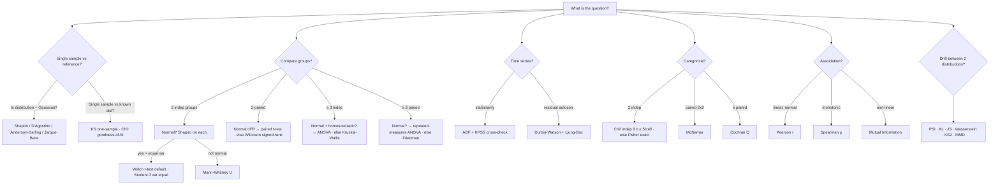

#### 2.5.n End-to-end workflow (applied to a new dataset)

1. **Schema + ranges** (Great Expectations / Pandera) — not a stat test, but the prereq
2. **Per-column normality**: Shapiro-Wilk (n ≤ 5k) or D'Agostino, log Q-Q plot
3. **Stationarity** if time-indexed: ADF + KPSS + plot
4. **Pairwise correlation**: Pearson heatmap + Spearman heatmap side-by-side (detect non-linear)
5. **Variance equality** across classes: Levene before group comparisons
6. **Group comparisons**: pick test via decision tree; always output (statistic, p, effect size, CI)
7. **Drift / monitoring**: PSI + KS on each feature vs reference; BH FDR if > 5 features
8. **Document every rejected H₀ with action taken** — a rejected H₀ with no action is noise

#### 2.5.o Anti-patterns

- ❌ **p-hacking**: testing until p < 0.05 → pre-register the hypothesis
- ❌ **Ignoring multiple testing**: 27 features × KS → ~1.35 false positives at α = 0.05 without correction
- ❌ **Reporting only p, never effect size**: large n guarantees p ≈ 0 on trivial differences
- ❌ **Student t-test on non-normal small samples**: false positive rate balloons — use Welch or MWU
- ❌ **Using normality tests on n > 10 000 and acting on them**: any deviation rejects — rely on Q-Q plot instead
- ❌ **Drawing causal conclusions from correlation tests**: see §5.6 Causal Inference

---

## 3. Feature Engineering & Preprocessing

### 3.1 Preprocessing Order (MANDATORY)

```mermaid
flowchart LR
    A[Raw DataFrame] --> B[1. Remove leakage columns]
    B --> C[2. Train/Test split STRATIFIED or TIME-BASED]
    C --> D[3. Fit imputer on TRAIN Transform TRAIN + TEST]
    D --> E[4. Encode categoricals OHE / Label / Frequency]
    E --> F[5. Log-transform volume variables on TRAIN]
    F --> G[6. Fit scaler on TRAIN Transform TRAIN + TEST]
    G --> H[7. SMOTE on TRAIN only never on TEST]
    H --> I[Ready for modeling]
```

> **Golden rule:** Fit everything on TRAIN. Apply to TEST. Never the other way.

### 3.2 Checklist

| # | Task | Methods / Tools | Notes |
|---|------|-----------------|-------|
| 3.1 | **Train/Test split** | `train_test_split(stratify=y)` or `TimeSeriesSplit` | Time series: always chronological, check both classes in each set |
| 3.2 | **Imputation** | `SimpleImputer`, `KNNImputer`, `IterativeImputer` | Fit on train only |
| 3.3 | **Log-transform** | `np.log1p(x)` for volume/skewed vars | Values < 0 → clip to 0 first |
| 3.4 | **Categorical encoding** | OHE (`drop_first=True`), LabelEncoder, FrequencyEncoder | OHE before SMOTE (SMOTE needs Euclidean distances) |
| 3.5 | **Scaling** | `StandardScaler` (SVM/KNN/LR), `MinMaxScaler` (NN) | After split, fit on train |
| 3.6 | **Class imbalance** | SMOTE, ADASYN (over), RandomUnderSampler (under) | On TRAIN set only; XGBoost `scale_pos_weight` as alternative. SMOTE forces 50/50 balance during training → prevents model from being "lazy" (always predicting majority class) → forces it to learn the minority class signal. Does NOT bias the test set since applied only on train. |
| 3.7 | **Feature selection — filter** | Variance threshold, Chi², Spearman univariate | Remove zero-variance first |
| 3.8 | **Feature selection — wrapper** | RFE, sequential forward/backward | Expensive, use after filter |
| 3.9 | **Feature selection — embedded** | LassoCV, XGBoost feature_importances_ | LassoCV for linear; XGB for non-linear |
| 3.10 | **VIF check** | `VIF < 5` per feature | Detect multicollinearity |
| 3.11 | **Temporal features** | 7-day growth vs 21-day average, rolling statistics | Detects trend vs plateau |
| 3.12 | **Interaction features** | `Listeners / Streams` retention ratio | Domain-specific cross-features |
| 3.13 | **Binning** | `pd.cut`, `pd.qcut` | Group continuous values into intervals |
| 3.14b | **A/B test for collinear variable comparison** | Train Random Forest on two collinear candidates separately, compare feature importance — keeps the one with higher predictive signal independently | Alternative to VIF when domain knowledge is ambiguous |
| 3.15 | **Feature space visualization** | Radviz (`pd.plotting.radviz(df, 'class')`) — projects N-dimensional data onto a circle, each feature is an anchor point; Parallel coordinates (`pd.plotting.parallel_coordinates(df, 'class')`) — each vertical axis = one feature, each line = one sample | Use to visually assess class separability before modeling |
| 3.14 | **Target definition** | Log-Knee method, Median active, binarization of skewed target | Document threshold choice |

### 3.3 Signal Processing Features (Vibration / Time-Series Sensor)

| Feature | Formula | Axis | Use case |
|---------|---------|------|---------|
| RMS | `sqrt(mean(x²))` | X, Y, Z | Overall energy level |
| Crest Factor | `peak / RMS` | X, Y, Z | Impulsiveness → bearing fault |
| Peak Frequency | `argmax(FFT[1:])` | X, Y, Z | Dominant vibration mode |
| Peak Magnitude | `max(FFT[1:])` | X, Y, Z | Resonance strength |
| Mean | `mean(x)` | X, Y, Z | DC bias (imbalance) |
| Std | `std(x)` | X, Y, Z | Spread |
| Peak-to-peak | `max - min` | X, Y, Z | Amplitude |
| Skewness | `skew(x)` | X, Y, Z | Asymmetry |
| Kurtosis | `kurt(x)` | X, Y, Z | Impulsive peak detection |

> **Note:** Always exclude FFT bin 0 (DC component): `fft_mag[1:]`

---

## 4. Modeling & Optimization

### 4.1 Algorithm Selection by Task

| Task | Baseline | Intermediate | Advanced | AutoML |
|------|---------|--------------|---------|--------|
| **Classification** | DummyClassifier | LogisticRegression, Naive Bayes, SVM, KNN, Decision Tree, Random Forest | XGBoost, LightGBM, CatBoost | TPOT (genetic algorithms — evolves pipelines across generations) |
| **Regression** | DummyRegressor | LinearRegression, SVR, KNN, Decision Tree | XGBoost, LightGBM | TPOT |
| **Anomaly detection** | z-score threshold | Isolation Forest | PCA-GMM, Autoencoder | — |
| **Time series** | Last-value baseline | ARIMA | LSTM, RNN, TCN | — |
| **Clustering** | Random assign | K-Means | DBSCAN, Hierarchical | — |
| **RL** | Random policy | Q-Learning | PPO, SAC (Stable-Baselines3) | — |

### 4.2 Training Checklist

| # | Task | Details |
|---|------|---------|
| 4.1 | **Baseline first** | Always fit `DummyClassifier(strategy='most_frequent')` before any real model |
| 4.2 | **Cross-validation** | `cross_val_score`, k-fold standard; `StratifiedKFold` (preserves class ratio per fold); `TimeSeriesSplit` (temporal, no shuffle); `GroupKFold` (when samples belong to natural groups — e.g. per machine, per patient — prevents same group leaking across folds); `Nested CV` (outer loop = model selection, inner loop = HPO — gives unbiased generalization estimate) |
| 4.3 | **Stratified CV** | Verify both classes appear in train and val at each fold |
| 4.4 | **Hyperparameter search** | GridSearchCV → RandomizedSearchCV → Optuna (Bayesian TPE) / Hyperopt (Bayesian) → Hyperband ASHA |
| 4.5 | **Early stopping — boosted trees** | XGBoost/LightGBM: `early_stopping_rounds` on eval_set — algorithm stops exactly before it starts memorizing training data |
| 4.6 | **Overfitting diagnosis** | Learning curves: train vs val loss/accuracy. If train >> val → overfit. For deep learning: plot metric vs epoch — stop or add dropout/regularization when val metric plateaus while train keeps improving |
| 4.7 | **Threshold optimization** | Search threshold on F1/Recall over validation, not fixed 0.5 |
| 4.8 | **Cost-sensitive training** | `scale_pos_weight`, `class_weight='balanced'`, or `sample_weight` |
| 4.9 | **Model stacking** | Use with caution for time-series (no future leakage in meta-model) |
| 4.10 | **NAS** | Neural Architecture Search for deep learning — computationally expensive |
| 4.11 | **Reproducibility** | Fix all random seeds before any split, fit or training: `np.random.seed(42)`, `random.seed(42)`, `torch.manual_seed(42)`, `tf.random.set_seed(42)`, `PYTHONHASHSEED=42` env var. Log seed in MLflow params so any run can be exactly reproduced. |
| 4.12 | **LR adjustment strategy** | Pair a learning-rate scheduler with early stopping — they form a coherent trio: (a) scheduler lowers LR when val_loss plateaus (`ReduceLROnPlateau`, `CosineAnnealingLR`, `OneCycleLR`), (b) early stopping halts after N epochs without improvement, (c) `ModelCheckpoint(save_best_only=True)` restores the best weights on stop. Boosted trees (XGBoost/LightGBM) get the same effect via §4.5 `early_stopping_rounds` plus a `learning_rate` callback. KMeans / GMM converge in O(iterations) — no LR but pin `tol=1e-4` and `max_iter=300`. Always log the scheduler config + final LR to MLflow. |
| 4.13 | **Underfitting diagnosis (symmetric to §4.6)** | After fit, compute BOTH `train_loss` and `test_loss`. **gap = test_loss − train_loss**. Three regimes: (a) **Underfit** — train_loss high AND gap < 5 % → model is under-parameterised, increase capacity (tree depth, hidden units, more features) or remove regularisation; (b) **Sweet spot** — train_loss low, gap < 10 %; (c) **Overfit** — gap > 20 % → regularise (cf §4.6). Log the triple `train_loss`, `test_loss`, `gap_pct` as MLflow params so audits can spot regression. NEVER report only test_loss — without the train baseline, underfitting is invisible. |
| 4.14 | **Random restart / multi-init** | For non-convex algos (NN, KMeans, GMM, autoencoders, t-SNE, PPO), a single seed = a single local minimum. Strategies: (a) sklearn `KMeans(n_init=10)` / `GaussianMixture(n_init=5)` — built-in support; (b) PyTorch / TF — train N=5 models with different seeds (e.g. `[42, 123, 456, 789, 1010]`), keep the one with best val_loss; (c) log every seed + score in MLflow under separate `run_id`s, promote only the best. **Different from §4.11 reproducibility** — that fixes ONE seed for replay; this EXPLORES many seeds to escape bad basins. Multi-init variance < 5 % of mean = stable; > 10 % = revisit LR or regularisation. |

### 4.3 Hyperparameter Search Decision Tree

> **HPO** = Hyperparameter Optimization — automatically find the best model settings (learning rate, tree depth, etc.) instead of guessing manually.

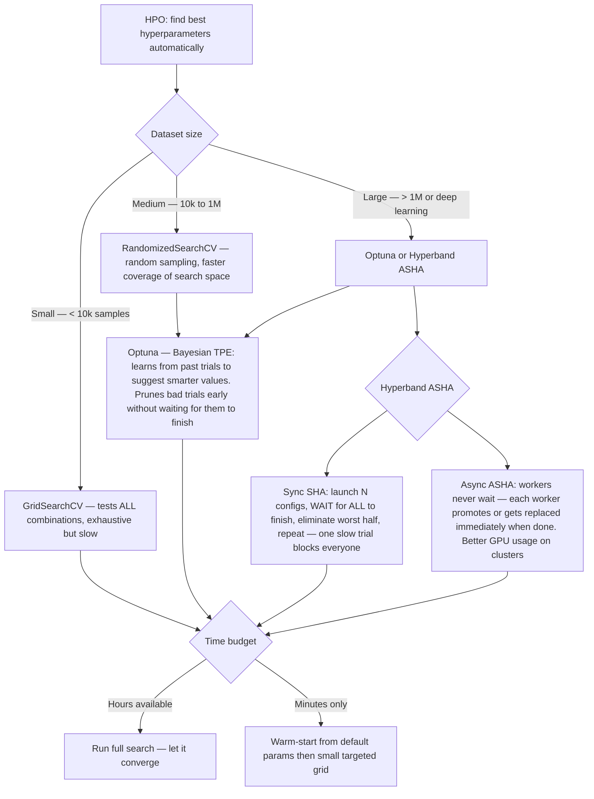

### 4.4 AutoML Catalog

> AutoML automates model + HPO + feature preprocessing + often stacking. Use it as a **strong baseline** — if your hand-crafted model does not beat AutoML, ship AutoML. Do NOT use it as a black-box final model for regulated use cases (fairness / explainability / retraining control).

| Library | Scope | Strong points | Weak points | Licence |
|---------|-------|---------------|-------------|---------|
| **AutoGluon** (Amazon) | tabular, time-series, image, text, multimodal | state-of-the-art tabular, ensembling out of the box, 3 lines of code | heavy (~GBs), black-box ensembling | Apache 2.0 |
| **H2O AutoML** | tabular, time-series | distributed (Spark/k8s), mature, rich model leaderboard | JVM dep, rich UI but heavier ops | Apache 2.0 |
| **FLAML** (Microsoft) | tabular, time-series, NLP | extremely fast, cost-aware HPO, integrates with scikit-learn | smaller model zoo | MIT |
| **Auto-sklearn** | tabular | meta-learning for warm-start, Bayesian + ensemble | Linux-only, no DL | BSD |
| **TPOT** | tabular | genetic programming pipelines, human-readable output | slow, no DL | LGPL |
| **AutoKeras** | vision, text | Keras-native NAS | large compute budget required | Apache 2.0 |
| **PyCaret** | tabular, time-series | low-code prototyping, unified API | not for production as-is | MIT |
| **LightAutoML** (Sberbank) | tabular | fast, strong on banking tabular | smaller community | Apache 2.0 |
| **MLJAR** | tabular | "Explain mode" generates readable HTML reports | less extensible | MIT |
| **Nixtla** (StatsForecast + MLForecast) | forecasting only | dozens of TS models, Numba-accelerated | TS only | Apache 2.0 |

**Example — AutoGluon 3-liner**

```python
from autogluon.tabular import TabularPredictor
predictor = TabularPredictor(label="fault", eval_metric="f1").fit(train_df, time_limit=3600)
leaderboard = predictor.leaderboard(test_df, silent=True)
```

**Workflow recommendation**

1. Run AutoGluon / FLAML with a fixed time budget (1 h) on the same train split as your custom model
2. Compare hold-out metrics — if AutoML wins by > 2 % F1 and you cannot explain why, **treat it as a red flag**: likely data leakage or your preprocessing is wrong
3. Use AutoML's feature importance / leaderboard to seed your custom model
4. Register AutoML model in MLflow as "baseline_automl" even if you ship your custom — rollback target

**Gates before shipping AutoML to production**

- [ ] Model card includes the AutoML library version + seed + time budget
- [ ] Ensemble members are enumerable (not an opaque blob)
- [ ] Inference latency p95 within SLO (AutoGluon stacks can be slow)
- [ ] Retraining script is re-runnable with exact same config
- [ ] Explainability: SHAP / feature importance exported — see §5.4

**Anti-patterns**

- ❌ Using AutoML with `time_limit=60` and declaring victory — most AutoML libs need ≥ 30 min
- ❌ Letting AutoML choose features from the full table (including leakage columns like `repair_date`)
- ❌ Comparing AutoML on one seed vs your model on a different seed

---

## 5. Evaluation & Interpretation (XAI)

### 5.1 Classification Metrics

| Metric | Formula | When to prioritize |
|--------|---------|-------------------|
| Accuracy | `(TP+TN) / N` | Only if balanced classes |
| Precision | `TP / (TP+FP)` | Minimize false alarms (costly maintenance) |
| Recall | `TP / (TP+FN)` | Minimize missed faults (safety-critical) |
| F1-Score | `2×P×R / (P+R)` | Balanced imbalanced datasets |
| ROC-AUC | Area under ROC | Model discrimination ability across thresholds |
| PR-AUC | Area under Precision-Recall | Better than ROC for extreme imbalance |
| Gini | `2×AUC - 1` | Banking/insurance convention |
| Lift / Gain curve | Cumulative gain | Marketing / targeted action value |

**Additional plots:** confusion matrix, calibration curve, learning curve, validation curve, discrimination threshold curve.

### 5.2 Regression Metrics

| Metric | Formula | When to use |
|--------|---------|-------------|
| R² / Adj-R² | Variance explained | General goodness of fit |
| Explained variance | `1 - Var(y - ŷ) / Var(y)` — unlike R², does not penalize systematic offset (bias). `explained_variance_score()` in sklearn | When you want to separate bias from variance error |
| MAE | `mean(|y - ŷ|)` | Robust to outliers, interpretable |
| MSE / RMSE | `mean((y - ŷ)²)` | Penalizes large errors |
| MSLE | `mean((log(1+y) - log(1+ŷ))²)` | Exponential growth targets |

**Additional:** residual plot, Breusch-Pagan heteroscedasticity test, Kolmogorov-Smirnov normality test, Q-Q plot / probability plot, prediction error diagram, MAE=f(epoch), LassoCV alpha vs error plot (plot CV error as function of alpha to find optimal regularization strength — `lasso.mse_path_` or `lasso.alpha_`).

### 5.3 XAI Checklist

| # | Tool | Scope | Output |
|---|------|-------|--------|
| 5.1 | Feature importance | Global | Bar chart (built-in XGBoost/RF) |
| 5.2 | SHAP summary plot | Global | Beeswarm — feature impact distribution |
| 5.3 | SHAP dependence plot | Global | Feature A vs SHAP value, colored by B |
| 5.4 | SHAP force plot | Local | Single prediction explanation |
| 5.5 | SHAP TimeSeriesExplainer | Global/Local | For LSTM / sequential models |
| 5.6 | LIME | Local | Perturbation-based, model-agnostic |
| 5.7 | Partial Dependence Plot (PDP) | Global | Marginal effect of one feature |
| 5.8 | Counterfactual | Local | "What would need to change for different output?" |
| 5.9 | Anchor | Local | Rule-based local explanation |
| 5.10 | Grad-CAM / Attention maps | Local | CNNs / Transformers |
| 5.11 | TreeInterpreter | Local | Decision path decomposition |
| 5.12 | Alibi | Global/Local | Production-grade XAI library |

> **Note:** If explainability is required, avoid PCA (destroys feature identity).

#### 5.3b Deep-learning-specific explainability

| Tool | Modality | Method | scipy / library |
|------|----------|--------|-----------------|
| **Captum** | PyTorch (any) | Integrated Gradients, DeepLIFT, DeepLiftShap, LayerGradCAM, Saliency, Occlusion | `captum.attr` |
| **Integrated Gradients** | any differentiable model | axiomatic attribution: path-integral of gradients from baseline to input | Captum `IntegratedGradients` |
| **SmoothGrad** | any | averages gradients over noisy inputs to reduce saliency-map noise | Captum `NoiseTunnel` |
| **Grad-CAM / Grad-CAM++** | CNNs | heatmap over spatial activations | `pytorch-grad-cam` |
| **Attention rollout** | Transformers | multiply attention matrices layer-by-layer | custom + `captum` |
| **LRP** (Layer-wise Relevance Propagation) | deep nets | back-propagates relevance from output to input | `zennit`, `innvestigate` |
| **DeepLIFT** | deep nets | compares activations to a reference; faster than IG | Captum `DeepLift` |
| **Alibi Explain** | any | Anchors, counterfactuals, integrated gradients, prototypes — production-grade | `alibi` |
| **InterpretML** (Microsoft) | tabular / glass-box | Explainable Boosting Machine (EBM) — intrinsically interpretable | `interpret` |
| **TCAV** (Testing with Concept Activation Vectors) | CNNs, NLP | measures if a human concept (e.g. "stripes") is used by the model | `tcav` |
| **SHAP DeepExplainer / GradientExplainer** | PyTorch / Keras | SHAP values for deep models | `shap.DeepExplainer` |

**Workflow** — pick ONE primary local method (Integrated Gradients for signals, Grad-CAM for images, SHAP for tabular) and ONE global method (PDP + SHAP summary). Report BOTH on every model card.

**Gates**

- [ ] Model card shows local explanation on ≥ 3 correct predictions + ≥ 3 wrong predictions
- [ ] Explanations stable under small input perturbations (Lipschitz check — no drastic jump for ε noise)
- [ ] For images/signals: the attribution map aligns with domain expert intuition (human sanity check)

**Anti-patterns**

- ❌ Reporting only saliency maps — known to be unreliable (Adebayo et al. 2018 sanity checks); pair with IG
- ❌ Using SHAP on a model with > 100 features and showing all 100 in the beeswarm — pick top-15
- ❌ "Explainability" == showing feature importance of a deep model — that's not explanation, it's aggregate

### 5.5 Probability Calibration

A model can have good ROC-AUC but badly calibrated probabilities — it predicts 0.9 when the true probability is 0.6. Calibration ensures `predict_proba()` reflects real-world frequencies.

| Method | How it works | When to use |
|--------|-------------|-------------|
| **Platt Scaling** | Fits a logistic regression on top of raw scores | SVM, small datasets |
| **Isotonic Regression** | Fits a non-parametric monotone function on raw scores | Any model, larger datasets |
| `CalibratedClassifierCV` | Wraps any sklearn estimator with cross-validated calibration | General use |

```python
from sklearn.calibration import CalibratedClassifierCV, calibration_curve
calibrated = CalibratedClassifierCV(base_model, method='isotonic', cv=5)
calibrated.fit(X_train, y_train)
# Plot: calibration_curve(y_true, y_prob, n_bins=10)
# Perfect calibration = diagonal line
```

> Use calibration when the **probability value itself matters** (risk scoring, cost-sensitive decisions) — not just the ranking.

### 5.4 Threshold Selection

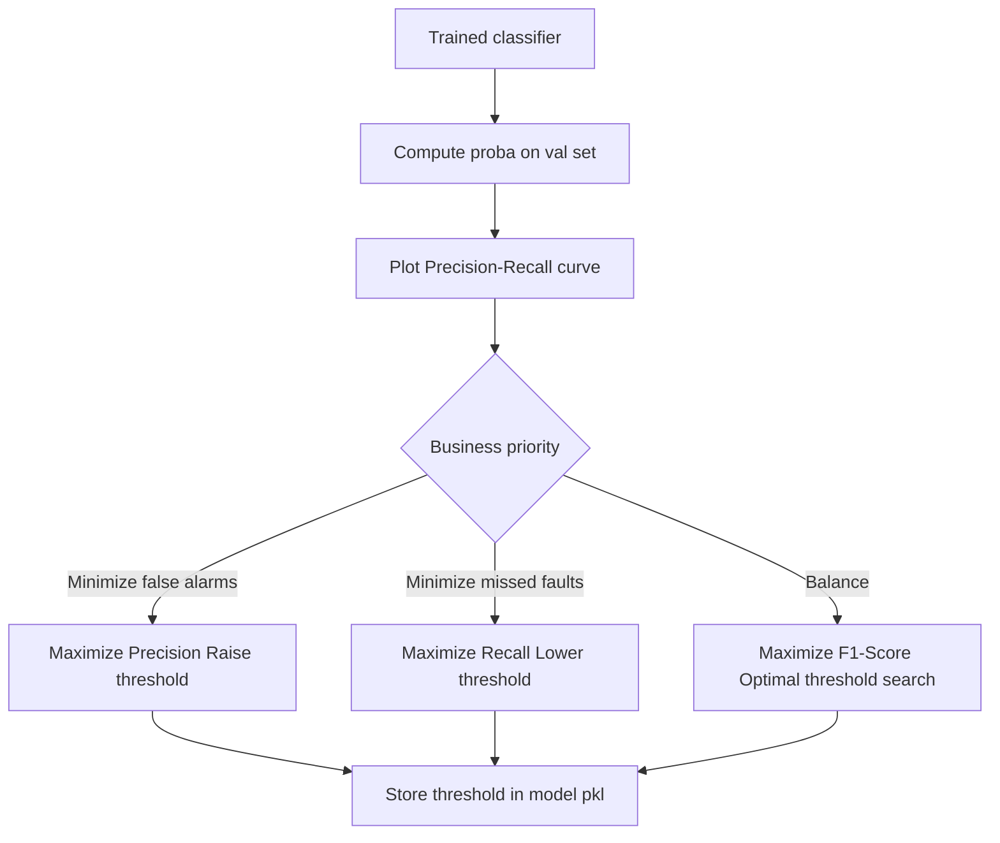

### 5.6 Causal Inference — correlation ≠ causation

> A standard ML model answers **"what will happen?"** (prediction). Causal inference answers **"what would happen if I did X?"** (intervention). Most industrial questions are secretly causal — "does the new PID tuning reduce wear?", "did the coolant upgrade reduce fault rate?", "which maintenance action lowers MTBF?" — and a classifier cannot answer them. Predictive models exploit correlation; deploying a decision on a correlation that is not causal is how you get surprises in production.

#### 5.6.a Core vocabulary

| Term | Definition |
|------|-----------|
| **Treatment T** | the intervention whose effect we want to measure (1 = applied, 0 = not) |
| **Outcome Y** | the metric we care about (wear, downtime, fault rate) |
| **Confounder X** | a variable that influences both T and Y — if uncontrolled, it biases the estimate |
| **Mediator M** | T → M → Y; part of the causal path, do NOT control for it when estimating total effect |
| **Collider** | T → C ← Y; controlling for C creates a spurious association |
| **ATE** (Average Treatment Effect) | E[Y(1) − Y(0)] across the whole population |
| **ATT** (ATE on Treated) | E[Y(1) − Y(0) \| T=1] — effect on those who received the treatment |
| **CATE** (Conditional ATE) | ATE conditional on covariates X — the "personalized" effect |
| **Counterfactual** | Y(1) for a unit that actually received T=0 — unobservable; estimated by the model |

#### 5.6.b Method catalog

| Method | When | Assumption | Library |
|--------|------|-----------|---------|
| **Randomized Controlled Trial (RCT)** | you CAN randomize | random assignment removes confounding by construction | native — design the experiment |
| **Propensity Score Matching (PSM)** | observational, X observed | conditional ignorability (no unobserved confounder) | `causalml.PropensityModel`, `dowhy` |
| **Inverse Propensity Weighting (IPW)** | observational, X observed | same as PSM, + good overlap | `econml` |
| **Doubly Robust (AIPW, TMLE)** | observational | consistent if EITHER propensity OR outcome model is correct | `econml.DRLearner`, `dowhy` |
| **Instrumental Variable (IV)** | unobserved confounders exist, valid instrument available | IV is exogenous + affects Y only through T | `econml.DMLIV`, `linearmodels.IV` |
| **Regression Discontinuity (RD)** | treatment assigned on a cutoff (age, threshold) | continuity of potential outcomes at cutoff | `rdrobust`, manual |
| **Difference-in-Differences (DiD)** | before/after + treatment/control groups | parallel trends | `linearmodels.PanelOLS` |
| **Synthetic Control** | 1 treated unit, many donors | weighted combo of donors reproduces pre-treatment trajectory | `SparseSC`, `pysyncon` |
| **Causal Forests / DML** | heterogeneous CATE | flexible ML nuisance models | `econml.CausalForest`, `dowhy` |
| **Do-calculus / SCM** | structural model known | correct DAG | `DoWhy`, `pgmpy` |

#### 5.6.c Libraries

| Library | Strengths | Typical API |
|---------|-----------|-------------|
| **DoWhy** (Microsoft) | 4-step discipline: **identify → estimate → refute → sensitivity**; enforces DAG thinking | `CausalModel(...).identify_effect().estimate_effect(...).refute_estimate(...)` |
| **EconML** (Microsoft) | rich ML-based estimators (Causal Forest, DML, Doubly Robust, Meta-learners) | scikit-learn-style `fit` / `effect` |
| **CausalML** (Uber) | uplift modeling (S/T/X/R-learners), marketing-flavored but generic | `from causalml.inference.meta import XLearner` |
| **pgmpy** | Bayesian networks, DAG learning, d-separation | inference over DAG |
| **CausalNex** (QuantumBlack) | structure learning (NOTEARS) + Bayesian nets | `StructureModel`, `InferenceEngine` |
| **Ananke** | graphical causal inference, latent projection | academic but rigorous |
| **WhyNot** | simulation playground to stress-test causal methods | benchmarks |

#### 5.6.d Workflow (DoWhy-style 4-step)

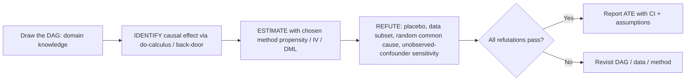

1. **Draw the DAG** with domain experts — nodes = variables, arrows = assumed direct causal links
2. **Identify** — does the DAG let you identify the effect? (DoWhy checks back-door / front-door / IV)
3. **Estimate** — fit the chosen estimator, report point + 95 % CI
4. **Refute** — mandatory: (a) placebo outcome → expect effect ≈ 0, (b) random common cause → expect unchanged, (c) data subset → expect stable, (d) unobserved-confounder sensitivity (how strong would a hidden confounder have to be to null the result?)

#### 5.6.e Example — did the PID re-tuning reduce wear?

```python
import pandas as pd
from dowhy import CausalModel

df = pd.DataFrame({"treatment": ..., "wear_index": ..., "load": ..., "material": ..., "spindle_age": ...})
model = CausalModel(
    data=df,
    treatment="treatment",
    outcome="wear_index",
    common_causes=["load", "material", "spindle_age"],
)
identified = model.identify_effect(proceed_when_unidentifiable=False)
estimate = model.estimate_effect(identified, method_name="backdoor.propensity_score_matching")
print(estimate.value)  # e.g. -0.08 → PID tuning reduces wear_index by 0.08 on average
refute = model.refute_estimate(identified, estimate, method_name="placebo_treatment_refuter")
print(refute)  # placebo effect should be ≈ 0
```

#### 5.6.f Anti-patterns

- ❌ **Controlling for a mediator** → closes the causal path, under-estimates effect
- ❌ **Controlling for a collider** → opens a non-causal path, creates spurious effect
- ❌ **Reporting a regression coefficient as "causal effect" without a DAG** — classic confound
- ❌ **RCT assumed when assignment was self-selected** — propensity + sensitivity mandatory
- ❌ **No refutation step** — an un-refuted causal estimate is a fragile claim

#### 5.6.g Gates before acting on a causal estimate

- [ ] DAG signed off by domain expert (version-controlled in the repo)
- [ ] Overlap / positivity check: propensity scores ∈ (ε, 1−ε) — no unit is near-certain to be in one arm
- [ ] All 4 DoWhy refutations pass (placebo, random common cause, subset, unobserved confounder)
- [ ] Sensitivity analysis shows the result survives plausible unobserved confounding

---

## 6. Dimensionality Reduction & Clustering

### 6.1 When to use PCA

| Condition | Use PCA? | Reason |
|-----------|---------|--------|
| Many features strongly correlated (\|r\| > 0.8) | Yes | PCA captures redundancy |
| n_features > n_samples / 10 | Yes | Curse of dimensionality risk |
| Explainability required | No | PCA destroys feature identity |
| Features independent | No | PCA adds no value |
| After first model: PCA score ≈ raw score | Yes | Justified compression |

**Kaiser criterion:** keep components with eigenvalue > 1.

**Plots:**
- Scree plot (line) — eigenvalue vs component index, look for the elbow
- Bar chart of explained variance per component — same data as scree plot, bar form, more readable for presentations
- Cumulative variance diagram — shows how many components needed to reach 95%
- 2D scatter of first 2 principal components — colored by class/cluster
- Biplot — 2D scatter + loading arrows (feature contributions overlaid on the projection)
- 3D interactive scatter — Bokeh or Plotly for exploratory analysis
- UMAP / t-SNE / PHATE — after PCA for non-linear structure

### 6.2 Reduction Algorithm Comparison

| Algorithm | Type | Preserves | Use case |
|-----------|------|-----------|---------|
| PCA | Linear | Global variance | Preprocessing, compression |
| SVD | Linear | Global structure | Denoising, matrix factorization |
| t-SNE | Non-linear | Local structure | 2D/3D visualization |
| UMAP | Non-linear | Local + global | Visualization, faster than t-SNE |
| PHATE | Non-linear | Global + local trajectories | Biological/temporal data |
| Autoencoder | Non-linear | Learned manifold | Complex data, reconstruction |

**SVD specific:** denoising, identifying failure modes, compressing historical BLOB data.

### 6.3 Clustering Algorithms

| Algorithm | Principle | Key parameter | Handles noise |
|-----------|-----------|--------------|---------------|
| **K-Means** | Assigns each point to nearest centroid, recomputes centroids iteratively. Compute inertia at each k to find elbow | `n_clusters=k`, `init='k-means++'` | No |
| **Hierarchical** | Builds a tree of merges (agglomerative bottom-up or divisive top-down). Cut the dendrogram at desired level to get k clusters | `linkage='ward'`, distance threshold | No |
| **DBSCAN** | Groups points in dense regions, marks isolated points as noise (-1). Does not require k upfront | `eps` (neighborhood radius), `min_samples` | Yes — noise points labeled -1 |

### 6.4 Clustering Validation

| Metric | Range | Interpretation |
|--------|-------|---------------|
| Inertia (Elbow) | Lower = better | Use for K selection |
| Silhouette coefficient | [-1, 1] | > 0.5 = good clusters |
| Calinski-Harabasz | Higher = better | Dense, well-separated |
| Davies-Bouldin | Lower = better | Compact clusters |

**Plots:** combined 4-metric dashboard, per-cluster silhouette scores, hierarchical dendrogram, PCA 2D cluster visualization, cluster mean bar chart.

---

## 7. Time Series & Deep Learning

### 7.0 Deep Learning Algorithm Catalog

> Quick-reference taxonomy. Pick ONE default per modality; document the pick + the discarded alternatives + the discard reason in an ADR before coding.

| Family | Algorithm | Input modality | Typical use | Key knobs | Notes / gotchas |
|--------|-----------|----------------|-------------|-----------|-----------------|
| **Feedforward** | ANN / MLP | tabular | simple regression / classification, RL policy head | depth, width, dropout | Default baseline for tabular when trees under-perform. Needs scaling. |
| **Convolutional** | CNN 2D | images | classification, detection, segmentation | kernel, stride, padding, channels | Overkill for tabular. For signals: prefer 1D CNN or TCN. |
| | CNN 1D | signals (vibration, audio, ECG) | feature extraction, classification | kernel along time axis | Strong baseline for vibration; cheaper than RNN. |
| | TCN (Temporal Conv) | long sequences | forecasting, RUL | dilation, receptive field | Parallelizable, stable gradients, outperforms LSTM on many industrial tasks. Brick 40. |
| **Recurrent** | RNN (vanilla) | short sequences | educational / baseline | hidden size, seq length | Vanishing gradients > 20 steps; rarely used in production, keep as reference only. |
| | LSTM | medium sequences (10–500) | language, RUL, anomaly | hidden size, layers, bidir | Stable but slow vs TCN; use bidir only when full window is available at inference. |
| | GRU | same as LSTM, lighter | same as LSTM, edge | hidden size, layers | ~25 % fewer params than LSTM, similar accuracy. Prefer when memory-constrained. |
| **Attention** | Transformer encoder | long sequences, text, signals | classification, forecasting | heads, layers, d_model, positional encoding | `O(N²)` memory in seq length — use sparse/linear attention above ~2k steps. |
| | Transformer decoder / encoder-decoder | generation, translation | seq2seq, prognostics | same + causal mask | Needs large dataset; transfer learning usually mandatory. |
| | Vision Transformer (ViT) | images | classification | patch size, d_model | Needs ≥ 100 k images or pretraining. |
| **Generative** | Autoencoder (standard) | any | reconstruction-based anomaly detection | latent dim, loss | Threshold on reconstruction MSE p95 of healthy data. Reference: trainer archived 2026-04-24 (`.claude/dev-docs/archives/scripts/train_autoencoder.py`); inference still served via `ml/inference/score_autoencoder.py`. |
| | Variational AE (VAE) | any | generation, probabilistic anomaly | latent dim, β | KL term regularizes latent space; useful when you need likelihoods. |
| | Conv Autoencoder | images / signals | denoising, anomaly | depth, bottleneck | Default for vibration windows. |
| | GAN (vanilla / DCGAN / WGAN-GP) | images, signals | synthetic data generation, data augmentation | generator / discriminator balance, gradient penalty | Notoriously unstable; WGAN-GP much safer than vanilla. Useful to augment rare-class fault data. |
| | Diffusion (DDPM, score-based) | images, signals | high-fidelity synthetic data | timesteps, noise schedule | SOTA generation quality but heavy compute; consider only when GAN output is inadequate. |
| **Graph** | GCN / GraphSAGE / GAT | graphs (topology) | fault propagation across machine fleet, sensor networks | message-passing layers, aggregation | Use when the system is a graph (plant layout, supply chain); overkill for a single machine. |
| **Self-supervised** | Contrastive (SimCLR, BYOL, MoCo) | images, signals | pretraining on unlabeled data | augmentation pairs, temperature | Critical when labels are scarce — pretrain on unlabeled sensor history, fine-tune on labeled faults. |
| | Masked modeling (MAE, BERT-style) | signals, images | pretraining | mask ratio | Alternative to contrastive; often simpler to tune. |

**Selection rules of thumb:**

- Tabular, few features → XGBoost first (§4), DL only if it beats it
- Vibration / audio 1D → 1D CNN or TCN before LSTM
- Sequences > 1000 steps → TCN or sparse Transformer, not vanilla LSTM
- Anomaly detection on healthy-only data → Autoencoder with reconstruction threshold
- Rare-class faults with < 100 examples → data augmentation (§7.4) first; if insufficient, WGAN-GP / diffusion to synthesize; track synthetic vs real ratio in training
- Labels scarce but unlabeled data abundant → self-supervised pretraining → fine-tune

**Anti-patterns:**

- ❌ Using vanilla RNN in 2026 for sequences > 20 steps — vanishing gradients, no business case
- ❌ Transformer on a dataset of 5 k samples — will memorize, not generalize
- ❌ GAN trained with no diversity metric (only generator loss) — mode collapse invisible
- ❌ Training synthetic data + using it as if it were real — label synthetic rows and stratify train/val splits

### 7.1 Time Series Preprocessing

| Step | Method | Notes |
|------|--------|-------|
| **Chronological split** | `TimeSeriesSplit(n_splits=5)` | Never random shuffle |
| **Class presence check** | Verify both classes in each fold | Critical for imbalanced time series |
| **Windowing** | Sliding window of size W, step S | `W=256` samples, overlap configurable |
| **FFT features per window** | Peak freq, peak mag, energy bins | Exclude DC bin (index 0) |
| **Statistical features per window** | RMS, crest factor, kurtosis, skewness, P2P | 9 per axis, 27 total for 3-axis accel |
| **Temporal dynamics** | 7-day growth vs 21-day moving average | Detect trend vs organic plateau |
| **Stationarity check** | ADF test, KPSS test | Required for ARIMA |
| **Normalization** | Fit on train window, apply to test | Per-window or global — document choice |

### 7.2 Deep Learning Efficiency Techniques

| Technique | What it does | Use case |
|-----------|-------------|---------|
| **Pruning** | Remove redundant neuron connections | Model compression |
| **Quantization (PTQ)** | Reduce weight precision post-training | Edge (STM32), fast |
| **Quantization (QAT)** | Train with quantization awareness | Better accuracy, slower |
| **Dynamic quantization** | Per-activation quantization at runtime — weights pre-quantized, activations quantized on the fly | Transformers, RNNs |
| **Static quantization** | Both weights AND activations pre-quantized using a calibration dataset — faster inference than dynamic, requires representative data sample | CNNs, edge deployment |
| **Low-rank approximation** | Factorize large weight matrices | Large FC layers |
| **Binary networks** | Weights ∈ {+1, -1} | Ultra-low power edge |
| **Knowledge distillation** | Small student imitates large teacher | Edge deployment |
| **Winograd** | Reduce multiplications in convolutions | CNN acceleration |
| **Parallel GPU (CUDA)** | Distribute operations across GPU cores | Training acceleration |

**Metrics:** mAP@0.5, model size (MB), latency (ms), sparsity (%), compression ratio.

### 7.3 Transfer Learning

> Fine-tune a pre-trained model instead of training from scratch. The model has already learned general representations on large datasets — you only adapt the last layers to your task.

| Strategy | What you freeze | What you train | When to use |
|---------|----------------|---------------|-------------|
| **Feature extraction** | All layers except final head | New classification/regression head only | Small dataset, similar domain |
| **Fine-tuning** | First N layers (general features) | Last layers + head | Medium dataset, different domain |
| **Full fine-tuning** | Nothing | All layers | Large dataset, enough compute |

| Domain | Pre-trained models |
|--------|------------------|
| Images | ResNet, EfficientNet, ViT (ImageNet) |
| Text / NLP | BERT, RoBERTa, GPT (HuggingFace) |
| Time series | TimesFM, Chronos (Google/Amazon) |
| Vibration / audio | wav2vec, LEAF |

```python
# PyTorch example — freeze all layers then replace head
for param in model.parameters():
    param.requires_grad = False
model.fc = nn.Linear(model.fc.in_features, n_classes)  # new head only
```

> **Rule of thumb:** the more your data differs from the pre-training domain, the more layers you should unfreeze.

### 7.4 Data Augmentation

> Artificially increase dataset size and diversity to reduce overfitting. Applied only on the **training set**.

| Data type | Technique | Tool |
|-----------|----------|------|
| **Images** | Random flip, rotation, crop, color jitter, Gaussian noise | `torchvision.transforms`, Albumentations |
| **Time series** | Time warping, magnitude warping, window slicing, jittering (add noise), permutation | `tsaug`, custom numpy |
| **Vibration signals** | Add Gaussian noise, scale amplitude, random phase shift | Custom numpy |
| **Tabular** | SMOTE (for class imbalance) — see §3.6 | imbalanced-learn |
| **Text** | Synonym replacement, back-translation, random deletion | `nlpaug`, EDA library |

> For time series: **time warping** (smooth random stretch/compress of the time axis) and **magnitude warping** (smooth random scaling of the signal amplitude) are the most effective for vibration data.

### 7.5 LSTM for Predictive Maintenance (Reference)

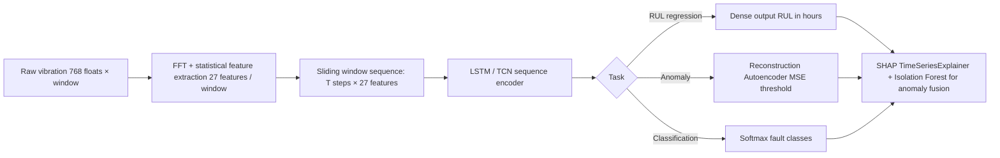

### 7.6 Time-Series Specialized Libraries

| Library | Scope | One-liner |
|---------|-------|-----------|
| **sktime** | unified API for TS forecasting, classification, clustering, regression | scikit-learn-compatible interface for dozens of TS models (ARIMA, Prophet, deep, ensembles) |
| **Darts** (Unit8) | 30+ forecasting models (statistical + deep) with a single API | easy backtesting, covariates, hierarchical forecasting, probabilistic outputs |
| **tsfresh** | automated feature extraction for time series (> 750 features) | `extract_relevant_features(df, y)` — FFT, entropy, peaks, etc. Use BEFORE tree models |
| **tsflex** | fast, flexible feature extraction on (possibly irregular) time series | alternative to tsfresh when data is irregular / large |
| **Prophet** (Meta) | business forecasting with seasonality + holidays | robust to missing data and outliers; poor extrapolation on non-business TS |
| **NeuralProphet** | Prophet architecture + PyTorch + AR terms + covariates | hybrid statistical/NN, modernized Prophet |
| **pmdarima** | auto-ARIMA à la R forecast package | `auto_arima(y, seasonal=True)` — searches (p,d,q)(P,D,Q,s) |
| **StatsForecast** (Nixtla) | dozens of statistical TS models, Numba-accelerated | faster than statsmodels by orders of magnitude |
| **MLForecast** (Nixtla) | forecasting via tree models (LightGBM, XGBoost) with lag features | scales to millions of series (panel forecasting) |
| **NeuralForecast** (Nixtla) | SOTA deep TS (NHiTS, NBEATS, TFT, PatchTST, TimeMixer) | unified API, pretrained + custom |
| **GluonTS** (Amazon) | probabilistic deep TS models | DeepAR, Transformer, TFT; MXNet + PyTorch |
| **Kats** (Meta) | detection (changepoint, trend, seasonality) + forecasting | Bayesian changepoint, Prophet backend |
| **tslearn** | classical TS distance metrics (DTW), clustering, classification | dynamic time warping, shapelets |
| **Merlion** (Salesforce) | forecasting + anomaly detection unified pipeline | benchmarking suite |
| **PyOD** | outlier / anomaly detection (tabular + TS) | 40+ algorithms (IForest, LOF, ECOD, DeepSVDD) |

**Workflow recommendation for industrial TS**

1. **Feature extraction baseline**: tsfresh → XGBoost on lagged windows
2. **Forecasting baseline**: StatsForecast AutoARIMA + Prophet in parallel
3. **Deep upgrade**: NeuralForecast (NHiTS or TFT) only if baselines are insufficient
4. **Anomaly detection**: PyOD ECOD/IForest + Merlion for unified API
5. **Probabilistic outputs**: prefer NeuralForecast / GluonTS when uncertainty must ship to Grafana

**Gates**

- [ ] Backtest on rolling window, never on random fold
- [ ] Report p50, p10, p90 (probabilistic) — point forecast alone is insufficient for maintenance decisions
- [ ] Forecast SLA documented: horizon, refresh cadence, p95 latency

---

## 8. Reinforcement Learning (Predictive Maintenance)

### 8.1 Why RL for Maintenance

Supervised ML answers: **"Will it fail?"** → binary prediction.
RL answers: **"What should I do, and when?"** → optimal decision policy.

### 8.2 Use Cases

| Use Case | State | Action | Reward |
|---------|-------|--------|--------|
| **Maintenance scheduling** | vibration, temp, age, load | maintain now / wait 1d / wait 1w | -cost_maintenance or -cost_breakdown + production_uptime |
| **Spare parts ordering** | stock level, failure probability, supplier lead time | order X parts now / wait | -holding_cost - stockout_cost |
| **Multi-machine prioritization** | all machines states | which machine to inspect next | -total_downtime |
| **Inspection routing** | machine locations + states | route order | -travel_time - missed_fault_penalty |

### 8.2a MDP Formalism (start here)

> A policy is only as good as its MDP. Get this wrong and no algorithm rescues you.

Formal tuple **⟨S, A, P, R, γ⟩**:

- **S** — state space. Must be **Markov**: the next state depends only on current state + action, not history. If your raw state is not Markov, augment with lagged features or a recurrent encoder before handing it to the agent.
- **A** — action space. Discrete (DQN family) or continuous (DDPG, SAC, TD3). Mixed = harder (parameterized action spaces).
- **P(s' | s, a)** — transition dynamics. Stochastic in the real world (sensor noise, partial observability). POMDP if state is partially hidden.
- **R(s, a, s')** — reward function. Sparse (fault happens once in 1 M steps) vs dense (per-step cost). Sparse is hard — use reward shaping cautiously (§8.6e).
- **γ ∈ [0, 1)** — discount factor. γ → 1 emphasizes long-horizon; γ → 0 is myopic. Maintenance typically γ ∈ [0.95, 0.99].

**Goal**: maximize **expected discounted return** `G_t = Σ γ^k · r_{t+k}`. Optimality condition (Bellman): `V*(s) = max_a E[R + γ · V*(s')]`.

**Gates before any agent code:**

- [ ] MDP tuple written out in a README, reviewed by a domain expert
- [ ] State space dimensionality + bounds documented + normalized to [−1, 1] or [0, 1]
- [ ] Reward function unit-tested with 3–5 hand-crafted trajectories (sanity: expected-vs-actual return)
- [ ] Episode horizon decided (finite vs infinite; terminal conditions listed)
- [ ] Partial observability acknowledged (POMDP → use recurrent policy or state stacking)

### 8.2b RL Algorithm Taxonomy

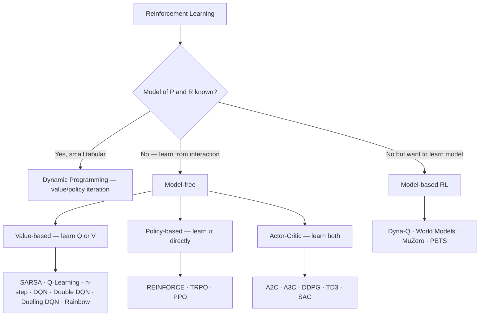

| Axis | Options | Rule of thumb |
|------|---------|---------------|
| **Action space** | discrete / continuous / parameterized | discrete → DQN family; continuous → SAC/TD3/PPO |
| **Sample efficiency** | on-policy (PPO, A2C, TRPO) / off-policy (Q-learning, DQN, SAC, DDPG, TD3) | off-policy when env steps are expensive (real machine) |
| **Policy type** | deterministic (DDPG, TD3) / stochastic (PPO, SAC, REINFORCE) | stochastic default for exploration; deterministic when action noise is injected externally |
| **Model knowledge** | model-free / model-based | model-based when simulator is perfect OR when real data is extremely scarce |

### 8.2c Value-based methods

| Method | Update rule (informal) | On / Off policy | When |
|--------|------------------------|-----------------|------|
| **Dynamic Programming** (Value / Policy iteration) | Bellman equation iterated to convergence, requires full P, R | — | Tabular, ≤ 10 k states, P known. Teaching tool more than production |
| **Monte Carlo (MC)** | update toward actual episode return G_t | on-policy (with ε-greedy) | Episodic tasks, high variance, no bootstrapping bias |
| **TD(0)** | update toward r + γ V(s') | on-policy | Online learning, biased but low variance |
| **TD(λ)** / eligibility traces | blend MC and TD via λ ∈ [0, 1] | on-policy | Controls bias-variance trade-off |
| **SARSA** (on-policy TD control) | update Q(s,a) toward r + γ Q(s', a') with **a' sampled from current policy** | on-policy | Safer during training (avoids "cliff walking" toward risky optimum) |
| **Q-Learning** (off-policy TD control) | update Q(s,a) toward r + γ max_a' Q(s', a') | off-policy | Converges to optimal Q* regardless of behaviour policy |
| **n-step bootstrapping** | update toward Σ_{k=0}^{n-1} γ^k r_{t+k} + γ^n V(s_{t+n}) | either | Interpolates between TD(0) (n=1) and MC (n=∞); tune n |
| **Deep Q-Network (DQN)** | Q-Learning + deep net + replay buffer + target network | off-policy | Discrete actions, large state space. Min replay, frozen target, ε-greedy decay required |
| **Double DQN** | decouple action selection (online) and evaluation (target) | off-policy | Reduces DQN's positive bias in Q-value overestimation |
| **Dueling DQN** | separate V(s) + A(s,a) streams | off-policy | Faster learning when many actions are similar-value |
| **Rainbow DQN** | DQN + Double + Dueling + prioritized replay + multi-step + distributional + noisy nets | off-policy | Best-in-class DQN; complexity cost — only justify with benchmarks |

**Gates for any value-based agent:**

- [ ] Replay buffer size + sampling scheme documented (uniform vs prioritized)
- [ ] Target network update cadence documented (hard copy every N steps OR Polyak soft)
- [ ] ε-greedy schedule logged (start, end, decay)
- [ ] Plot Q-value magnitudes over training — diverging Q means bug or Q-overestimation (switch to Double)

### 8.2d Policy-based methods

| Method | What it optimizes | Key property |
|--------|-------------------|--------------|
| **REINFORCE** (vanilla policy gradient) | ∇ log π(a|s) · G_t | Unbiased but very high variance; needs baseline |
| **REINFORCE with baseline** | ∇ log π(a|s) · (G_t − b(s)) | Baseline b (often V(s)) reduces variance |
| **TRPO** | policy gradient with KL-divergence trust region | Monotonic improvement guarantees; heavy math + compute |
| **PPO** | clipped surrogate objective, simpler than TRPO | **Stable default**. Clipped objective prevents destructive updates. On-policy |

**PPO ship rules** (Brick 42):

- [ ] `clip_range` in [0.1, 0.3] — smaller = safer but slower
- [ ] `n_epochs` 3–10 per rollout — too many → policy drifts too far
- [ ] Advantage normalization enabled (GAE λ ≈ 0.95)
- [ ] Reward scaling applied (normalize or clip) — raw magnitudes destabilize

### 8.2e Actor-Critic & continuous control

| Method | Action space | Sample efficiency | Notes |
|--------|--------------|-------------------|-------|
| **A2C** (synchronous Advantage Actor-Critic) | any | medium | Simpler than A3C; single worker, deterministic rollouts |
| **A3C** (asynchronous) | any | medium | Multi-worker, async gradient updates; often outperformed by A2C today |
| **DDPG** (Deep Deterministic PG) | continuous | high (off-policy) | Deterministic policy + noise; brittle, easy to destabilize |
| **TD3** (Twin Delayed DDPG) | continuous | high | DDPG + twin critics (fixes Q-overestimation) + delayed policy updates + target smoothing |
| **SAC** (Soft Actor-Critic) | continuous (and discrete variant) | high | Stochastic policy, max-entropy objective. **Default off-policy continuous choice** |

### 8.2f Exploration strategies

| Strategy | Mechanism | When |
|----------|-----------|------|
| **ε-greedy** | prob ε of random action, decaying schedule | DQN default; simple, effective |
| **Boltzmann / softmax** | sample action ∝ exp(Q / τ) | Smoother than ε-greedy; τ decays |
| **Gaussian / OU noise** | add noise to deterministic action | DDPG, TD3 continuous control |
| **Parameter noise** | perturb policy net weights | Often beats action noise for exploration |
| **UCB** (upper confidence bound) | pick action with highest Q + c · √(log t / N(s,a)) | Tabular / bandits; less common deep RL |
| **Thompson sampling** | sample from posterior over Q / reward | Bayesian flavor; contextual bandits |
| **Intrinsic motivation** (ICM, RND, curiosity) | reward novelty | Sparse-reward environments (Montezuma's Revenge–style) |
| **Max-entropy** (SAC) | bonus for policy entropy | Continuous control, built into SAC |

**Anti-patterns:**

- ❌ Constant ε with no decay — never converges
- ❌ ε too small too early — premature exploitation of wrong policy
- ❌ Adding external action noise AND training a stochastic policy — double-counting exploration

### 8.2g Entropy regularization

- Add `−β · H(π(·|s))` to loss (β > 0) to encourage policy stochasticity
- SAC makes entropy a first-class citizen with auto-tuned α
- **Use when**: policy collapses to a single action too early; reward is sparse; exploration is critical
- **Don't use when**: you want a sharp deterministic policy at convergence (set β → 0 or remove at fine-tune stage)

### 8.2h Reward shaping — pitfalls catalog

Reward shaping changes learning speed, not the optimal policy **only if done correctly** (potential-based shaping `F(s,s') = γ Φ(s') − Φ(s)` is the safe form). Everything else risks **policy bias**.

| Pitfall | Symptom | Fix |
|---------|---------|-----|
| **Reward hacking** | agent exploits a loophole: racks up points without solving the task | Inspect trajectories; add penalty for the loophole; prefer potential-based shaping |
| **Shaping changes optimum** | shaped policy performs worse on the true reward than unshaped | Use potential-based shaping only (Ng et al. 1999) |
| **Reward too sparse** | agent never sees reward, no learning signal | Add dense intermediate rewards OR use curiosity/ICM OR reduce horizon |
| **Reward too dense / over-specified** | agent optimizes the shaping, ignores the true goal | Simplify; each shaping term must trace back to the business KPI |
| **Magnitude mismatch** | one reward term dominates (e.g. −1000 for failure, +0.01 per second of uptime) | Normalize each term; use reward scaling / clipping |
| **Time-inconsistent γ** | different γ across terms → unstable | Single γ applied uniformly |

### 8.2i Model-based vs model-free

| Criterion | Model-free | Model-based |
|-----------|-----------|-------------|
| Needs env model (P, R)? | No | Yes (learned or given) |
| Sample efficiency | lower | higher |
| Asymptotic performance | often higher | can match |
| Training complexity | lower | higher (two models) |
| **Default for predictive maintenance** | ✅ — real data, no perfect simulator | only when domain simulator is available (digital twin) |

Notable algorithms: Dyna-Q (classic), World Models / PlaNet (learn dynamics from pixels), MuZero (combines search + learned model), PETS (probabilistic ensembles + trajectory sampling).

### 8.2j Advanced topics (recommended reading, not mandatory sections)

- **Offline RL / Batch RL** — train from a fixed dataset, no interaction. Critical when you have historical logs but cannot let the agent act freely (safety, cost). Look at: CQL, BCQ, IQL, AWAC.
- **Inverse RL (IRL)** — recover the reward function from expert demonstrations. Useful when the reward is hard to write but the "good policy" is observable (expert operators).
- **Imitation Learning / Behavior Cloning** — supervised learning on (state, expert action) pairs. Simpler than IRL; suffers from covariate shift (DAgger mitigates).
- **Hierarchical RL** — options, sub-policies, temporal abstraction. Useful for long-horizon tasks (maintenance over months).
- **Multi-agent RL (MARL)** — centralized training / decentralized execution (CTDE), MADDPG, QMIX. Applies to fleet of machines sharing spare parts.
- **Safe RL** — constrained MDPs (CMDP), shielded RL. Mandatory for real-machine training — fault-induced actions must be blocked.

### 8.3 RL Implementation Checklist

| # | Step | Tool / Method |
|---|------|---------------|
| 8.1 | Define state space | Normalized features: RMS, temp, age, ML anomaly score |
| 8.2 | Define action space | Discrete: `[do_nothing, schedule_inspection, perform_maintenance]` |
| 8.3 | Define reward function | `-cost_maintenance * action - cost_breakdown * fault_happened` |
| 8.4 | Build environment | OpenAI Gym / Gymnasium custom env from historical data |
| 8.5 | Choose algorithm | PPO (stable, continuous), SAC (sample efficient), DQN (discrete actions) |
| 8.6 | Train agent | Stable-Baselines3: `model = PPO("MlpPolicy", env)` |
| 8.7 | Evaluate policy | Compare vs rule-based baseline (e.g., fixed 30-day interval) |
| 8.8 | Simulate cost savings | Monte-Carlo rollout on held-out historical data |

### 8.4 RL Environment Architecture

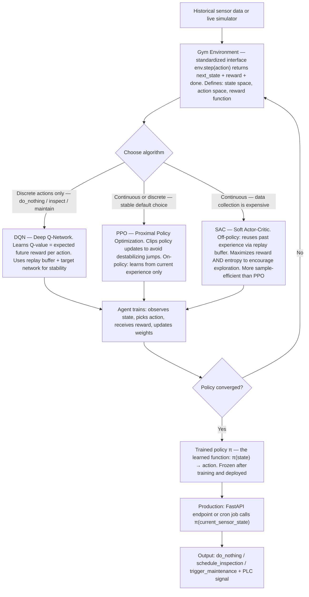

---

## 9. Deployment & MLOps

### 9.0 ETL Pipeline Checklist

> **ETL** = Extract, Transform, Load — the data pipeline that feeds the ML system continuously.

| # | Step | Details |
|---|------|---------|
| 9.0.1 | **Identify all I/O** | Inventory every data source and sink: sensors, PLCs, APIs, DBs, exports (CSV, Parquet) |
| 9.0.2 | **Extract** | USB CDC / OPC UA / REST API / file ingestion — handle connection errors and retries |
| 9.0.3 | **Transform** | Cleaning, type casting, unit conversion, feature computation — same logic as training pipeline |
| 9.0.4 | **Load** | Insert into SQLite / InfluxDB / data lake — idempotent writes, deduplication |
| 9.0.5 | **Scheduling** | APScheduler, cron, Airflow — document frequency and SLA |
| 9.0.6 | **Monitoring** | Data freshness watchdog, volume checks, null rate alerts |
| 9.0.7 | **Export** | CSV / Parquet export endpoints for BI tools or audit |
| 9.0.8 | **Network topology** | Document all services, ports, VLANs, firewall rules — who talks to whom |

### 9.0b Data Pipeline Orchestration

> Covers pipeline tooling, data quality gates, and feature freshness — the layer between raw ingestion and model training.

| # | Item | Detail |
|---|------|--------|
| 9.0b.1 | **Pipeline tool chosen** | APScheduler (simple), Airflow DAG (complex), Prefect flow (modern), dbt (SQL transforms) — document choice |
| 9.0b.2 | **Data lineage tracked** | Raw sensor → ETL transform → feature table → training dataset — every step auditable |
| 9.0b.3 | **Feature freshness SLA defined** | Example: features must be ≤ 1h old before triggering training; alert if stale |
| 9.0b.4 | **Data quality gates on ingestion** | Null rate < 5% per column; value range checks (e.g. RMS ∈ [0, 16] m/s²); no duplicate timestamps in 100ms window |
| 9.0b.5 | **Quality gate library** | Great Expectations suite, dbt tests, or custom assertions — run on every batch |
| 9.0b.6 | **Idempotent pipeline** | Re-running the pipeline on the same data produces identical output — no double-inserts |
| 9.0b.7 | **Feature versioning** | Training job pins the feature set version used — immutable snapshot, not live table |
| 9.0b.8 | **Retraining dataset window** | Document strategy: last 90 days / all history / sliding window — matches §9.4 retraining strategy |
| 9.0b.9 | **Pipeline failure alerting** | Missing data batch triggers alert within 15 min — do not let stale features silently feed production model |

### 9.1 Model Packaging Checklist

| # | Task | Details |
|---|------|---------|
| 9.1 | **Save full pipeline** | Pickle/Joblib: model + scaler + imputer + OHE together, or sklearn `Pipeline` |
| 9.2 | **Model metadata** | pkl contains: `{'model', 'threshold', 'features', 'train_date', 'metrics', 'version'}` |
| 9.3 | **Model card** | Standardized doc: performance, bias, limits, training data description |
| 9.4 | **DVC versioning** | `dvc add models/`, `dvc push` for reproducible model artifacts |
| 9.5 | **MLflow tracking** | Log: params, metrics, artifacts, model signature |
| 9.6 | **Rollback strategy** | Keep N-1 model version; auto-rollback if drift or metric degradation |

### 9.1b MLflow Model Registry — Concrete Workflow

> End-to-end workflow from experiment run to production serving.

> ⚠️ **`infer_signature`** — always pass `X_train` and `model.predict(X_train)` (not `y_train`) so MLflow captures input schema AND output schema. Missing signature breaks the model serving endpoint.
> ⚠️ **`input_example`** — pass a sample of 3–5 rows from `X_train`. Required for the MLflow UI "Try it" tab and for automatic schema validation in the serving layer.
> ⚠️ **`registered_model_name`** — if omitted, the model is logged as an artifact only, not registered in the registry. Transitions (Staging → Production) only work on registered models.

| # | Step | Command / Detail |
|---|------|-----------------|
| 9.1b.1 | MLflow server running | `mlflow server --backend-store-uri sqlite:///mlflow.db --default-artifact-root ./mlruns --host 0.0.0.0 --port 5000` |
| 9.1b.2 | Set tracking URI in scripts | `mlflow.set_tracking_uri("http://localhost:5000")` or `MLFLOW_TRACKING_URI` env var |
| 9.1b.3 | Log run + register model | `mlflow.sklearn.log_model(..., registered_model_name="model_name")` |
| 9.1b.4 | Promote to Staging | `client.transition_model_version_stage(name, version, stage="Staging")` |
| 9.1b.5 | Validate on Staging | Run smoke tests against Staging version, compare metrics vs Production baseline |
| 9.1b.6 | Promote to Production | `client.transition_model_version_stage(name, version, stage="Production")` |
| 9.1b.7 | Archive old version | `client.transition_model_version_stage(name, old_version, stage="Archived")` |
| 9.1b.8 | Load Production model in API | `mlflow.sklearn.load_model(f"models:/your_xgboost_model/Production")` |
| 9.1b.9 | Auto-rollback trigger | If metrics degrade: transition current Production → Archived, promote Archived → Production |

### 9.2 MLOps Pipeline

```mermaid
flowchart LR
    subgraph Data["Data Layer"]
        DB[(SQLite / InfluxDB)] --> DVC[DVC data versioning]
    end

    subgraph Training["Training"]
        DVC --> TRAIN[ml/training/{xgboost,pca_gmm,tcn_forecast,wear_regressor}.py]
        TRAIN --> MLFLOW[MLflow experiment tracking — Staging only ADR-021]
        MLFLOW --> MODEL[/models/*.pkl + .pt + .joblib/]
    end

    subgraph Serving["Serving"]
        MODEL --> API[FastAPI /predict endpoint]
        API --> MONITOR[ml/pipelines/scoring.py hourly orchestrator]
    end

    subgraph Monitoring["Monitoring"]
        MONITOR --> DRIFT[Drift detection KS-test / PSI / Chi²]
        DRIFT -->|Drift detected| RETRAIN[GitHub Actions retrain trigger]
        RETRAIN --> TRAIN
    end
```

### 9.2b Environment Promotion Workflow (dev → staging → prod)

> Three identical environments, different configs. Same Docker image promoted through stages — never rebuild per environment.

| Environment | DB | Secrets | Monitoring | Image tag |
|------------|-----|---------|-----------|-----------|
| **Local / dev** | SQLite in-memory or local file | `.env.local` | None | `image:dev` (mutable) |
| **Staging** | Copy of prod DB schema, synthetic data | GitHub Secrets / CI | Alerts silenced | `image:v1.0-rc` (immutable) |
| **Production** | Real DB, persistent volume | Vault or Docker secrets | Full alerts | `image:v1.0` (immutable, signed) |

```yaml
# docker-compose.override.prod.yml — prod overrides applied on top of base compose
services:
  api:
    image: myregistry/your-api:v1.0          # immutable tag, never "latest"
    restart: unless-stopped
    mem_limit: 4g
    cpuset: "2,3,4,5"
    environment:
      - ENV=production
      - MLFLOW_TRACKING_URI=http://mlflow:5000
    secrets:
      - db_password
      - smtp_password
    logging:
      driver: "json-file"
      options:
        max-size: "10m"
        max-file: "3"
```

| # | Step | Detail |
|---|------|--------|
| 9.2b.1 | **Image tags are immutable** | Never use `latest` in staging or prod — tag with `v1.0` or git SHA |
| 9.2b.2 | **Same image, different config** | `.env.staging` vs `.env.prod` — no code rebuild per environment |
| 9.2b.3 | **Secrets by environment** | Local: `.env` file. CI/CD: GitHub Secrets. Prod: HashiCorp Vault or Docker secrets |
| 9.2b.4 | **Smoke tests after each promotion** | Health check (`GET /system/metrics`), key prediction (`POST /predict`), drift check (`GET /drift-status`) |
| 9.2b.5 | **Staging mirrors prod data schema** | Use prod DB schema with synthetic or anonymized data — no schema surprises on promotion |
| 9.2b.6 | **Promotion gate** | CI pipeline must pass (unit tests + integration tests + load test baseline) before staging → prod |
| 9.2b.7 | **Resource limits in prod** | `mem_limit`, `cpuset` defined per container in prod override — not in base compose |
| 9.2b.8 | **Image registry** | Push to Docker Hub or ACR: `docker build -t registry/your-app:v1.0 . && docker push` |

### 9.3 Drift Detection Strategy

| Drift Type | What changes | Method | How it works | Tool | Threshold |
|-----------|-------------|--------|-------------|------|-----------|
| **Data drift** | Input feature distributions | KS-Test (continuous) | Measures max distance between two CDFs — no normality assumption, sensitive to tail shifts | `scipy.stats.ks_2samp` / Evidently | p-value < 0.05 |
| **Data drift** | Categorical input features | Chi² test | Compares observed vs expected frequencies per category — does not work on continuous data | `scipy.stats.chi2_contingency` / Evidently | p-value < 0.05 |
| **Concept drift** | Relationship between features and target | PSI (Population Stability Index) | Bucketizes distribution (10-20 bins), computes `Σ (Actual% − Expected%) × ln(Actual%/Expected%)` per bin — originally from banking credit scoring | Evidently / custom | < 0.1 stable, 0.1–0.2 watch, > 0.2 retrain |
| **Target drift** | Label / target distribution | Jensen-Shannon divergence | Symmetric bounded version of KL divergence. Range [0,1]: 0 = identical, 1 = completely different. More stable than KL (never explodes when a probability is zero) | `scipy.spatial.distance.jensenshannon` / Evidently | JS > 0.1 = significant |
| **Prediction drift** | Model output distribution | KS-Test on predictions | Same as data drift but applied to the model's output scores — catches silent failures | Custom / Evidently | p-value < 0.05 |
| **SHAP drift** | Feature importance in production | Compare mean absolute SHAP per feature | If a feature's importance has shifted by more than 1σ vs training baseline, the feature-target relationship has changed (localized concept drift) | SHAP + scipy | Mean SHAP shift > 1σ |

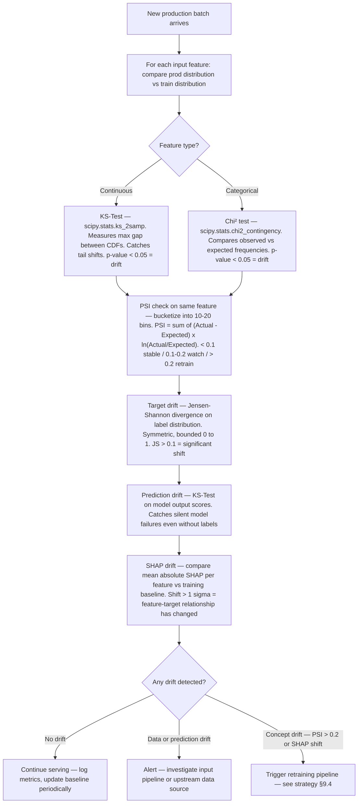

### 9.3b Advanced ML Observability Platforms (SaaS + OSS)

> When Grafana + custom drift code stops scaling (many models, many features, many environments), dedicated ML observability platforms take over. They bundle drift, data quality, performance, fairness, root-cause analysis and alerting.

| Platform | Type | Strengths | Trade-offs |
|----------|------|-----------|-----------|
| **Evidently AI** (OSS) | library + UI | pre-built drift + perf reports (HTML + JSON), Airflow / MLflow hooks, test suite API | no managed UI in OSS tier; self-host |
| **NannyML** (OSS + Cloud) | library | **performance estimation WITHOUT ground truth** (CBPE, DLE) — rare and valuable when labels are delayed (maintenance world) | narrower UI than paid platforms |
| **Arize AI** (SaaS) | managed | embedding drift (computer vision, NLP), fine-grained slicing, RAG + LLM tracing | paid |
| **WhyLabs** (SaaS) | managed | privacy-preserving sketches (no raw data leaves), anomaly detection on data profiles | paid, learning curve |
| **Aporia** (SaaS) | managed | no-code monitors, custom policies via YAML, Slack-native | paid |
| **Fiddler** (SaaS) | managed | explainability + drift + fairness, strong for regulated industries | paid |
| **Censius** (SaaS) | managed | all-in-one with lineage + alert triage | paid |
| **Superwise** (SaaS) | managed | rules engine + streaming monitors | paid |
| **Seldon Alibi Detect** (OSS) | library | adversarial + drift detectors (KS, MMD, learned kernels, Chi²), TF / PyTorch agnostic | library-only, you build the UI |
| **Deepchecks** (OSS + Cloud) | library + UI | validation suites for data + model (pre-training + pre-deployment) | lighter on streaming monitoring |
| **MLflow + Grafana** (OSS DIY) | DIY | full control, air-gap friendly | you own drift + alerting code |

**Selection rule**

- Air-gapped IPC, regulated → Evidently + NannyML + Prometheus/Grafana
- Cloud, many models, small team → Arize or WhyLabs
- Heavy compliance (banking, healthcare) → Fiddler or Arize
- Labels are delayed weeks/months → NannyML is almost unique in estimating performance without ground truth

**Anti-patterns**

- ❌ Buying a SaaS observability platform before you ship your 2nd model — not enough signal, vendor lock-in risk
- ❌ Running both Evidently and a SaaS redundantly — pick ONE, delete the other
- ❌ Monitoring only input features and ignoring predictions + labels (when available) — blind spot on concept drift

### 9.4 Retraining Strategy Decision Tree

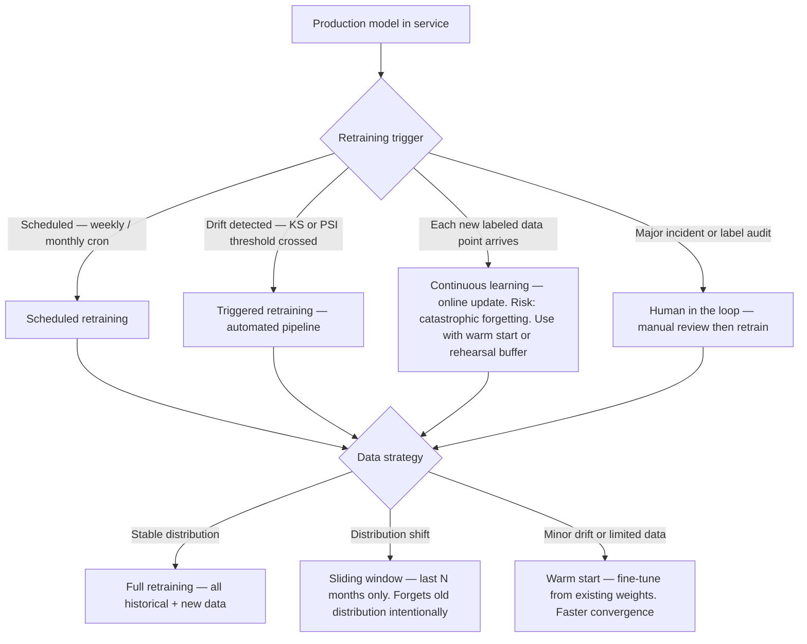

### 9.4b CI/CD → MLflow Auto-registration Loop

> GitHub Actions workflow that triggers retraining, registers the model, validates it, and promotes or rejects it automatically.

```yaml
# .github/workflows/retrain.yml
name: Retrain and Register Model
on:
  schedule:
    - cron: "0 2 * * 0"          # Weekly Sunday 2am
  workflow_dispatch:               # Manual trigger
  repository_dispatch:
    types: [drift-detected]        # Triggered by POST /admin/check-drift

jobs:
  retrain:
    runs-on: ubuntu-latest
    steps:
      - uses: actions/checkout@v4
      - name: Train model
        run: |
          pip install -r requirements.txt
          python -m ml.training.xgboost --no-search \
            --output /models/candidate.pkl
        env:
          MLFLOW_TRACKING_URI: ${{ secrets.MLFLOW_URI }}

      - name: Compare vs production baseline
        run: |
          python scripts/compare_models.py \
            --candidate /models/candidate.pkl \
            --baseline models:/your_xgboost_model/Production \
            --min-f1-delta -0.02    # reject if F1 drops > 2%

      - name: Register to Staging if better
        run: python scripts/promote_model.py --to Staging

      - name: Run smoke tests on Staging
        run: pytest tests/test_api.py -k "predict" --env staging

      - name: Promote to Production
        run: python scripts/promote_model.py --to Production
```

| # | Step | Detail |
|---|------|--------|
| 9.4b.1 | Retrain trigger | Scheduled cron + `repository_dispatch` event from `/admin/check-drift` endpoint |
| 9.4b.2 | Metrics comparison | Candidate must match or beat production: F1, precision, recall within tolerance |
| 9.4b.3 | Auto-register to Staging | `mlflow.sklearn.log_model(..., registered_model_name=...)` then transition to Staging |
| 9.4b.4 | Smoke test Staging | API integration tests run against Staging model version |
| 9.4b.5 | Auto-promote to Production | Only if smoke tests pass and metrics gate cleared |
| 9.4b.6 | Auto-reject | If metrics gate fails: model stays in Staging, alert sent, human reviews |
| 9.4b.7 | Archive old Production | Transition previous Production → Archived after successful promotion |
| 9.4b.8 | **Docker layer cache in CI** | Add `cache-from: type=gha` + `cache-to: type=gha,mode=max` to `docker/build-push-action` — cuts build time from ~3 min to ~30s on cache hit |
| 9.4b.9 | **Tag image with git SHA** | `tags: myregistry/your-api:${{ github.sha }}` — immutable, traceable to exact commit |

### 9.5 Monitoring Dashboard Metrics

**9.5a — KPI Catalog Template (mandatory before any dashboard JSON is pushed)**

Every KPI surfaced in Grafana and/or Streamlit MUST have one row in a central catalog file (`kpi_pipeline.md` or equivalent). No KPI row = no panel. This prevents "mystery metrics" that nobody owns and dashboards that grow faster than the contract.

| KPI | Source module + endpoint | Formula / query | Thresholds (ok / warn / crit) | Refresh | Dashboard target | Owner | Linked use case |
|---|---|---|---|---|---|---|---|
| `rms_norm` | `acquisition.py` → `/data/latest` | √(rms_x² + rms_y² + rms_z²) | < 50 / 50–500 / ≥ 500 mg | per frame | Grafana `ops` | platform | uc00_raw |
| `health_score` | `domain/machine.py` formula + `database/repositories/quality_repo.py::compute_health_score` → `/health-score` | weighted avg of IF, GMM, AE, RUL-norm | ≥ 80 / 50–79 / < 50 | hourly | Streamlit `overview` | ML | uc03_health |
| `null_plc_ratio` | `sync_health.py` | `null_plc / total` over last 1 h | < 0.5 % / 0.5–2 % / ≥ 2 % | 60 s | Grafana `sync` | platform | sync_infra |
| `chrony_offset_ms` | `chronyc tracking` | abs(offset) in ms | < 10 / 10–50 / ≥ 50 | 60 s | Grafana `sync` | platform | sync_infra |

**Rules**

- **Grafana = real-time ops** — refresh ≤ 60 s, time-series focus, on-call consumers
- **Streamlit = offline / analysis** — refresh manual or ≥ 5 min, narrative and drill-down, ML engineer consumers
- **No overlap** — a given named KPI appears in at most ONE of the two. If both views need it, make two distinct KPIs with suffixes (`health_score_live` vs `health_score_24h_avg`)
- **Every KPI row MUST link back to a use case ID from §1.5** (or be tagged `sync_infra` / `infra` for cross-cutting metrics)
- **Every alert threshold is testable** — the catalog row is the input to the scenario library in §2.3

**Gate** (automatable):

- [ ] Linter compares Grafana `*.json` panel `title`/`measurement` against catalog table — fails CI on orphan panel or orphan catalog row
- [ ] Every KPI has an owner (individual or team) — blank owner blocks merge

**9.5 — Category overview (umbrella)**

| Category | Metric | Alert Threshold |
|---------|--------|----------------|
| **Infrastructure** | CPU, RAM, disk, Docker health | > 80% sustained |
| **API** | Uptime, p50/p95/p99 latency, error rate (4xx/5xx), request throughput (req/s) | p95 > 200ms, error > 1% |
| **Model** | Prediction distribution, anomaly score trend, SHAP drift | Per-project baseline |
| **Data** | Input feature distributions, null rate, volume, data freshness | KS p-value < 0.05 |
| **Sync** | Clock offset (ms), cross-store join null ratio, join `diff_ms` p95, DLQ backlog | See §2.4 multi-DB sync checklist |
| **Business** | False alarm rate, missed faults, maintenance cost | Domain-specific |
| **Alerting channels** | Email via SMTP (fault alerts, weekly recap), security logs (access log anomalies), threshold-based alerts | Cooldown period to avoid alert storm — e.g. `ALERT_COOLDOWN_MIN=60` |

### 9.5b Model Validation Gates (Pre-deployment)

> Run these checks before any model is promoted from Staging to Production. Gate = automated pass/fail.

| # | Gate | Check | Pass criterion |
|---|------|-------|---------------|
| 9.5b.1 | **Baseline comparison** | Candidate F1 vs current Production F1 | Candidate ≥ Production − 2% tolerance |
| 9.5b.2 | **Precision/Recall trade-off** | Verify threshold is set on val set, not test set | Threshold tuned on validation fold only |
| 9.5b.3 | **Inference latency** | p95 latency on full validation set (single-sample requests) | p95 < 200ms |
| 9.5b.4 | **Memory footprint** | Model size in MB | Fits within container memory limit (< 500 MB for edge) |
| 9.5b.5 | **Adversarial stability** | Add Gaussian noise (σ=0.1) to each feature, check prediction stability | Flip rate < 5% of predictions |
| 9.5b.6 | **Feature drift check** | Validation set feature distributions vs training distributions | KS p-value > 0.05 on all features |
| 9.5b.7 | **Holdout test** | Final metrics on never-touched test set | F1 > project-defined minimum (e.g. 0.85) |
| 9.5b.8 | **Fairness check** | Demographic parity gap across protected groups (if applicable) | Gap < 0.3 |
| 9.5b.9 | **Reproducibility** | Re-run train pipeline from same git SHA + random seed → identical metrics | Metrics match within floating-point tolerance |
| 9.5b.10 | **Model card updated** | Model card documents train date, data version, known limits, metrics | File exists and is current |

### 9.5c Prometheus + Grafana Monitoring (Concrete Setup)

> ⚠️ **Counter vs Gauge** — use `Counter` for monotonically increasing values (requests, errors), `Gauge` for values that go up and down (drift score, queue size). Mixing them breaks PromQL rate calculations.
> ⚠️ **`make_asgi_app()`** — mounts `/metrics` as a sub-application on FastAPI. Do NOT expose this endpoint publicly — add IP whitelist or internal-only routing in Nginx/Traefik.
> ⚠️ **Histogram buckets** — define buckets matching your SLOs before deploying. Default buckets are too coarse for API latency. Example: `[0.01, 0.05, 0.1, 0.2, 0.5, 1.0, 2.0]`.

**Key Prometheus queries (PromQL):**

| Metric | PromQL query | Alert threshold |
|--------|-------------|----------------|
| Requests/sec | `rate(api_requests_total[5m])` | — |
| p95 latency | `histogram_quantile(0.95, rate(api_request_duration_seconds_bucket[5m]))` | > 0.2s |
| Error rate | `rate(api_requests_total{status=~"5.."}[5m]) / rate(api_requests_total[5m])` | > 1% |
| API down | `absent(up{job="your-api"})` | Any absence |
| Drift score | `model_drift_ks_score > 0.05` | > 0.05 |
| Disk usage | `node_filesystem_avail_bytes{mountpoint="/data"} / node_filesystem_size_bytes < 0.2` | < 20% free |

```yaml
# prometheus.yml — scrape config
scrape_configs:
  - job_name: "your-api"
    static_configs:
      - targets: ["api:8000"]
    metrics_path: /metrics
    scrape_interval: 15s

  - job_name: "node-exporter"    # host CPU/RAM/disk
    static_configs:
      - targets: ["node-exporter:9100"]
```

| # | Setup step | Command |
|---|-----------|---------|
| 9.5c.1 | Install prometheus_client | `pip install prometheus-client` |
| 9.5c.2 | Add Prometheus service to compose | `image: prom/prometheus:latest`, volume for `prometheus.yml` |
| 9.5c.3 | Add Grafana service to compose | `image: grafana/grafana:latest`, port 3000 |
| 9.5c.4 | Add node-exporter (host metrics) | `image: prom/node-exporter:latest`, `network_mode: host` |
| 9.5c.5 | Connect Grafana to Prometheus | Data source: `http://prometheus:9090` |
| 9.5c.6 | Import dashboard | Grafana ID 1860 (Node Exporter Full) + custom API dashboard |
| 9.5c.7 | Configure Alertmanager | Alert rules in `alert_rules.yml`, channel: email or Slack webhook |

### 9.6 Industrial IPC Deployment Checklist

> Applies when deploying on an embedded industrial PC (SIMATIC IPC BX-39A or equivalent fanless box). Full hardware specs and on-site procedures are in the project-specific brick26 dev-docs of the target repo.

#### 9.6.1 Hardware & OS

| # | Item | Notes |
|---|------|-------|
| 9.6.1 | OS: Linux Debian (not Windows) | Confirmed for the reference project |
| 9.6.2 | NVMe partitioned: OS (~100 GB) + `/data` (~900 GB) | Keep OS partition headroom |
| 9.6.3 | Docker data root on `/data` partition | `/etc/docker/daemon.json` |
| 9.6.4 | udev rule: USB device fixed alias (`/dev/stm32_vibration`) | Survives reboots, ttyACM0/1 aliasing |
| 9.6.5 | BIOS: "Restore on AC Power Loss" = Enabled | Auto-restart after 24V cut |
| 9.6.6 | `sudo systemctl enable docker` — Docker starts at boot | |
| 9.6.7 | All containers: `restart: always` | |

#### 9.6.2 CPU Isolation (real-time acquisition)

| Container | cpuset | Rationale |
|-----------|--------|-----------|
| `receiver` (STM32 acquisition) | `0,1` | Real-time priority, isolated from ML load |
| `api` + ML training | `2,3,4,5,6,7` | ML cannot starve acquisition |

#### 9.6.3 Docker Hardening

| # | Item | Notes |
|---|------|-------|
| 9.6.8 | Log rotation: `max-size: "10m"`, `max-file: "3"` per container | Prevents log files filling disk |
| 9.6.9 | `HEALTHCHECK CMD curl -f http://localhost:8000/system/metrics` | Docker auto-restart on failure |
| 9.6.10 | Docker rootless mode or dedicated `app_svc` user | No root blast radius |
| 9.6.11 | Docker daemon: Unix socket only, no TCP exposure | |

#### 9.6.4 Dual-NIC Network (IT + OT)

| # | Item | Notes |
|---|------|-------|
| 9.6.12 | Only ONE default gateway — on IT NIC | Two gateways = routing conflict |
| 9.6.13 | Static route for CNC subnet on OT NIC | `ip route add <CNC_net> dev <OT_NIC>` |
| 9.6.14 | Route persistent in `/etc/network/interfaces` or NetworkManager | |
| 9.6.15 | Firewall: 8000+8501 open inbound on IT; 4840 (OPC UA) outbound on OT | |
| 9.6.16 | OT container may need `network_mode: "host"` | Required for PROFINET multicast/broadcast |

#### 9.6.5 Time Synchronization

| # | Item | Notes |
|---|------|-------|
| 9.6.17 | NTP client configured to factory/corporate NTP server | `systemd-timesyncd` or `chrony` |
| 9.6.18 | OS timezone = UTC | `timedatectl set-timezone UTC` |
| 9.6.19 | Python: all timestamps `datetime.now(timezone.utc).isoformat(timespec="milliseconds")` — bare `datetime.now()`/`utcnow()` forbidden outside cosmetic use (see `.claude/rules/python.md`) | |
| 9.6.20 | PostgreSQL: `TIMESTAMPTZ` columns + container `TZ=UTC` / `PGTZ=UTC` — verified in `database.py` + `.claude/rules/timesync.md` (gate `test_docker_compose_tz_utc_invariant`) | the reference project |
| 9.6.21 | QuestDB: native µs UTC epoch | Default |
| 9.6.22a | InfluxDB (if used): native UTC | Default (reference only — not in the reference stack) |

#### 9.6.6 Power Loss Resilience

| # | Item | Notes |
|---|------|-------|
| 9.6.22 | SIGTERM handler in `acquisition.py` | On power loss: `PRAGMA wal_checkpoint(FULL)` before exit |
| 9.6.23 | Nightly SQLite backup: `rsync` to NAS or network share | Via cron |
| 9.6.24 | Daily BLOB purge: `POST /admin/purge-blobs?older_than_days=30` | Prevents 1 TB saturation |
| 9.6.25 | Disk usage alert: cron warns if `/data` > 80% | |
| 9.6.26 | Heartbeat: `GET /system/metrics` pinged from monitoring every 60s | Detects silent Python crashes |

#### 9.6.7 CNC / PLC Integration (Fanuc 30i)

| # | Item | Notes |
|---|------|-------|
| 9.6.27 | Fanuc OPC UA add-on TCP:4840 | Confirm licence + NodeIDs on-site |
| 9.6.28 | `fanuc_reader.py` mock/real switch: `FANUC_MOCK=0` for production | |
| 9.6.29 | Poll interval ≥ PLC scan time | Avoids flooding CNC communication processor |
| 9.6.30 | OPC UA Pub/Sub preferred over polling | Reduces OT network load |
| 9.6.31 | Variables to expose: spindle speed, feed rate, tool number, program number, alarm code, axes positions | Confirm NodeIDs on-site |
| 9.6.32 | OPC UA credentials (user/pass or cert) stored in `.env`, not hardcoded | |

#### 9.6.8 Data Alignment (vibration ↔ CNC context)

| # | Item | Notes |
|---|------|-------|
| 9.6.33 | STM32: ~1000 samples/s USB CDC | |
| 9.6.34 | CNC (OPC UA): up to 50 polls/s Ethernet | |
| 9.6.35 | Join strategy: ±500 ms time-window RMS → nearest CNC snapshot | `fetch_plc_context_at` helper + `sync_joiner` materialises `acquisitions_enriched` with `diff_ms` (ADR-019 Pilier 2) |
| 9.6.36 | QuestDB ASOF join / Redis Streams consumer group with `WINDOW_MS=500` (env `SYNC_JOINER_WINDOW_MS`) | Cross-store join discipline per `.claude/rules/timesync.md` |
| 9.6.37 | QuestDB measurements: `cnc_context` (CNC), `vibration` (STM32 ILP), `ml_scores`, `rms_forecast` | PG holds the relational siblings `plc_snapshots`, `acquisitions`, `phase_windows` |

#### 9.6.9 Remote Access & Disaster Recovery

| # | Item | Notes |
|---|------|-------|
| 9.6.38 | SSH key-only, `PasswordAuthentication no` | |
| 9.6.39 | VPN: Tailscale or SINEMA Remote Connect | many corporate networks block direct port 22 to the public Internet |
| 9.6.40 | Code updates via `git pull` over VPN tunnel | Not USB key |
| 9.6.41 | Clonezilla full disk image after validation | ~10 min restore on replacement IPC |

#### 9.6.10 OS & Architecture Compatibility Matrix

> Decide up front which OS family, distribution version, and CPU architectures the stack must support. Ambiguity here surfaces as broken wheels, missing glibc symbols, or QEMU-emulated containers running at 10% of native speed. Dev↔prod arch parity is the single biggest silent-failure source in industrial deployments.

| # | Axis | Decision required | Notes |
|---|------|-------------------|-------|
| 9.6.42 | **OS family** | Debian / Ubuntu LTS / RHEL / Alpine | Industrial IPCs usually ship Debian or a vendor-branded Debian (e.g. Siemens IndOS). Alpine saves space but uses musl libc — **numpy/scipy/torch manylinux wheels are glibc-only**, switching to Alpine forces source builds or `alpine+glibc` hacks |
| 9.6.43 | **Distribution version pin** | `bookworm` / `bullseye` / `jammy` — and digest-pin the image | `FROM python:3.11-slim-bookworm@sha256:...` — `:latest` or `:slim` drift silently between builds |
| 9.6.44 | **Target CPU arch(es)** | `linux/amd64` / `linux/arm64` / `linux/arm/v7` | Check the IPC datasheet — Siemens IPC BX-39A = x86_64 only; NVIDIA Jetson = arm64; Raspberry Pi 4 = arm64 (or armv7 on 32-bit OS) |
| 9.6.45 | **Multi-arch build pipeline** | `docker buildx` with manifest list in CI | `docker buildx build --platform linux/amd64,linux/arm64 --push` — without this, an `arm64` deployment will silently pull the amd64 image under QEMU |
| 9.6.46 | **Per-service platform pinning** | `platform: linux/amd64` in compose for vendor images with no arm64 variant | QuestDB, Grafana OSS, MLflow: verify each image publishes the target arch on Docker Hub — else pin `platform:` to avoid QEMU |
| 9.6.47 | **Base image choice** | `python:X.Y-slim-<codename>` vs `-bookworm` vs `-alpine` | Default: `slim-bookworm` for ML (glibc, small). Never `alpine` for numpy/scipy/torch |
| 9.6.48 | **Dev↔prod arch parity** | same arch on dev laptop, CI runner, and target IPC — OR QEMU tested explicitly | WSL2 amd64 → IPC amd64 = OK. Dev on Apple Silicon arm64 → IPC amd64 = must validate in CI on amd64 runner |
| 9.6.49 | **Hardware constraints** | fanless thermal envelope, RAM ceiling, swap policy, NVMe endurance | Document `Tj_max`, min/recommended RAM for the full stack under load, swap disabled or sized, NVMe DWPD if log-heavy |
| 9.6.50 | **restart policy** | `unless-stopped` on all services (NOT `always`) | `always` causes boot loops on IPCs when a container fails at startup — the IPC reboots, container fails again, infinite loop. `unless-stopped` respects manual `docker stop` |
| 9.6.51 | **USB / PCI device bindings** | udev rules for stable aliases + privileged only where needed | USB VID:PID → stable symlink (`/dev/stm32_vibration`); avoid `privileged: true` unless required |
| 9.6.52 | **Locale & filesystem encoding** | `LANG=C.UTF-8`, `LC_ALL=C.UTF-8` in compose env | Avoids `.encode()` surprises with non-ASCII filenames on fresh Debian installs |

**Gate** (automatable):

- [ ] `tests/test_compose_platform_invariant.py` parses `docker-compose.yml` and asserts:
  - every service has explicit `platform:` OR the image publishes all target archs
  - every service has `restart: unless-stopped`
  - every service has `TZ=UTC` (cross-ref §2.4)
- [ ] CI matrix runs `docker buildx bake` on at least all target archs before release
- [ ] `uname -m` on target IPC is logged on first boot + matches expected arch

**Anti-patterns:**

- ❌ Using `:latest` tag for base images — breaks reproducibility + silent libc version bumps
- ❌ Dev on Apple Silicon deploying to amd64 IPC with no CI amd64 validation — QEMU differences bite at runtime
- ❌ Mixing Alpine and Debian base images across services — doubles the glibc/musl test matrix for no gain
- ❌ `restart: always` on industrial IPCs — confirmed boot-loop source

> Cross-ref: see `.claude/rules/os_arch.md` for the short project-rule version + `deployment-constraints.md` for per-IPC REX entries.

### 9.7 Load Testing Checklist (Locust)

| Metric | Target | Notes |
|--------|--------|-------|
| RPS (requests per second) | Baseline × 10 | Peak load scenario |
| p50 latency | < 50ms | Median user experience |
| p95 latency | < 200ms | 95% of requests |
| p99 latency | < 500ms | Tail latency |
| Failure rate | < 0.1% | Under load |
| Concurrent users | Production peak × 2 | Safety margin |

> ⚠️ **Task weights** — in `locustfile.py`, assign `@task(N)` weights that reflect real traffic distribution (health checks more frequent than predictions). A flat distribution underestimates prediction endpoint stress.
> ⚠️ **`--headless` + `--html`** — always export the HTML report in CI: `locust ... --headless --html locust_report.html`. Store it as a CI artifact for comparison across runs.

```bash
locust -f locustfile.py --host http://staging:8000 \
  --users 50 --spawn-rate 5 --run-time 10m --headless \
  --html locust_report.html
```

| # | Step | Detail |
|---|------|--------|
| 9.7.1 | Run against staging (never prod) | `--host http://staging:8000` |
| 9.7.2 | Duration ≥ 10 min | Short bursts hide memory leaks and slow degradation |
| 9.7.3 | Ramp up gradually | `--spawn-rate 5` — avoid thundering herd from t=0 |
| 9.7.4 | Pass/fail criteria enforced | CI fails if p95 > 200ms or failure_rate > 0.1% |
| 9.7.5 | Monitor container resources during test | `docker stats` — check for memory leaks under load |

### 9.8 Deployment Strategies

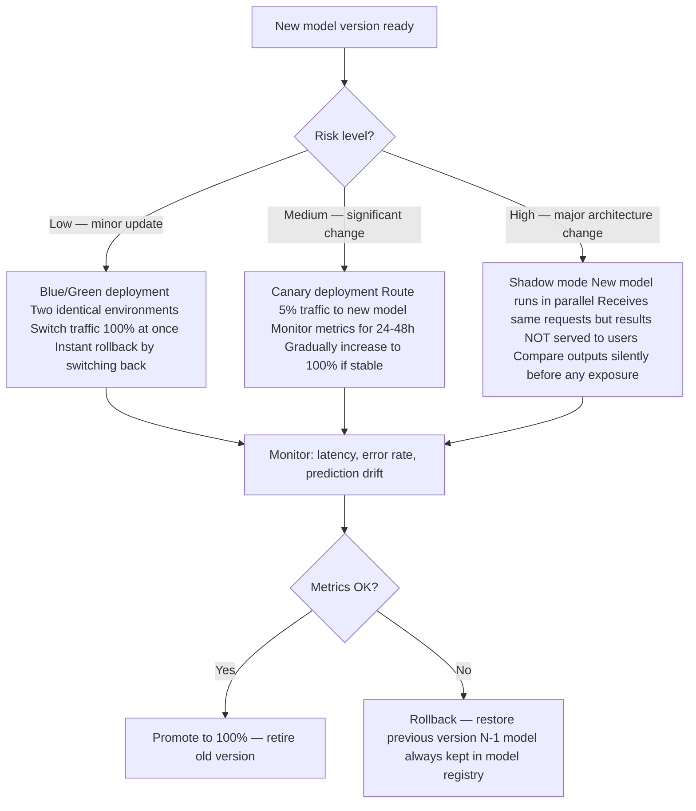

| Strategy | Traffic exposure | Rollback speed | Use when |
|---------|----------------|---------------|---------|
| **Blue/Green** | 0% then 100% instantly | Immediate (switch back) | Low-risk updates, simple infra |
| **Canary** | 5% → 25% → 100% gradually | Fast (reduce canary to 0%) | Medium-risk, monitor real traffic |
| **Shadow mode** | 0% (parallel, silent) | N/A — no exposure | High-risk, validate before any exposure |

### 9.8b Rollback Procedure (Step-by-Step)

> To use when metrics degrade after a promotion. Do not improvise under pressure — follow this sequence.

| # | Step | Command / Action |
|---|------|-----------------|
| 9.8b.1 | Confirm alert is not flaky | Check Grafana: is degradation sustained > 5 min, or a spike? |
| 9.8b.2 | Identify the bad version | `mlflow ui` → Models → your_xgboost_model → find current Production version |
| 9.8b.3 | Rollback model in registry | `client.transition_model_version_stage(name, bad_version, stage="Archived")` then promote N-1 back to Production |
| 9.8b.4 | Rollback Docker image (if needed) | `docker compose down && docker compose up -d` with previous image tag in `.env` |
| 9.8b.5 | Verify rollback | Run smoke tests: `pytest tests/test_api.py -k "predict"` + check Grafana p95 latency |
| 9.8b.6 | Confirm metrics recovered | Wait 5 min — verify p95 < 200ms, error rate < 1%, drift score stable |
| 9.8b.7 | Keep rollback state 24h | Do not re-promote until root cause is identified |
| 9.8b.8 | Post-mortem | Root cause: concept drift? data quality regression? code bug? Update §9.4 retraining strategy accordingly |

### 9.9 Observability — Logs & Traces

> Structured logging + distributed tracing. Enables incident investigation without SSH into production containers.

#### 9.9.1 Structured Logging Standard

> ⚠️ **One JSON object per line** — every log event must be a single self-contained JSON object. Multi-line logs (stack traces, print statements) break log aggregators. Wrap exceptions: `logger.exception("predict.error", exc_info=True)` outputs the traceback as a single JSON field.
> ⚠️ **`request_id`** — generate a UUID at the entry point of every request and propagate it through all downstream calls (DB query, model inference). Without it, correlating logs from different services for a single user request is impossible.

| # | Rule | Detail |
|---|------|--------|
| 9.9.1 | JSON format | Every log line is valid JSON — no free-form strings |
| 9.9.2 | Mandatory fields | `timestamp` (UTC ISO-8601), `level`, `event`, `request_id`, `service` |
| 9.9.3 | Sensitive data masking | No raw sensor payloads, no passwords, no full IP addresses in logs |
| 9.9.4 | Log levels used correctly | DEBUG (dev only), INFO (normal ops), WARNING (degraded), ERROR (action needed), CRITICAL (service down) |
| 9.9.5 | Retention policy | Debug logs: 7 days. Info logs: 30 days. Audit/security logs: 1 year |

#### 9.9.2 Log Aggregation

| Stack | When to use | Setup |
|-------|-------------|-------|
| **Grafana Loki + Promtail** | Already using Grafana (lightweight, no Elasticsearch) | Add `loki` and `promtail` services to compose, tail Docker log files |
| **ELK Stack** | Enterprise, full-text search needed | Elasticsearch + Logstash + Kibana — heavier but more powerful |
| **CloudWatch / Azure Monitor** | Cloud deployment | Native integration, no infra to manage |

```yaml
# docker-compose addition for Loki log aggregation
services:
  loki:
    image: grafana/loki:latest
    ports: ["3100:3100"]
    volumes: ["loki_data:/loki"]

  promtail:
    image: grafana/promtail:latest
    volumes:
      - /var/lib/docker/containers:/var/lib/docker/containers:ro
      - ./promtail-config.yml:/etc/promtail/config.yml
```

#### 9.9.3 Distributed Tracing (OpenTelemetry)

> ⚠️ **`FastAPIInstrumentor.instrument_app(app)`** — auto-instruments all FastAPI routes with zero code change. Every incoming request automatically gets a trace span with method, path, status code, and duration. Add custom child spans only for slow operations (DB query, model inference) that you want to profile individually.
> ⚠️ **OTLP vs Jaeger native protocol** — prefer OTLP (OpenTelemetry Protocol) over the legacy Jaeger UDP format: OTLP is vendor-neutral and works with Tempo, Datadog, and Honeycomb without code changes.

| # | Step | Detail |
|---|------|--------|
| 9.9.6 | Install OpenTelemetry | `pip install opentelemetry-sdk opentelemetry-instrumentation-fastapi opentelemetry-exporter-otlp` |
| 9.9.7 | Add Jaeger or Tempo service | `image: jaegertracing/all-in-one:latest` — Jaeger UI on port 16686 |
| 9.9.8 | Propagate trace context | Every downstream call (DB query, model inference) gets a child span |
| 9.9.9 | Use trace for incident investigation | Identify which span is slow: DB lock? Model load? Feature extraction? |

### 9.10 Production Docker Compose Template

> Checklist for hardening a development `docker-compose.yml` for production. Apply as a diff/override file.

```yaml
# docker-compose.prod.yml — production overrides
version: "3.9"
services:
  receiver:
    image: myregistry/your-receiver:v1.0   # immutable tag
    restart: unless-stopped                 # better than always: won't restart if manually stopped
    mem_limit: 512m
    cpuset: "0,1"                           # isolated for real-time acquisition
    devices:
      - "/dev/stm32_vibration:/dev/ttyACM0"
    logging:
      driver: "json-file"
      options: {max-size: "10m", max-file: "3"}

  api:
    image: myregistry/your-api:v1.0
    restart: unless-stopped
    mem_limit: 4g
    cpuset: "2,3,4,5,6,7"
    secrets: [db_password, smtp_password]
    logging:
      driver: "json-file"
      options: {max-size: "10m", max-file: "3"}
    healthcheck:
      test: ["CMD", "curl", "-f", "http://localhost:8000/system/metrics"]
      interval: 30s
      timeout: 5s
      retries: 3
      start_period: 10s

  dashboard:
    image: myregistry/your-dashboard:v1.0
    restart: unless-stopped
    mem_limit: 2g
    logging:
      driver: "json-file"
      options: {max-size: "10m", max-file: "3"}

secrets:
  db_password:
    external: true    # managed by Docker secrets or Vault, not .env
  smtp_password:
    external: true
```

| # | Rule | Anti-pattern to avoid |
|---|------|----------------------|
| 9.10.1 | Use immutable image tags (`v1.0`, git SHA) | Never `image: myapp:latest` in prod |
| 9.10.2 | `restart: unless-stopped` (not `always`) | `always` restarts even manual stops — hard to maintain |
| 9.10.3 | `mem_limit` per container | Without limits, one container OOM-kills all others |
| 9.10.4 | Log rotation on every container | Without it, logs fill the disk silently within weeks |
| 9.10.5 | `healthcheck` on every service | Without it, Docker reports container "Up" even if app is frozen |
| 9.10.6 | Docker secrets for sensitive values | `.env` files in prod are a security anti-pattern |
| 9.10.7 | Non-root user in Dockerfile | `USER appuser` in Dockerfile — never run as root inside container |
| 9.10.8 | Read-only filesystem where possible | `read_only: true` + explicit `tmpfs` mounts for writable dirs |
| 9.10.9 | Drop Linux capabilities | `cap_drop: [ALL]`, add back only what's needed (`cap_add: [NET_BIND_SERVICE]`) |

### 9.11 Disaster Recovery

> What to do when things break. Covers both IPC on-site (hardware failure) and cloud scenarios.

| Scenario | RTO target | RPO target | Recovery procedure |
|---------|------------|-----------|-------------------|
| IPC hardware failure | 30 min | 24h (last nightly backup) | Restore Clonezilla image on replacement IPC → follow `operations/dr_runbook.md` §3-§4 |
| Docker container crash | < 1 min | 0 (restart: unless-stopped) | Auto-restart; alert if restart loop |
| PostgreSQL volume corruption | < 2h | 24h (B44 nightly `pg_dump -Fc`) | `operations/dr_runbook.md` §2 — drop `postgres_data`, `alembic upgrade head`, `pg_restore`, verify `alembic_version` matches MANIFEST |
| QuestDB volume corruption | < 2h | 24h | Stop questdb, untar `questdb.tar.gz` into `questdb_data`, restart — `operations/dr_runbook.md` §3 step 5 |
| Model degradation | < 15 min | 0 (rollback to N-1) | MLflow registry rollback — see §9.8b |
| Full disk | < 30 min | 0 | Run BLOB purge (`POST /admin/purge-blobs`), free space, restart |
| Network partition (OT isolated) | Continues autonomously | 0 (local PG buffer) | STM32 + local acquisition continues; CNC data resumes on reconnect |

| # | Item | Command / Detail |
|---|------|-----------------|
| 9.11.1 | Nightly PG + QuestDB + MLflow backup (B44) | `tools/dr_backup.sh` → `${BACKUP_DIR}/YYYY-MM-DD/{pg.dump, questdb.tar.gz, mlflow.dump, mlruns.tar.gz, MANIFEST.json}` |
| 9.11.2 | Backup verification | `tools/dr_restore.sh` runs `pg_restore -l`, sha256 match on the artifact tarball, TOC row-count diff — exits 0 only on success |
| 9.11.3 | Model artifacts backed up | MLflow artifacts tarred from `/data/mlruns` + `pg_dump` of the `mlflow` PG database |
| 9.11.4 | Clonezilla image for IPC | After each major system change; stored on NAS |
| 9.11.5 | Recovery runbook tested | Nightly `.github/workflows/dr-nightly.yml` exercises `dr_restore.sh`; gate via `/admin/last-backup` `age_hours ≤ 26` |
| 9.11.6 | SIGTERM handler for clean shutdown | `acquisition.py` flushes pending writes before exit — prevents torn writes in PG / QuestDB / Redis on power loss |
| 9.11.7 | Disk usage monitoring | Alert at 80% full (`node_filesystem_avail_bytes < 20%` in Prometheus) |
| 9.11.8 | Document RTO/RPO per service | See `.claude/dev-docs/operations/dr_runbook.md` (B44 brick) |

#### 9.11.a Per-store backup matrix

| Store | Idiom | RPO target | Typical pitfall |
|-------|-------|-----------|----------------|
| **PostgreSQL** | `pg_dump -Fc` (custom, compressed, selective restore). Stream to off-host. | 1–24 h | Dump without `alembic_version` / migration head is an orphan — unreviewable at restore |
| **QuestDB / InfluxDB** | `CHECKPOINT CREATE` → tar of data volume → `CHECKPOINT RELEASE` in RETURN trap | 1–24 h | Forgetting RELEASE on error = writer paused indefinitely; always trap |
| **SQLite** | `sqlite3 .backup` (never `cp` — live WAL corruption) | 1–24 h | `cp` while WAL active = partial write; `.backup` is the only safe idiom |
| **MLflow artifacts** | `tar` of `/mlruns/` + `.backup` on mlflow.db (or `pg_dump` if PG-backed) | 24 h–1 w | Artifacts + backend out of sync = orphan run metadata |
| **Labels / ground truth** | Dedicated backup or source-of-truth in version control (DVC / git-lfs) | 0 (immutable) | Mutable label tables break model auditability |
| **Container volumes** | `docker run --volumes-from ... busybox tar czf` or named-volume snapshot | 24 h | Bind-mount UID/GID drift between backup and restore host |
| **Object storage / cloud** | Native snapshot (S3 versioning, Azure Blob soft delete) + cross-region replication | 1 h–1 d | Snapshot is not versioning is not replication — they fail for different reasons |

#### 9.11.b Historical data management

| # | Rule | Detail |
|---|------|--------|
| 9.11.b.1 | **Retention policy defined per store** | Raw / features / labels / artifacts have explicit TTLs; no "forever by default" |
| 9.11.b.2 | **GFS rotation** | Daily (7) + weekly (4) + monthly (3+) — tune to regulatory / audit horizon |
| 9.11.b.3 | **Retrain window ≤ retention window** | A model trained on data no longer backupable is not reproducible |
| 9.11.b.4 | **Each backup tagged with migration head** | `alembic_version` / schema revision / code SHA written into MANIFEST |
| 9.11.b.5 | **MLflow runs pin dataset version** | DVC hash / dataset snapshot ID — not a live table query |
| 9.11.b.6 | **Destructive ops gated by env flag** | `ALLOW_DESTRUCTIVE_DOWNGRADE=1` or equivalent — stray scripts cannot nuke the baseline |
| 9.11.b.7 | **Off-host + off-site** | Same-disk snapshot is not backup; require ≥2 physical copies on ≥2 media |
| 9.11.b.8 | **Automated restore drill** | Nightly / weekly CI job: backup → restore → integrity check → row-count diff |
| 9.11.b.9 | **Quarterly oldest-snapshot drill** | Verify format / codec / encryption key still readable for the oldest retained slot |
| 9.11.b.10 | **Alert on skipped backups** | Scheduler miss → alert within one SLA cycle — silent backup daemon is the worst failure mode |

> ⚠️ **"We have snapshots" ≠ backup.** A same-volume snapshot survives a file deletion but not a disk failure. A same-host snapshot survives a disk failure but not a host failure. A same-region replica survives a host failure but not a region loss. Size the backup tier to the disaster scenario — not to the convenient default.

> ⚠️ **Untested backup = schrödinger's backup.** Every production incident post-mortem where backup failed shares the same root cause: the backup ran daily for years but was never restored. Automate the restore in CI, not just the backup.

### 9.12 Kubernetes Deployment (optional — multi-node only)

> Use K8s when Docker Compose on a single IPC is no longer sufficient: multi-node, auto-scaling, HA. Not required for Phase 1.

| # | Item | Detail |
|---|------|--------|
| 9.12.1 | Deployment manifest | `kind: Deployment` with `replicas: 2`, `image: myregistry/your-api:v1.0` |
| 9.12.2 | Service manifest | `kind: Service`, `type: ClusterIP` (internal) or `LoadBalancer` (external) |
| 9.12.3 | ConfigMap | Non-sensitive config (feature names, thresholds) as key-value pairs |
| 9.12.4 | Secret | Sensitive values (DB password, API keys) — never in ConfigMap |
| 9.12.5 | PersistentVolumeClaim | Model artifacts and datastore volumes (PG / QuestDB / MLflow artifacts) on persistent storage, not pod ephemeral disk |
| 9.12.6 | HorizontalPodAutoscaler | `targetCPUUtilizationPercentage: 70`, min 2 replicas, max 10 |
| 9.12.7 | Liveness + Readiness probes | Liveness: restart dead pod; Readiness: stop routing traffic to unready pod |
| 9.12.8 | Namespace isolation | `namespace: your-app-prod` — isolated from other workloads |
| 9.12.9 | RBAC | ServiceAccount with minimal permissions — no cluster-admin for app pods |
| 9.12.10 | Deploy: `kubectl apply -f k8s/` | Declarative — `kubectl apply` is idempotent; avoid `kubectl run` in prod |

---

## 10. Security

### 10.1 Checklist

| # | Layer | Method | Tool |
|---|-------|--------|------|
| 10.1 | **Auth** | OAuth 2.0 + JWT tokens | python-jose, FastAPI OAuth2 |
| 10.2 | **Transport** | HTTPS + TLS (min 1.2) | Let's Encrypt, Certbot |
| 10.3 | **Rate limiting** | Per-IP or per-token limits | SlowAPI (FastAPI), Nginx, Kong |
| 10.4 | **Input validation** | Strict Pydantic schemas on all endpoints | FastAPI + Pydantic v2 |
| 10.5 | **CORS** | Whitelist allowed origins | FastAPI `CORSMiddleware` |
| 10.6 | **Secret management** | No secrets in code or .env committed | HashiCorp Vault, Docker secrets |
| 10.7 | **Logging & Audit** | Structured logs, access logs, auth events | structlog, ELK Stack |
| 10.8 | **API Gateway** | Rate limiting, routing, auth at edge | Kong, Traefik |
| 10.9 | **Data encryption** | At rest (DB encryption) and in transit (TLS) | SQLCipher, TLS |
| 10.10 | **Data freshness** | Monitor data age, alert on stale feeds | Custom watchdog |

### 10.2 ML-Specific Security & Fairness

| # | Concern | Method | Tool |
|---|---------|--------|------|
| 10.11 | **Selection bias** | Audit data collection process | Manual review + data lineage |
| 10.12 | **Proxy bias** | Detect features proxying protected attributes | Correlation analysis |
| 10.13 | **Label bias** | Audit labeling process, inter-rater agreement | Manual audit |
| 10.14 | **Fairness metrics** | Demographic parity, equalized odds < 0.3 | AIF360, Fairlearn |
| 10.15 | **Model robustness** | Input perturbation tests | KS-test on adversarial inputs |
| 10.16 | **Hallucination rate** | For LLM components — factuality check | Custom eval harness |

### 10.3 ML Model Security — Adversarial Threats

> Beyond classic app security (§10.1), ML models have unique attack surfaces. Covers poisoning, evasion, extraction, and inversion.

| # | Attack type | Threat | Mitigation |
|---|------------|--------|-----------|
| 10.17 | **Data poisoning** | Attacker injects malicious training samples to corrupt the model | Audit data provenance; anomaly-detect training samples before ingestion; track data lineage |
| 10.18 | **Evasion attack** | Attacker crafts inputs that fool the model at inference time (adversarial examples) | Adversarial training; input perturbation smoke tests (see §9.5b); reject inputs > N σ from training distribution |
| 10.19 | **Model extraction** | Attacker queries the API repeatedly to reconstruct the model | Rate limit per token; do not return raw confidence scores (return class only or bucketed confidence); log abnormal query patterns |
| 10.20 | **Model inversion** | Attacker reconstructs training data from model outputs or gradients | Do not expose gradient information; add noise to confidence outputs (differential privacy) |
| 10.21 | **Prompt injection (LLM)** | Attacker embeds instructions in user input to override model behavior | Strict input schema validation; never concatenate raw user input into prompt templates |
| 10.22 | **Supply chain** | Malicious dependency or pre-trained model weight | Pin all dependencies (`==`); verify model checksums; use trusted model registries only |
| 10.23 | **Training data leakage** | Sensitive data memorized by model | Audit training data for PII before ingestion; differential privacy during training if sensitive |

| # | Audit item | Check |
|---|-----------|-------|
| 10.24 | **Model card published** | Documents: train data source, known failure modes, bias risks, performance by subgroup |
| 10.25 | **Version audit log** | Every production model version: who trained it, from what data, with what code SHA |
| 10.26 | **Reproducibility** | `git SHA + random_seed + data_version → identical model metrics` — verified in CI |
| 10.27 | **Inference output scope** | API returns minimum necessary output — no raw feature importance, no confidence histogram exposed publicly |

---

## 11. Software Engineering — Architecture

| # | Criterion | Principle | Reference example |
|---|-----------|-----------|--------------|
| 11.1 | **SSOT per layer** | Each layer has one source of truth | `database/__init__.py` (façade) re-exports 113+ helpers from 14 domain repos under `database/repositories/` — only PG access point |
| 11.2 | **Separation of concerns** | Each module has one clearly scoped responsibility | `streaming/ingestion → ml/features → ml/inference → api → dashboard` (layered) |
| 11.3 | **API-First** | UI consumes API only, never DB directly | `dashboard/app.py` + `dashboard/api_client.py` call REST endpoints only |
| 11.4 | **Abstraction layer for DB** | Functions like `get_data()` hide DB implementation | Schema lifecycle owned by Alembic since brick `alembic-pre-b44` (ADR-018) — see `database/migrations/versions/` |
| 11.5 | **BLOB codec centralized** | Binary encode/decode in one module | `utils/blob.py::pack_blob` / `unpack_blob` (carved Phase 12 polish — single seam used by acquisition + serializers) |
| 11.6 | **Multi-board via env vars** | Hardware IDs configurable without code change | `BOARD_ID` env var → `board_id` column |
| 11.7 | **Idempotent writes** | Double insert does not corrupt DB | `INSERT OR IGNORE` + composite key `(timestamp, board_id)` |
| 11.8 | **Health endpoint** | External monitoring possible via `/health` | `GET /system/metrics` → uptime, last timestamp |
| 11.9 | **Env vars for all thresholds** | No magic numbers in code | `IDLE_MAX`, `FAULT_MIN`, `ALERT_COOLDOWN_MIN` in `.env` |
| 11.10 | **Firmware ↔ software mirror** | Critical constants identical on STM32 and Python side | `SAMPLES=256`, `ODR=6667Hz` in `processing.py` AND `main.h` |

---

## 12. Software Engineering — Data & Tests

### 12.1 SQLite Best Practices

| # | Rule | Implementation |
|---|------|---------------|
| 12.1 | WAL mode | `PRAGMA journal_mode=WAL` in `get_connection()` |
| 12.2 | Indexed filter columns | `CREATE INDEX idx_timestamp ON acquisitions(timestamp)` |
| 12.3 | Backward-compatible migrations | `ALTER TABLE ... ADD COLUMN` wrapped in `try/except` |
| 12.4 | BLOB format documented | `float32 LE`, `np.frombuffer(blob, dtype=np.float32)` |
| 12.5 | FK hierarchy documented | `tools → sessions → holes → acquisitions → quality_records` + ERD |
| 12.6 | Configurable BLOB purge | `POST /admin/purge-blobs?older_than_days=30` → `raw_data = NULL` |

### 12.2 Test Checklist

#### 12.2a Test Types

| # | Test type | Method | Coverage target |
|---|-----------|--------|----------------|
| 12.1 | Unit — preprocessing | Test each transform function in isolation | `test_features.py`, `test_processing.py` |
| 12.2 | Unit — signal parsing | Valid + malformed USB frames | `test_acquisition.py::test_parse_data_line_valid` |
| 12.3 | Unit — DB helpers | Insert, fetch, update on in-memory DB | `test_database.py` |
| 12.4 | Integration — API | TestClient + patched DB path | `test_api.py` |
| 12.5 | Integration — ML pipeline | Train + predict on synthetic data, F1 > 0.8 | `test_train_xgboost.py` |
| 12.6 | E2E — full pipeline | Staging environment, real-like data | Manual + CI |
| 12.7 | Performance — load | Locust: RPS, p50/p95/p99, failure rate | `locustfile.py` |
| 12.8 | Coverage report | `pytest --cov=. --cov-report=html` | Target > 80% |
| 12.9 | Regression tests | Re-run full test suite on every PR — new code must not break existing tests | CI gate: all previously passing tests still pass |
| 12.10 | API contract tests | Validate response schema on every endpoint: field names, types, required fields | `test_api.py` + Pydantic response models or `pytest-schema` |
| 12.11 | Edge case / boundary tests | Null values, empty arrays, out-of-range inputs, max-length strings, zero division | One `test_edge_cases.py` per module or inline parametrized |
| 12.12 | Security tests | SQL injection strings, oversized payloads, malformed JSON on all POST endpoints | `test_api_security.py` — expect 422 or 400, never 500 |
| 12.13 | Dependency injection tests | Verify each function can be tested with injected mocks for external I/O (DB, USB, API) | Use `unittest.mock.patch` or `pytest-mock` |

#### 12.2b Test Infrastructure

| # | Item | Detail |
|---|------|--------|
| 12.14 | **`conftest.py` for shared fixtures** | DB connection, seeded data, mock USB port, test client — one `conftest.py` per test directory, inherited by all tests in subtree |
| 12.15 | **`@pytest.mark.parametrize`** | Use for exhaustive input coverage — one test function, multiple input sets. Avoids copy-paste test proliferation |
| 12.16 | **Mocking strategy** | Mock at the boundary: external I/O (DB, USB, network, filesystem). Never mock pure functions — test them directly. Never mock what you own. |
| 12.17 | **When NOT to mock** | DB layer: use in-memory SQLite (`sqlite:///:memory:`), not a mock. Mocking DB calls hides schema errors and query bugs. |
| 12.18 | **Test isolation** | Each test must be independent — no shared mutable state between tests. Use fixtures with function scope, not module/session scope for stateful resources. |
| 12.19 | **Deterministic tests** | Fix random seeds in all tests (`random.seed(42)`, `np.random.seed(42)`). Tests that produce different results on re-run are unreliable. |
| 12.20 | **Fast unit test suite** | Full unit test suite must run in < 30s. Slow tests (DB, network, ML training) marked `@pytest.mark.slow` and excluded from pre-commit hook. |
| 12.21 | **Test naming convention** | `test_<unit>_<scenario>_<expected>` — e.g. `test_parse_frame_malformed_raises_valueerror`. Readable failure messages without opening the code. |
| 12.22 | **CI test matrix** | Run tests on Python 3.10 + 3.11 minimum. Add OS matrix (Ubuntu + Windows) if cross-platform deployment is planned. |

> ⚠️ **Mock what you don't own, test what you do** — mocking the DB to test DB interaction is the most common testing mistake. It gives false confidence: the mock passes but the real query fails on a type mismatch or missing index. Use an in-memory SQLite instead.
> ⚠️ **100% coverage ≠ correct code** — coverage measures lines executed, not correctness. A test that calls every line but asserts nothing achieves 100% coverage with zero value. Always assert the output, not just that the function runs.

### 12.3 Docker Checklist

| # | Rule | Status |
|---|------|--------|
| 12.9 | 3 core services: receiver / api / dashboard | ✅ |
| 12.10 | Optional services under Docker profiles (`--profile plc`, `--profile mlflow`) | ✅ |
| 12.11 | Named shared volumes: `sensor_data`, `model_data` | ✅ |
| 12.12 | `.env.example` documents all required variables | ✅ |
| 12.13 | `requirements.txt` with pinned versions (`==`) | ✅ |
| 12.14 | `HEALTHCHECK CMD curl -f http://localhost:8000/system/metrics` | 🔵 |
| 12.15 | CI pipeline: `pytest` blocks merge on failure | 🔵 |

---

---

## 13. Development Environment & Tooling

### 13.1 Python Environment — venv & Dependencies

| # | Item | Detail |
|---|------|--------|
| 13.1.1 | **One venv per project** | `python -m venv venv` at repo root — never install into system Python |
| 13.1.2 | **Activate before any work** | `source venv/bin/activate` (Linux/Mac) or `venv\Scripts\activate` (Windows) |
| 13.1.3 | **`.gitignore` the venv** | Add `venv/`, `__pycache__/`, `*.pyc`, `.env` to `.gitignore` — never commit |
| 13.1.4 | **`requirements.txt` pinned for prod** | Use `==` for all dependencies in prod: `fastapi==0.111.0`. Reproducible builds. |
| 13.1.5 | **`requirements-dev.txt` relaxed** | Dev/test deps use `>=` or `~=` — allows minor upgrades without breaking prod lockfile |
| 13.1.6 | **Generate from current env** | `pip freeze > requirements.txt` after `pip install` — captures exact transitive deps |
| 13.1.7 | **`pip-compile` for managed lockfile** | `pip-tools`: write top-level deps in `requirements.in`, compile to `requirements.txt` with hashes |
| 13.1.8 | **Dependency audit** | `pip-audit` or `safety check` — scan for known CVEs in installed packages |
| 13.1.9 | **Upgrade strategy** | Monthly: `pip list --outdated`, test upgrades in branch before merging to main |

> ⚠️ **`pip freeze` includes everything** — if your venv has dev tools (pytest, black, ipykernel), `pip freeze` will include them in `requirements.txt`. Use separate files or `pip-compile` with scoped inputs to avoid bloating the prod image.

### 13.2 Docker Hub & Image Registry

| # | Item | Detail |
|---|------|--------|
| 13.2.1 | **Authenticate before push** | `docker login` (Docker Hub) or `docker login <acr>.azurecr.io` (ACR) — use token, not password |
| 13.2.2 | **Token-based auth** | Docker Hub: use Access Token (Settings → Security), not account password. Revocable. |
| 13.2.3 | **Image naming convention** | `registry/organisation/image-name:tag` — e.g. `myregistry.azurecr.io/your-org/your-api:v1.0` |
| 13.2.4 | **Public vs private registry** | Docker Hub free tier: 1 private repo. Use ACR/ECR/GCR for enterprise or sensitive images. |
| 13.2.5 | **Push workflow** | `docker build -t registry/image:tag .` → `docker push registry/image:tag` |
| 13.2.6 | **Pull on deployment** | `docker compose pull && docker compose up -d` — always pull before restart in prod |
| 13.2.7 | **Tag strategy** | `latest` = dev only. `v1.0` = stable release. `sha-abc1234` = CI build (traceable). Never use `latest` in prod. |
| 13.2.8 | **`.dockerignore`** | Must exclude: `venv/`, `.git/`, `__pycache__/`, `*.pyc`, `.env`, `tests/`, `*.md` — reduces image size and avoids leaking secrets |
| 13.2.9 | **Multi-stage Dockerfile** | Builder stage installs deps + compiles; runtime stage copies only artifacts. Reduces final image by 60–80%. |
| 13.2.10 | **Image vulnerability scan** | `docker scout cves image:tag` (Docker Hub) or `trivy image image:tag` — scan before push to prod |

> ⚠️ **Multi-stage build** — the most common mistake: running `pip install -r requirements.txt` in the final stage pulls build tools (gcc, headers) into prod. Use `--no-cache-dir` and a separate builder stage with only the compiled wheels copied over.

### 13.3 Docker Compose — Operational Tips

| # | Item | Detail |
|---|------|--------|
| 13.3.1 | **Validate before deploy** | `docker compose config` — resolves all variables and prints merged config. Catches typos before `up`. |
| 13.3.2 | **Override files for environments** | `docker-compose.yml` (base) + `docker-compose.override.yml` (auto-loaded for dev) + `docker-compose.prod.yml` (explicit: `docker compose -f docker-compose.yml -f docker-compose.prod.yml up`) |
| 13.3.3 | **`docker compose profiles`** | Optional services declared with `profiles: [mlflow]` — activated with `--profile mlflow`. Keeps base stack lean. |
| 13.3.4 | **`depends_on` with health condition** | `depends_on: db: condition: service_healthy` — waits for healthcheck to pass, not just container start |
| 13.3.5 | **Named volumes vs bind mounts** | Named volumes: managed by Docker, portable. Bind mounts: direct path on host, easier to inspect. Use bind mounts on IPC for NVMe partition access. |
| 13.3.6 | **`docker compose down` vs `down -v`** | `down` stops containers and removes them. `down -v` **also deletes named volumes** (data loss). Never use `-v` in prod. |
| 13.3.7 | **Check running containers** | `docker compose ps` — shows status, ports, health. `docker compose logs -f service` for tailing. |
| 13.3.8 | **Resource limits syntax** | Compose v3+: use `deploy.resources.limits` (not `mem_limit` at top level — deprecated in Swarm mode) |

> ⚠️ **`docker compose down -v`** — destroys named volumes including databases. This is the #1 cause of accidental data loss in dev. Always double-check the command before running in a shared or production environment.

### 13.4 Testing on a Clean Linux VM (Oracle VirtualBox / Vagrant)

> Before deploying to production IPC, validate the full stack on a clean VM that mirrors the target OS exactly.

| # | Item | Detail |
|---|------|--------|
| 13.4.1 | **Match target OS exactly** | IPC runs Debian 12 → VM runs Debian 12. Avoid Ubuntu if prod is Debian (systemd and package versions differ). |
| 13.4.2 | **Start from a clean snapshot** | Take a VM snapshot after fresh OS install + Docker install. Always restore this snapshot before each full test run. |
| 13.4.3 | **No pre-installed dependencies** | The VM must NOT have Python packages, models, or configs from previous runs — tests the full installation procedure. |
| 13.4.4 | **Simulate the install procedure** | Run exactly the commands from your deployment runbook on the clean VM — if it breaks here, it will break on the IPC. |
| 13.4.5 | **Test `docker compose pull`** | Simulate air-gapped: disable internet, verify that `docker compose up` works from local images only. |
| 13.4.6 | **Test power-loss scenario** | VM → Force power off (not graceful shutdown) → restart → verify SQLite WAL integrity and container auto-restart. |
| 13.4.7 | **Test udev rules** | Attach a USB device (or simulate with `socat`) — verify the alias `/dev/stm32_vibration` appears as expected. |
| 13.4.8 | **Vagrant for reproducible VMs** | `Vagrantfile` defines the VM (box, memory, port forwards, provisioning script) — `vagrant up` reproduces the environment in one command. Commit `Vagrantfile` to repo. |
| 13.4.9 | **Shared folder for code** | Mount the project folder as a shared folder in VirtualBox — edit on host, run in VM. Faster iteration than re-building images. |

> ⚠️ **Oracle VirtualBox USB passthrough** — to test USB devices (STM32) in VirtualBox, install the **VirtualBox Extension Pack** and add the USB device filter in VM settings. Without it, the VM cannot see USB devices even if physically connected.

### 13.5 Pre-commit Hooks & Code Quality

| # | Tool | Purpose | Config |
|---|------|---------|--------|
| 13.5.1 | **black** | Auto-format Python — removes all style debates | `pyproject.toml`: `[tool.black]` line-length = 100 |
| 13.5.2 | **isort** | Sort imports automatically | `[tool.isort]` profile = "black" |
| 13.5.3 | **flake8** | Lint for PEP8 violations, unused imports | `.flake8`: max-line-length = 100, ignore E203 |
| 13.5.4 | **mypy** | Static type checking | `mypy.ini`: strict = true (or per-module) |
| 13.5.5 | **pre-commit** | Run all of the above automatically on `git commit` | `.pre-commit-config.yaml` — `pre-commit install` once per clone |
| 13.5.6 | **bandit** | Security linter — detects hardcoded secrets, SQL injection patterns | `bandit -r src/ -ll` |

> ⚠️ **`pre-commit install`** — must be run once after cloning the repo. Without it, hooks are not active even if `.pre-commit-config.yaml` exists. Add a reminder to the repo README and `Makefile`.

### 13.6 Makefile — Common Commands

> A `Makefile` at repo root wraps recurring commands. One-word targets replace long commands that nobody remembers.

| Target | Command it wraps | Purpose |
|--------|-----------------|---------|
| `make install` | `pip install -r requirements.txt -r requirements-dev.txt` | Set up dev environment |
| `make test` | `pytest tests/ -v --tb=short` | Run full test suite |
| `make lint` | `black . && isort . && flake8 .` | Format + lint |
| `make build` | `docker build -t your-api:dev .` | Build Docker image |
| `make up` | `docker compose up --build` | Start full stack |
| `make down` | `docker compose down` | Stop stack |
| `make logs` | `docker compose logs -f api` | Tail API logs |
| `make load-test` | `locust -f locustfile.py --headless ...` | Run load test |

> ⚠️ **Makefile tabs** — Makefile recipes must be indented with a real TAB character, not spaces. Most editors auto-convert. If `make` fails with `missing separator`, check indentation with `cat -A Makefile`.

*Legend: ✅ Implemented | 🔵 Planned | ⚠️ In progress*
